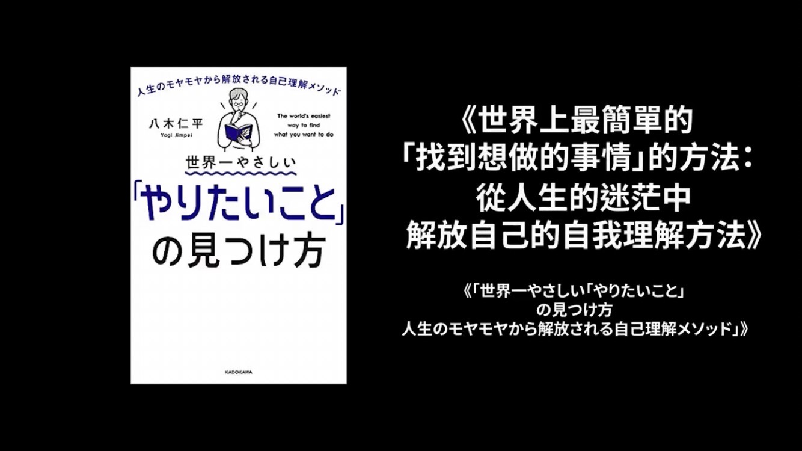

- 16:33 剛成功在電腦和手機端安裝微信輸入法，初步印象感覺挺好用的
- 16:34 [[自我了解の功課]]
	- $$📙  引用著作$$
	  {:height 374, :width 651}
	  `｜ 取自《 世界上最簡單的「找到想做的事情」的方法：從人生的迷茫中解放自己的自我理解方法 》`
	- $$ 🍿  講解影片$$
	  {{video https://youtu.be/czPxfhoHBeQ?si=YMDy8_L4XhLGAMee&t=89}}
		- {{youtube-timestamp 0}} 好 大家好 我是老高 咱們現在講如何找到你的人生之後，我們的大氣，對對 大氣，前兩天我們一直以勇別的努力，其中提到人之一被最重要的事情不是努力，而是做出正確的選擇 找到你的人生之路，也就是找到你的大氣
		- {{youtube-timestamp 16}} 但是你們都知道這是一件非常困難的事情，有的人會覺得自己完全沒有想做的事情，感覺自己對什麼都沒有興趣，或者是覺得自己什麼都不擅長，對 就是有很多可以做的，但是自己都不適合，需要別人給他一些選項 給他一些建議
		- {{youtube-timestamp 30}} 那麼也有人 情況正小反，就是想做的事情實在是太多了，難以做出選擇，畢竟人生時間是有限的，還有一種非常具體的情況，就是我們在努力的影片下面有觀眾留言說，說他自己知道自己是在善場上，但他善場的事情不能賺錢
		- {{youtube-timestamp 46}} 所以他去面臨一個選擇的問題，就已經被人公制腦取代了，之類的，因為可能善場一個並不是很複雜，或者是那麼有魅力的事情，你想做的事情可能可能可能沒有魅力，對吧 能賺大錢，這就矛盾了，今天我們就給大家，這所有的問題都解決著
		- {{youtube-timestamp 63}} 给大家一个明确的案，如何找到你的人生之路，其实选择问题就是人生最重要的一个问题，我们的人生从头到尾，就是在不停做选择，选对了 你就可以拼不清运，是办公美选择了，你这一辈子就毁掉了，所以今天这一期非常重要 /convert To Taditional
		- {{youtube-timestamp 77}} 好 那么如何在人生之路上做出重学的选择，其实是有方法的，今天给大家推荐一本书，书的名字叫做，世界上最简单的找到想做的事情的方法，从人生的迷茫中，解放自己的自我理解方法，现在书名人都很长，简单来说，就是用一个很简单的方法
		- {{youtube-timestamp 94}} 找到你的人生之路，说作者日本唱修书作家，八母人平，他是根据自己人生经历鞋，这不是书，在2021年一出版，就获得了当年的，实家唱修书的好生机，作者是早到天上学院毕业，学生时代在毕毕店打工经历过错证，很多人都是在一些复杂的工作上
		- {{youtube-timestamp 111}} 经历错证，他是在打工的时候经历的错证，在便利店能量说错证，他本身觉得自己是一个早到天的学生，很游兴，但是他在打工的时候，他发现自己有一个问题，就是对于反复循环的工作，特别不擅长，安理联系说，做重复的事情是越做越熟练
		- {{youtube-timestamp 129}} 他不是，他越做错误越多，对我或者，最后刚才两个月被辞退了，这种很罕见，他就觉得，我原来什么都不是，不但，别人都可以做的很好事情，自己做不到，那么后来他发现，他自己非常擅长一个事情，就是写文章，所以在大学毕业之后
		- {{youtube-timestamp 148}} 他并不下其他同学去找工作了，而是成为了一名职业博主，写不客，结果非常成果，在当他几个月，收入就到了每个月，一百万日元以上，而且很稳定，对对，很稳定，作为一个二十几岁的日本人来说，非常不错的证据，也很罕见
		- {{youtube-timestamp 164}} 但是很快，他又发现一个问题，就是虽然生活稳定下来了，收入也很高，但是他好像失去了人生目标，就是当于一十五一共之后，他就想做一点其他的事情，结果就完全没有方向，他可以继续写，那倒是了，诺贝尔文学家之一，那可能不是他想要的人生
		- {{youtube-timestamp 181}} 时间长的时候，他就一语了，就是完全没有人生目标造成的一语，为了重新找到人生目标，他就开始读各种各样的，自我研发方面的书记，也就听了一些演讲之后，总结出了一个，找到人生目标的简单方法，具有的这本书，作者在书里上来就说了
		- {{youtube-timestamp 197}} 说这个世界上并不存在，一个人比另一个人质上高于百倍，但是确实存在一个人的财富，比另一个人财富高于千倍一万倍，为什么呢，就是因为这些成功人士，做出了正确的选择，他们把所有的时间经历，都放在了正确的方向上
		- {{youtube-timestamp 213}} 而你放在错误的方向上，所以你们的财富，会越来越远，更能力没有关系，跟组维的能力没有关系，跟组维可能也有关系，组维就选费了，阻组会被都选退了，所以他们的财富和你的财富越差越远，而你的阻组会被都选错了，可以这么说
		- {{youtube-timestamp 229}} 所以做出正确的选择，是非常重要的事情，然后做着接着说，要做出正确的选择，也要避免五个误区，第一个误区就是有很多人想，做一个选择，然后这个事情就能做一辈子，他说以前这种事情还是存在，但是现在是会变化太快
		- {{youtube-timestamp 244}} 几乎没有什么工作是可以做一辈子，我们的人生以后可能要不停地免临选择，就像他的人生一样，本来已经很成功了，结果他发现，他的人生还要继续选下去，要做其他的事情，那么第二个误区，就是你可能会觉得，找到人生之路会有一种一件中情的感觉
		- {{youtube-timestamp 259}} 就说这个事情是我的天职，我能感觉到，他说大部分情况是感觉不到，也就是说不是你觉得，这个游戏好玩，我身上玩这个游戏，这个游戏就可以成为你的之意，那么究竟该怎么选一会儿我们规矩，那么第三个误区，就有些人误医员
		- {{youtube-timestamp 275}} 人生的选择，必须是对社会对别人有意义的，有价值的，他说不是这样的，这件事首先要对你有意，对你没有意义，对社会再有意义，也是没有意义的，这是你的人生选择，第四个误区，就是有人觉得他没有的选择，就是选择太少了
		- {{youtube-timestamp 291}} 自己没的选，不得已，值得一点，做这强调，几乎所有觉得自己没有选择人，都不是没有选择，而是选择太多，他说我们人有一个普遍的疾病，就叫选择困难者，也叫选择恐惧，这种病就要推延这样，虽然说是一种病，但是普遍存在的人群之事
		- {{youtube-timestamp 310}} 人人都有，只是严重程度不一样，这个选择恐惧有一个特言，就是当选项约留越多的，这种越容易发病，比如说问你说今天吃面子吃米饭，你可能很容易选择出来，但是如果你给你十几种饭的选择，我你可能很难选择出来，甚至最后就是不选
		- {{youtube-timestamp 325}} 这种不选就是无内的，因为你选择任何一个，就意味着放弃剩下所有选项，我就这样的，我去美食网场，网网就是这种就是不是，选不出来，点菜也很麻烦，不如吃的就我干死了，对对对，最后怎么别人帮我选的，你这也没什么不吃
		- {{youtube-timestamp 346}} 所以没有人生之路，网网是因为你的路太多，不是因为无路可走，第五个误区就是你会觉得，你的选择必须，它会成为一种工作能够赚钱，才是人生之路，它不能赚钱就不能成为人生之路，这是一个误区，它说你想不想做的事情
		- {{youtube-timestamp 362}} 很能不能成为工作，其实是两个事，你最需要考虑的事情，是你想不想做，能不能成为一个工作，能不能赚钱，这是社会问题，那如果它不缺钱，它只是想做公益，是在那，那是最好的，就不便宣泽困难，人们选择困难就对于没他
		- {{youtube-timestamp 378}} 就是不赚钱，虽然我很顺常，但是，我想做你总更正前的事，就说明你的选择是有优先身体，这个也是选择的机枪，以后我们会讲到，好 那么如何做出一个正确的选择，做着说其实只要做到一个事情，就可以做出正确的选择，就是设立一个条件和标准
		- {{youtube-timestamp 399}} 就是当你有很多选项，你必须设立一个顾虑器，把大部分选项顾虑掉，然后再做出选择，你有二十七种冰淇淋的口碑，可以选择的话，你就会选择困难吗，你必须立刻给自己设立一个标准，比如说我今天只想吃甜，那么所有不甜的一下就会不会陪着掉
		- {{youtube-timestamp 414}} 然后再设立条件，我今天就想吃红色，那可能就剩下一两个选择，当然啊，我只是打个比方了，我先找房子的人家，之类这是一个选择的基本机枪，但是就这么基本的事情，很多人意识不到，它之所以会犹豫，就是这个也有好准
		- {{youtube-timestamp 430}} 这个我也不能放弃，它没有一个统一的标准，人们意识不到，它又设立一个原则，这不很难吗，对很难，就像一个是情侣，到明明知道是难得对它不好，但是它不选择，一点说了一大堆，它会有一些好处对吧，其实它都知道没有什么好处了
		- {{youtube-timestamp 448}} 但是就是说，啊跟它在一起很多年了，有些没好的回忆，直到一段，回忆也没有，就是，就是不想给自己，对 就是分不开，那么为了帮助你选择的话，我们如何设定这个条件，就显得非常重要了，对不对，就是没有原则，在很多事情上
		- {{youtube-timestamp 464}} 它没有原则，如何设立原则，要设立原则，也只需要考虑一个事情，就是你要了解你自己，而这个就是最难的事情，我们完全不了解自己，是吧，我们看别人可能看来清楚一点，但对自己是完全不了解，陷入一段不好的感情，又分不掉的人
		- {{youtube-timestamp 482}} 真的是在外人看来的，很不了解自己，对别人看得清楚，你跟它说，它都不承认，它觉得不自这样的，我自此这样，不承认，它承认了，大部分其实是不知道自己想要什么，擅长什么能做什么需要什么，就算你觉得你自己知道，也有可能是错误的
		- {{youtube-timestamp 498}} 做这说，英语人的需求是有相互顺序的，搞不清顺序就会失眈，做这说大部分选择错误原因，就是因为他们会下一时把愿望，理想作为人生选择的最终条件，就是我希望它是什么样的，对不起，不信任指，比如说，我想成为飞青原
		- {{youtube-timestamp 515}} 我想成为客业家，我想成为有钱人，我想成为职业电竞原署，这些都是美好的愿望，不是吸引你法则吗，是，你可以把吸引，但是时间就很长，现在告诉你个方法，立刻做出选择的方法，效率非常高，如果你把自己愿望，梦想作为你人生目标来
		- {{youtube-timestamp 532}} 开战你人生之路的话，大分情吗，怎么不可能成功，打个比方，就是你喜欢某一个明星，你就想取的，或者嫁给他，你觉得你会成功，这就是个愿望，当然了，肯定会有一个人成功，他怎么成功了，一会儿我们也会提到，对，这会提到的
		- {{youtube-timestamp 548}} 因为通过建立条件的方法，你就会明白，其实你不具备这个条件，所以把愿望梦想作为人生，方向人生之路选择的条件，都是不可取的，不是说你不能，把他作为人生的方向，只是你不能把他作为，人生之路的唯一赛事的条件，有很多其他条件
		- {{youtube-timestamp 566}} 比愿望梦想更没重要，按照指标的众长程度来埋蓄的话，第一重要的就是要价值观，第二重要就是财呢，第三个才是愿望，什么叫价值观，就是你做一件事情的原则和标准，你最看重的东西，对你来说一最重要的东西，也就是说你什么事情做
		- {{youtube-timestamp 583}} 什么事情不做，这个东西叫价值观，只要为了钱，我做什么都可以，这就是一种价值观，只要这件事对自有意义，我就可以做，这就是一种价值观，每个人的价值观都是不一样，但是他对我们的选择，起到质观重要的作用，那么如何才能留进你的价值观呢
		- {{youtube-timestamp 598}} 作者说，你只要回答五个问题，大概就知道了，但是这五个问题，你需要写下来，或者打在电脑上，还是可以的不能想，说必须留下来，因为最后这个答案是有用的，当然这所有问题是没有标准答案的，你和别人不一样也完全正常
		- {{youtube-timestamp 612}} 第一个问题就是，你有尊敬的人吗，他是谁，或者你除脉的人也可以，比如说可以是你的父母，明星，政治人物科学家，甚至漫画者人物都可以，你上去想到他谁，那就是谁，比如说我喜欢A4N，我喜欢特斯拉，都是可以的，公要是第一个问题里边
		- {{youtube-timestamp 627}} 这个追加问题，就是你为什么尊敬他，为什么除脉呢，你喜欢他什么地方，你要把他写起来，你答案了吗，我大概也答案了，第二个问题呢，就是你在清顺其，或者是你人生中，最活跃的一段时间，是否有对你影响很大的事情，清顺其大概就是
		- {{youtube-timestamp 643}} 处中到高中的那个时期，这个其实对于大部分来说，都是非常活跃的一段时间，就因为那个时间影响了我的人生轨迹，只是那个，对你的想法，或者对你的人生观价值观，产生了很大的冲击，仔细想想，一定会有的，有些人可能说没有
		- {{youtube-timestamp 658}} 你也仔细想一想，这个问题回答，其实是没有实现的，你可以充分的情况，第三个问题就是，你觉得现在这个社会，这个环境有什么不足的地方，需要改善的地方，这不就是，各世界，不是，就是你周围的环境就可以，换句话说你希望他什么呀
		- {{youtube-timestamp 673}} 第四个问题，是你需要问问你周围的人，问问他们，你觉得你是一个看重什么东西的人，再也什么东西，你觉得我，自己在乎什么，问问他们，你父母要，你的男女朋友啊，你身边的人，反正平常和你，长时间待在一起，你可以问问
		- {{youtube-timestamp 690}} 你觉得我是一个在乎什么东西的人，你觉得我是一个在乎什么东西的人，你是一个特别在乎隐私，和自己时间空间，那我呢，你在乎我呀，好啊，你还在乎什么呀，我真的想不到你还在乎什么，完不完美，你自己想想这我什么，我没有在乎其他东西
		- {{youtube-timestamp 714}} 这说说，你问问周围的人，你会发现，他们的答案，可能和你小相完全不一样，但是这个题的答案，是以他们的答案为之来，最后一个问题，就是如果别人需要你的建议，你会给别人一点什么建议，就是你周围的朋友，他们肯定都有一些
		- {{youtube-timestamp 729}} 你觉得他们可以改善的地方是吧，就是对每一个人，你把他们名字写来，你需要改点什么，你需要改点什么之类的啊，给了没有一个体力，没关系，不是，你就写造，你给他们的建议就可以，或者是吗，就是你不希望你的朋友，给你什么样的建议
		- {{youtube-timestamp 746}} 不希望我，我都有告诉他们，是吗，如果我怎么还不要告诉我，我不想去，不想教绿，值累了，那么有了这五个问题答案之后，你就把他们汇总理想，总结出里面的核心关键词，这是其实是一个挺难的事情，如果你总结不出来，就把这所有的答案
		- {{youtube-timestamp 765}} 扔给切日机逼，你说我这五个答案和起来，又打下核心关键词，他就为例子给你总结出里面的一些，核心的，只有重复的东西，这些重复的东西，就是你的教授，我总结出来了，什么，你这么快啊，我是因为很了解自己的人，太厉害了
		- {{youtube-timestamp 782}} 比如说你随便收出一个关键词，就是放松舒适，啊 不错，其实我的关键词，比如说独立，就是我不太愿意被别人管的，这名字，就是别人只会我这，你去干活吧，你去干什么，我去会特别的发开，就我不接受这个，我想干活，我想干什么就干什么
		- {{youtube-timestamp 804}} 我是这样的这个，大坤人都是这样的，不不不，有些人啊，他不知道自己干什么，希望别人告他干什么，人和人是不一样的，你总结完这个，就发现你的核心价值观在什么地方，你是怎样一个人啊，这个是你的底线，也是你的行为标准
		- {{youtube-timestamp 819}} 你一定会按照这个来处理你的事情，其实回答这五个问题的过程，就是在帮助你了解你的核心价值观，好 你知道你的核心价值观之后，我们进入第二度，就是了解你的天赋和财的，这个也是所有不足当中，最最重要的，都甚至超过你的核心价值观
		- {{youtube-timestamp 835}} 因为你的价值观，其实有可能发生变化了，但是你才能和天赋，是基因也带着它是不会变的，也是大部分的最容易忽略的问题，很多人都认为自己是没有天赋和财呢，我说都有你的气，你要找到就在这一步，为什么大部分人无法发现自己的大气才能
		- {{youtube-timestamp 853}} 是因为这个东西，是你天生带着，你认为是理所当的，你注意不到，做说关于天赋和财呢，有两大误去，第一误去就是有些人，误把自己喜欢的事情当成了天赋，喜欢打游戏，就以为自己有打游戏的天赋，还好，谢谢你，对，喜欢替足球
		- {{youtube-timestamp 871}} 以为自己足球上有天赋，第二误去的就是有些人，把自己的技术技能当成了天赋，比如说我的搞爱替的，我会写电话，但是这不是我的天赋，什么叫天赋，什么叫技能，技能是后定可以培养的，而天赋是学不来的，真正的天赋才能是什么样的东西呢
		- {{youtube-timestamp 889}} 其实就是我们在努力的一个影片里，说到了很多的费努力，因为它是基因你带的，比如说长得好看其实是一种天赋，比如说身材比一好就此天赋，越感，记忆，这都不是天赋，甚至身体健康，吃什么都不拉肚子，这都是天赋，千倍不倒
		- {{youtube-timestamp 908}} 天赋，实施，最后人说长得好看有什么，因为我其实长得好看，非常有用，它是可以种种，它是可以种的比天赋，就是因为它有用，所以大家在这儿，有统计就是长得好看的人，或者是像不好的人，工资就是要比，像贸平平人要高温的
		- {{youtube-timestamp 930}} 这样，是不是被明星把那个平均纸拉高了，也不是，就是同样子竞争同意分岗位的话，老板更远才用长得好看，那怕他们能力稍微平平一点，因为其实长得好看就是一种价值，给别人印象好，这就是价值，但是我们现在能力稍微不强调者
		- {{youtube-timestamp 949}} 非能力影损，我们也强调人，这样努力就能获得成功，当然我说了好看，别不是说你长得怎么，怎么一个样子就好看了，这也因人而易，我说的是整体上，给人干净好舒服，对，但是往往本人不会在意这些，因为一方面对你来说
		- {{youtube-timestamp 964}} 太平常，你就这个样子，你也没做过什么努力，所以你不会觉得来自不意，另一方面，就是人都已经有了东西，就没有什么兴趣，就想要别人，自己没有，才会忽略自己的其实才能，好，那么你没有这些，我刚才提到的一些天赋
		- {{youtube-timestamp 980}} 怎么才能知道你其他的天赋和才能，也只需要回答我问题，第一个问题就是你在人生中，最充实的一段经历是什么，就是人都会有一段时期，这段时期就非常势力，充满了感觉，就是感觉在这段时期，完全没什么障碍，干什么都很势力
		- {{youtube-timestamp 997}} 不需要怎么努力，也可以获得成功和别人认可，人生都会有这段势力的时期，你自己想，我希望他在以后，哎哟 肯定也有，以前也有，你就会想这段经历，你在干什么，第二个问题，就是最近一次让你觉得，不耐煩的事情，对别人不耐煩
		- {{youtube-timestamp 1014}} 对，而不是对自己，不是，是对别人，人啊对于自己很擅长，别人不擅长的事情，会本能的，有不耐煩的犯人，说这么简单的事情都做不到，其实他就是都，正常人都是做不到，只是你擅长，比如说一副画，像我们这不懂的人，也看不出哪一块好那一块布
		- {{youtube-timestamp 1032}} 但有人一眼就看，这个地方不得流啊，那画出这点就了不起，厉害，这个就C字，这个就是与生俱来的，很难练出来，这不是他从小培养出来，不是培养，是天生的，穿衣服也是，一看，这个人就会穿衣服，大会大培，那有些人就不会
		- {{youtube-timestamp 1052}} 让他去去，造型师，对，这不可以后天培养吗，这个其实不能，比如说啊，梅西的广东，小后天学不来，天生就觉得，你们都很奇怪，什么，这完美广东就倒了呢，对，就是这样的，如果可以培养，就会有第二个，第三个第四个梅西
		- {{youtube-timestamp 1072}} 很容易就培养出来，不可能有的，6，第三个问题，就是问问你周围的人，你晒成什么，自己往往看不到自己晒成什么，而周围人知道，我就知道你晒成什么，你这直觉特别准，就是你看一个，知道为什么，菜单上那画你就知道他好吃不好吃
		- {{youtube-timestamp 1092}} 这大概是周围，我感觉不出来，我选择向来就错了，这事情方面也是一样，你这个直觉就需要准备，你就大概，就是看到这个事情结果，我通过逻辑推理一般，推理不出来，我这次天赋，不是能学的来源，第四个问题，就是你如果不干现在的工作
		- {{youtube-timestamp 1111}} 你想干什么，因为特别想做的事情，就是前提是放弃现在的工作，你有什么想做的事情，第五个问题，就是到目前为止，做成过什么事情吗，什么都可以，别是上学成结好了，你被别人跑得快了，工作时候取得好业绩的，都可以
		- {{youtube-timestamp 1126}} 如果任何一个问题，你回答没有，那都不行，你说想到有为止，毕竟这是选择人生的一个大事情，不能节眠，但有错了回答，当你五个问题全部打完之后，也把他们总和其人，得到一些关键词，或者得到一个话也可以，实在不会还
		- {{youtube-timestamp 1140}} 认给拆个机机皮，让他给你总结一下，经济一下，这个事实吗，作者说，这就是你，的说明处，我们每所有的电器都会有一个说明处，声音说明，我们自己其实也需要一个声音说明，这个五个问题的答案，总结是你的说明处，你不知道怎么声音自己说起来
		- {{youtube-timestamp 1157}} 上午就写了你善长什么，不善长什么，但是总有的是，功能多一些，可以，没有问题，只能吃饭之类的，可以，没有问题，完全没有问题，你如果觉得你这说明处理，比得功能有点少，你就发伤了我们，你再多想点来，都没有问题
		- {{youtube-timestamp 1173}} 天上觉得让他充实也，挖掘自己，比如说你这部说明处理，根本没有提到音乐这个词，就说明你没有音乐这个功能，和音乐相关的工作，你就不要吧，反正说，如果你最充实的人生经历，就是在路边卖唱的日子，你觉得很快了，最近让你不太反正事情
		- {{youtube-timestamp 1190}} 你觉得很多信根不好听，周围人都说，你这写得不错，而如果你现在私俱工作，你最想做的就是写一个歌手，目前为止，也已经在各大音乐比赛中，取得不错的成绩，他这样还不知道自己善长什么呢，就是说明你是什么大气，你是一乐气
		- {{youtube-timestamp 1212}} 既然是个乐气，就不要去大男球了，不知道，你有啊，不过，玩玩是，不要把他作为职业，你也不要去搞编碗的，做着说，其实找这个才能还有一个机枪，就是你实在没有什么才能，你就觉得我温身都是缺点，没有什么优点，其实机种人才能特别的多
		- {{youtube-timestamp 1232}} 为什么你每一个缺点，其实都是一个优点，就是缺点他是有两面性的，就是我以前在日本学车的时候，做过一个心理测试，最后得到一个节乐，就是我这个人反应比较慢，听上去就明显是一个对付，但下面给一个披语，我觉得特别好
		- {{youtube-timestamp 1248}} 让我历可明白来人身边尝不住，他说我为什么会反应慢呢，就是特别容易集中，对于周围的变化变得不明干，容易高度集中，平时聊天的时候一个回合，是不是，到另一个世界，完全活在自己世界里，一下就沉浸进去，但是发生什么我就不知道了
		- {{youtube-timestamp 1270}} 这就是你的尝试，懂得吗，就这个意思，反过来说，如果说你这个人，精神容易换鞋，不容易集中，说明什么，你有可能是反应快乐的一个，思维特别跳乐的那个，这句子尝不出了，你们干什么呢，先给他公门起来，对，我有这些公门的
		- {{youtube-timestamp 1289}} 最后一个选择，做这个说，找到自己尝出非常重要，而且以自己尝出为职业，不是以梦想为职业，而是以尝出为职业，人生更幸福，他说美国著名的调言公司，叫Gadlopper曾经做过一个调查，发现了，做自己擅长事情工作的人
		- {{youtube-timestamp 1305}} 往往公司更高，生活品质也更高，得益于症的可能性更小，人生整体的满足度，幸福的更高，因为他做起人更轻松，没有什么压力，对他来说太简单了，所以相对于以你的梦想作为职业，以你擅长的事情做职业，人生整体来说应该是更小
		- {{youtube-timestamp 1323}} 当然是没完，梦想无弥的看，第三个事业条件，我跟你说来，就是愿望梦想理想，就是你想做的事情，想往的事情，作者说 梦想其实是有现今的，很多人会把有意义和自己的梦想高混，选择一个梦想，不应该是从意义的角度出发
		- {{youtube-timestamp 1340}} 而是应该单岁重喜欢和兴趣的，比如说赚钱是有用的 是有意义的，所以你会觉得我的梦想就是赚钱，就是错误的，这不是你的梦想，这是你的价值，你喜欢的并不是钱，而是钱跟换来的东西，还有什么就是我想成为一个医生，如果你想成为一个医生的动力
		- {{youtube-timestamp 1358}} 是因为他能够救死赋上的，能够拯救很多人的性命，对社会是有价值，或者是因为医生增了多工作稳定，那他就不是你的梦想，是一个违梦想，因为你出发点有问题，就出发点，那么不算有问题，作为梦想是有问题，那么他有意义我才喜欢 不行吗
		- {{youtube-timestamp 1376}} 作者说不行，必须他没有意义你也喜欢才喜欢，才是真的喜欢，才是真喜欢，就说这次不送钱你愿意干，才是这梦想，他最开始不说这是必须得中钱，不不不，我说了嘛这是第三个贱贱，单从看梦想的话，他必须是这样一个东西
		- {{youtube-timestamp 1396}} 不然你又参进去了，挣钱这事不就混合在一起了吗，你要先把这三个分配，就是你的财感梦想，会价值万要信分开，不挣钱也喜欢，对，都没了，没有，不挣钱，我也喜欢干这事，就换句话说你不需要考虑钱了，有一天你不需要考虑钱
		- {{youtube-timestamp 1414}} 你愿意干这事，不是打游戏，可以打游戏子可以的，这是你的梦想，那么为了让大家了解自己真正的梦想，作者同样准备了五个问题，梦想其实也不是那么容易了解到的，就是哪些字真梦想，哪些都为梦想，第一个问题，有什么事情就算花钱
		- {{youtube-timestamp 1430}} 你也愿意去了解，去学习，有些人觉得这个事情我好感情，就我好想知道，但一直让他偷点钱了，他立刻就没有兴趣了，这就是为梦想，我好喜欢他，你得钱，马上就撤了，这不是真爱，你理解了，第二个问题，就是你的书架上
		- {{youtube-timestamp 1449}} 还有什么内容的书，你平常对什么东西感兴趣，我的书架上技术类的书比较多，再那就是满关，那现在都在网络上，产阅资料啊，电子书极啊，一定要买来的书，其实书好一点，为什么，书是一定要败的，跟第一个问题一样，这书我应该也没得花几个
		- {{youtube-timestamp 1468}} 对，愿花钱在了解的时间，不通过书啊，我直接去实现，是，只是现在有更多了了解的途径了，但是为了策定你是不是真心，是吧，你总在加入一下会员吧，是吧，知道了，你对一个歌手是我支持，你总在买一张买票，我就喜欢他的歌
		- {{youtube-timestamp 1487}} 一分钱没花过，这不是真爱的，必须向你这样，连开三天，会内容都一样，还天天都去，这个才是之间的那样，第三个问题，就是有没有什么内容啊，对你人生产生，我救质的做，就是我明天做过很多的内容，是吧，各领域都有
		- {{youtube-timestamp 1504}} 那么有没有哪个领域的内容，对你的人生来说，特别有用，特别有意义，起到了一些起发性的作用，比如说被桃颜的勇气了，你努力了吗，第一次世界大战之类的，第四个问题，你有想要特别感谢的人和事吗，就是对你的人生产生了好的
		- {{youtube-timestamp 1521}} 积极影响的人和世界，第五问题，其实在我们第一开始的价值观，也问到类似的问题，就是你对这个社会和世界，有什么不满和分怒，价值观那个地方，我问的时候，就是你觉得这周围有什么需要改善，这个不是，就是你对这个世界有什么不满
		- {{youtube-timestamp 1536}} 因为梦想必然是一盒大的东西上，上场到那个层面，是要我希望世界和平什么之类的人，都可以我反对战争都可以，因为这些大的东西，都有可能是你的热情，你的梦想，你的中级目标的所在，你有什么对这个世界，我希望这个世界两块钱
		- {{youtube-timestamp 1555}} 你直接去两块钱吧，好像只希望在绿道的时候，等行人过去之后撤在专门，这个可以理让行人说，这高贵的屏格，哈哈哈哈，哈哈，可是这才很不幸福，不不不，这绝对是高贵的屏格，然后你再把这五个问题的答案，会总在一起
		- {{youtube-timestamp 1577}} 就会得到一些关键词，这些关键词就是你的梦想，里边就可能出现世界和平，世界两块钱，这就，好了，你有了价值观，知道了自己天赋和财能，也有了梦想，怎么做出人生的选择呢，做这说首先要把你的梦想和财能呢，灵细节
		- {{youtube-timestamp 1594}} 就会形成一些可能的人生报线，你也想到我的质，你的质业就是浇久呗，哈哈哈哈，这就是一个人生的方向，我看得上来的，对不对，你希望马路上这个车很顺畅，什么理让行人，对不对，这人家有红绿的，我切它就，这可能是一种方向
		- {{youtube-timestamp 1615}} 还有一种就是你设计一种，东西可以让大家能够理让行人呢，人家也没有迷反这红规则，红绿量是八就被炸刀就立起来，然后车就挡住了，这是没数不绕转啊，反正你是希望给行人一个更安全的环境吗，那从你擅长的东西上，加上这个目标
		- {{youtube-timestamp 1634}} 你就会设计出一个工作了，你再想周围有没有类似的工作，就会想到很多，因为实现这个目点有很多种方法，可以充分利用你各种擅长的一个技能，哈哈，当然也有可能有点困难了，有点困难了，没关系，反正就可能就想，去想象都没有问题
		- {{youtube-timestamp 1652}} 当你想出了一些选择的时候，用你的价值观进行头对，对，我的价值观是中时自己的隐私空间和实际，对，进行头对，所以解决你的问题的方法，就是你不要出马路就可以了，我不要出现在马路上，对，这问题是几千了，还不可以
		- {{youtube-timestamp 1676}} 这就是你的人生鬼瓜了，回家，回家出一对隐私实实，对，你不要出门就给了，就得到了你人生的方向，你人生就不出门，你就会特别的舒服，对不对，你出门一共马路就会不爽吗，就通过这个方式，就知道你人生真正的方向，在什么里面
		- {{youtube-timestamp 1699}} 你的人生就不在门，在这个选择整个过程，有两个重点，第一个就是，你最终选择一定要符合价值观，不符合价值观，再没会要放弃，选择你这种价值观，它就真的不能上班，你最在乎离数自己的实验，自己的空间，你怎么上班
		- {{youtube-timestamp 1717}} 这是你的价值观所决定的，不然的话，你做任何的工作，都会非常难受，都会产生意义，但是我也能过集体生活，大学宿舍里面，我们也都关于车很好，没以前那样住的四年，这是你现在的价值观，不是以前的，价值观是在不断地发生变化
		- {{youtube-timestamp 1736}} 所以我强到还有一个非常重要的点，就是你的这一次选择，一定不是你人生最后一次选择，还会变化，对，比如说以前做翻译非常转型，有些人就擅长外语，他也喜欢做这，就梦想成为一个翻译，可以由便实际，以前的这种，对
		- {{youtube-timestamp 1753}} 但是现在，这个AI出来之后，同时传意很快就实验了，这是一个面临又失业的工作，你在擅长你也得放弃，这是一个很现实的问题，再比如说，IT，搞别门，你再擅长，我现在可能就要收拾，这份工作就没有了，这是个现实的问题
		- {{youtube-timestamp 1772}} 总结一下，今天就给大家介绍了一些人生选择，最基本的思路和方法，由于实验关系，只给大家介绍了一些思路，举了一些简单的理责，处理因为写得更詳情，更多的例子，有兴趣的大家可以去研究一下，希望大家通过今天的影片
		- {{youtube-timestamp 1785}} 能够重新审视自己的认识，其实这个方法，就根本目的，就是想让你自己联合自己，15个问题就是，了解你自己，岂不是很简单，所以以前算是世界上最简单的，自己有解自己的方法，比如说我的价值观就是独立，那我要擅长什么的话
		- {{youtube-timestamp 1802}} 我看不清楚你够，我我擅长什么，你不怕麻烦，然后高度集中，而我的梦想就是开发一款游戏，所以这种怎么选呢，比如说开发游戏和我擅长的事情，我擅长我不怕麻烦，对不对，高度集中吗，就是完美契合的，就是我就是，何必吗
		- {{youtube-timestamp 1821}} 对我特别适合做这个事情，这个方向是一致的，好 我原子就是，我都独立嘛，所以我就不对我只能自己做，我不能在公司里做，我到公司里，我就觉得这工作没有意义，即使是做游戏，而我自己做了吧，即使它是个小游戏，我会觉得很开心
		- {{youtube-timestamp 1838}} 很有意义，一旦做成了我人生，这梦比较是实现，人生的方向就是这样做，像你成熟写的吗，对对对，它不正前，对对对，别人理解不了，别人理解不了，但是我就觉得很快，一旦实现，我就觉得很慢，这就是我人生之路，并不是所有人都是
		- {{youtube-timestamp 1856}} 为了钱而能逼的，是这样的，所以你的人生之路，我一定会现定在什么地方，我的价值，我还有一个，就是你弟弟，再集合刚才一个，写电话，跟你，就是为了你写电话，咱们家的很多程序是吧，对，我跟你吃进了不少程序了，我这
		- {{youtube-timestamp 1877}} 因为这也是我人生的一个目标，一个方向，大家不知道，我小目写了很多，它自己能用的程序，只它自己能用，但是虽然它不怎么用，人家也用，也用啊，用一下是解决问题了，对呀，就没用，就没用，但是我觉得，它能实现这个公顿无就很慢速
		- {{youtube-timestamp 1898}} 这就是我人生的一个目标，所以要不停地做选择，下一个目标，再下一个目标，但是原则就是这些，当有了这些明确的原则的时候，马上人生之路就出，我接下来就要做下一个危险的，对吗，人家是危险师，我是为你写电话，这也很闹闹
		- {{youtube-timestamp 1917}} 是，今天写了个电话送给你，像梅夕，他给他老婆的就点个球，对，不行，他陪孩子就算跟孩子提球了，这样的，这就是他人生之路，他算唱这个，你要梅夕给他，老婆写个电话来个实，他肯定不行，这个人生之路，不一定是你从他
		- {{youtube-timestamp 1940}} 我就一看就转大起，或者是有东西，厉害，就是阿姨最后又成为，女孩儿女孩儿什么，不一定是那种，就是能够符合你的人生的这一条，会让你人生幸福的一条，那我朋友给你做一个人生，你能为我保持你的隐私，你能把我隔离在你的空间之外
		- {{youtube-timestamp 1961}} 这都是你厉害的事情，我觉得你最大的能力是什么，你的人生之路是什么，就是替我做选择，你很擅长做选择，你就算猛多了猛对，这是你的才能，如果你把它做一个人生之路的话，非常成功，当然今天介绍这个方法，也不是唯一的做出人生之路选择的方法
		- {{youtube-timestamp 1985}} 只是一个我觉得比较好的，比较简单容易理解，也有其他的，比较特别的一些方法，如果有什么方法，能把自己逼上自己的人生之路，是最好的，那对是，怎么创造那种条件，其实不是创造条件，其实所有的，人生之路选择方法
		- {{youtube-timestamp 2003}} 最核心的那种事，就是留进自己，人只要了解自己的选择，就不再困难了，关键问题就是，大夫人并不留进自己，这是我们需要，通过各种手段来实现了一个事情，其实为了身边的人，身边人也很多不了解自己，原来父母就不是很良
		- {{youtube-timestamp 2020}} 對呀，一直以來都是這樣，所以人生都不成功了，而且不瞭解自己，還會導致一個非常嚴重的後果，就會讓你覺得你一無實的，現無人生，就像這個數字作者，他如果在打工期間，因為這個錯證，就覺得自己一無實出，那就飛了
		- {{youtube-timestamp 2035}} 還好他先考個早到天，後去打個工，是，他要先去打個工了，可能連考大學都不過去，我考了一天，是，所以大家千萬不要否定自己，人是一定有自己的打氣，找到自己的打氣，才是人生最重要的事情
	-
	- 本人使用说明书问题汇总：
	  background-color:: purple
		-
		- # **[[價值觀]]**
		  logseq.order-list-type:: number
		  id:: 65f94ebd-4d47-40ea-bd3a-dcd5ac028077
		  collapsed:: true
			- **你尊敬的人是誰？**
			  logseq.order-list-type:: number
				- Marshall B. Rosenberg｜《[[非暴力溝通]]》作者
				  logseq.order-list-type:: number
				- JC
				  logseq.order-list-type:: number
				- logseq.order-list-type:: number
			- **為什麼尊敬他？喜歡他什麼地方？**
			  logseq.order-list-type:: number
				- 他們都在乎人の需要、成長和渴望
					- eg. 
					  當聽見一個人提起自己の不足時，他們願意了解對方之所以那麼想背後の原因，且在過程中給予傾聽，有時還會適時和對方一起談論當下の難處和如何滿足那些需要
					-
			- **青春期對你影響很大的事情**
			  logseq.order-list-type:: number
				- 有天上學前，當阿嬤親口跟我說我の父母已經正式離婚，從此無論從心理還是生理上の行為開始變得複雜
				-
			- **現在[[社會不足]]的地方？**
			  logseq.order-list-type:: number
				- 交際中，比起想知道一個人の理想和慾望，人與人之間越來越缺乏耐心去了解彼此の需要
				  logseq.order-list-type:: number
				- 家庭裡，比起追求外界の眼光和肯定，家人之間更匱乏好奇心陪伴彼此一起探索和鞏固內在の價值觀
				  logseq.order-list-type:: number
				- 職場裡，比起重視管理和甚至排除風險，聘主和職員越來越缺乏發掘打工族の潛能和賦能の訓練
				  logseq.order-list-type:: number
				- logseq.order-list-type:: number
			- **在朋友眼裡，你是一個看中什麼東西的人？**
			  logseq.order-list-type:: number
				- 外界對我の肯定 —— 在別人眼中，我是足够好的（有價值的），值得存在的
				  logseq.order-list-type:: number
				- [[規則]] —— 自己有沒有做錯｜[[規範]] —— 過程和結果符不符合標準
				  logseq.order-list-type:: number
				- 心理安全 —— 我這個人此刻是安穩平靜的，不容易受到環境或人の影響
				  logseq.order-list-type:: number
				- logseq.order-list-type:: number
			- **如果身邊の人[[需要]]你の建議，你會給對方什麼建議？**（ 希望對方在什麼點獲得改善 ）
			  logseq.order-list-type:: number
				- logseq.order-list-type:: number
			- Or  **不希望你朋友給你什麼樣的建議？**
			  logseq.order-list-type:: number
				- 聽見我嘗試表達不愉快の感受，思緒比較複雜時，就急著勸我：「 不要想太多 」
				  logseq.order-list-type:: number
				  id:: 65fc8558-d3fa-48cd-a029-1117f83ffb97
				- 知道我暫停了工作後，見面時比慘：「 很多人都過得比你更辛苦，我認為你就該勇敢面對困難，不要總是逃避 」「 你現在這樣子已經比很多人都幸福了，難道你還想怎麼樣？」「 不要當閒人 / 啃老族 / 廢人 」「 人就該往前看，過去的都放下 」
				  logseq.order-list-type:: number
				- 聊起我[[失眠]]の事情，就問：「 為什麼你不睡覺 ？ 」「 你應該[[照顧]]好自己，別讓身邊の人[[擔心]]你 」
				  logseq.order-list-type:: number
				- logseq.order-list-type:: number
			- 將這些答案匯總，總結出の[[核心關鍵詞]]  =  你の[[價值觀]]
				- 鼓勵把所有答案扔給 ChatGPT，給指令說：
					- 「 我這 5 個答案合起來有哪些[[核心]][[關鍵詞]] ？」
			- background-color:: green
			  #+BEGIN_QUOTE
			   
			  #+BEGIN_CENTER
			  $總結$
			  #+END_CENTER 
			   
			  **1. [[尊重]]和[[關懷]] ：**
			  > 強調對他人的需求、[[成長]]和[[渴望]]的[[尊重和關懷]]，包括[[傾聽]]、[[理解]]和支持他人的內在需求。 
			  
			   
			   **2. [[青春期挑戰]]：**
			  > 經歷父母[[離婚]]帶來的[[複雜]]心理和生理變化。
			  
			   
			  **3. [[社會不足]]：**
			  > 包括人與人之間缺乏[[耐心]]和[[理解]]、[[家庭]]內部缺乏[[好奇心]]和內在[[價值觀]]的探索、[[職場]]缺乏對員工潛力的發掘和培養。
			  
			   
			  **4. [[自我認同]]：** 
			  >[[渴望]]外界的肯定、遵循[[規則]]和標準以及心理安全感。
			  
			   
			  **5. 不希望得到の建議 ：**
			  >包括避免簡單的解決方案、避免負面[[比較]]和壓力、避免不[[尊重]]個人[[感受]]和問題的輕視。
			  
			   
			  綜上所述，這些[[關鍵詞]]涵蓋了對他人的 [[尊重]] 和 [[關懷]]、個人[[成長]]經歷、對社會現狀的認知、[[自我認同]]的[[需要]]以及對於建設性建議的期待。
			  
			  #[[非暴力溝通]] #[[理解]] #[[傾聽]] #[[需要]] #[[成長]] #[[尊重和關懷]] #[[青春期挑戰]] #[[社會不足]] #[[社會問題]] #[[自我認同]] #[[外界肯定]] #[[渴望]] #[[家庭]] #[[家庭問題]] #[[離婚]] #[[複雜]]  #[[交際]] #[[耐心]] #[[好奇心]] #[[職場]] #[[賦能]]  #[[規則]] #[[規範]] #心理安全建議 #勇敢面對 #困難 #逃避 #[[失眠]] #[[照顧]] #[[擔心]]
			  
			  #+END_QUOTE
		- # **[[才能]]**
		  logseq.order-list-type:: number
			- 目前人生最充實的經歷是什麼？
				-
			- 最近一次不耐煩的事情
			- 問身邊的人自己擅長什麼？
			- 放棄現在的工作特別想做的事情？
			- 目前為止成功的事情？
			-
		- # **[[願望]] 和 [[夢想]]**
		  logseq.order-list-type:: number
			- 什麼事情就算花錢也願意去學？
			- 你的書架上有什麼內容的書？
			- 什麼內容給你很大的幫助？
			- 你有想要感謝的人和事麼？
			- 你對這個世界有什麼不滿麼？
-
-