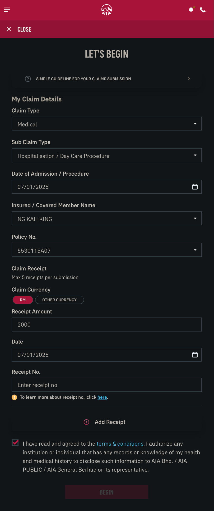
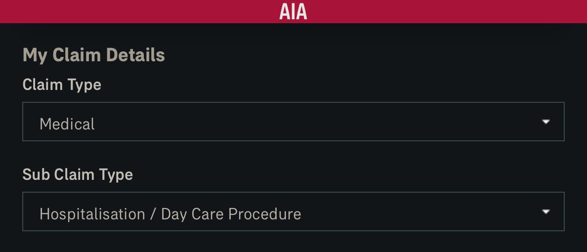
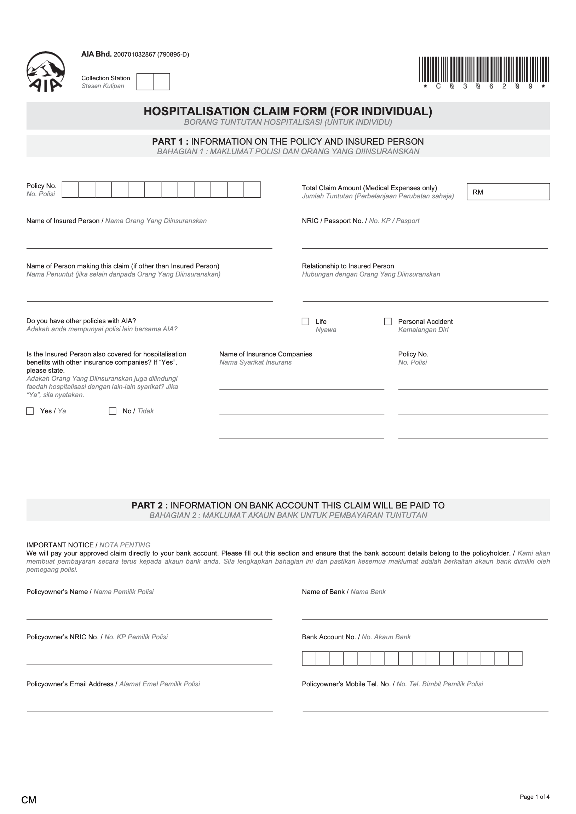
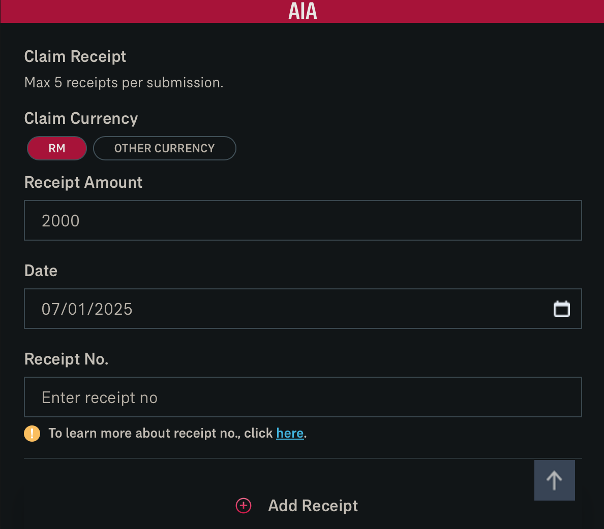
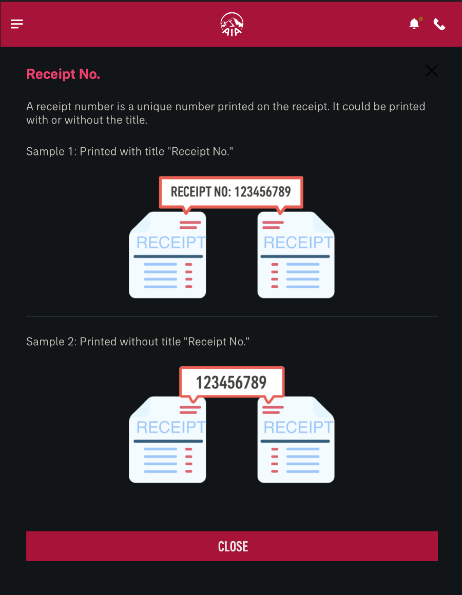

-
- 16:27
	- 剛補眠睡醒
	- 先[[梳理]]和[[確認]]目前收集到情報，再決定是否[[需要]]聯絡嫲嫲的 [[AIA]] 保險 Agent
		-
		- $$ 我最在乎的點 $$
			-
			- 爲了[[幫助自己]]]]替嫲嫲
			  logseq.order-list-type:: number
			  collapsed:: true
				- # 支付醫療手續費
				  logseq.order-list-type:: number
				  collapsed:: true
					- ## 入院
						- [[Thu, 16-01-2025]] ｜2PM
					- ## 費用
					  logseq.order-list-type:: number
						- 住院 ── RM 2, 000
						  logseq.order-list-type:: number
						- 手術 ── RM 10, 000
						  logseq.order-list-type:: number
						- ##### P/S：入院當天才付
						-
				- # 向 [[AIA]] 辦 [[索賠 Submit Claims]] 手續
				  logseq.order-list-type:: number
				  collapsed:: true
					- ## 術前 / 入院前
						- 我是否真的[[需要]]跟嫲嫲一起前往銀行，將對方 *[[定期存款 Fixed Deposit (FD)]]* 提早匯進我的銀行戶口？
						  logseq.order-list-type:: number
							- 這樣做最大的[[幫助]]是什麼？
							  logseq.order-list-type:: number
								- 更順利達成[[目的]]的每個步驟：
									- {{embed [[成功索賠]]}}
					- ## 全程
					  logseq.order-list-type:: number
						- [[成功索賠]] 最重要的 [[_green]]==[[條件]] + 步驟== 是什麼？
						  id:: 677ceba6-9bf9-4570-92dc-16445f89d95e
							- >  eg.     是否需收錄 + 出示自己銀行戶口每筆支付醫療的 [[[[費用]][[記錄]]]]？
							- ###### Example
							  collapsed:: true
								- 
								-
							- ### **索賠類別 ｜ [[Documents Checklist]]**
							  id:: 677d04b2-5306-4b41-a85c-ed65b5cab092 #.ol
							  logseq.order-list-type:: number
							  collapsed:: true
								- ##### Claim [[Type]]
								  logseq.order-list-type:: number
								  id:: 677d05f3-8424-48e0-9540-0b38fe0e37d8
									- Medical
								- ##### Sub Claim [[Type]]
								  logseq.order-list-type:: number
									- Hospitalisation / Day Care Procedure
								- ##### Example
								  collapsed:: true
									- {:height 224, :width 503}
							- ### **證件  ｜ [[Supporting Documents]]**
							  logseq.order-list-type:: number
							  collapsed:: true
								- Original Official Receipt including deposit receipts
								  logseq.order-list-type:: number
								- Original Itemised Bill
								  logseq.order-list-type:: number
								- Medical Report
								  logseq.order-list-type:: number
								- 
								- ##### Example
								  collapsed:: true
									- {:width 202,:height 277}
								- OR
								- endorsement from treating doctor on the nature of illness / accident for each receipt / bill submitted
								- Lab / Imaging Reports, Dengue Serology Report, Police Report, Copy of passport or flight details for overseas claim (where applicable)
								  logseq.order-list-type:: number
								  id:: 677d0836-0a7d-48a1-8571-e660018527f1
								- Referral Letter or eReferral Summary screenshot in AIA+ App (where applicable)
								  logseq.order-list-type:: number
							- ### **收條 ｜  [[Receipt]]**
							  logseq.order-list-type:: number
							  collapsed:: true
								- 每次提交 MAX 5 張
								  logseq.order-list-type:: number
									- ##### Example
									  collapsed:: true
										- 
										- 
									-
							- ### **身份證 ｜  [[[[NRIC]] / [[Passport]]]]**
							  logseq.order-list-type:: number
							  collapsed:: true
								- 正面 only
								  logseq.order-list-type:: number
									- WONG LEN THAI
									  logseq.order-list-type:: number
									- 561202085058
									  logseq.order-list-type:: number
			- 停筆於 20:32