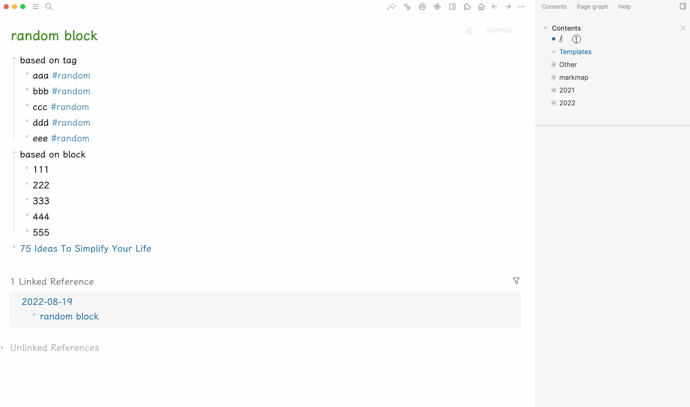

- 00:05
  collapsed:: true
	- 還在處理同步問題
	- 還不曉得是什麼原因
- 00:20
  collapsed:: true
	- [[嘗試]][[對比]] auto_sync.sh [[優化]]前 & 後
	- 總結：
		- ## **同步成功的 3 大關鍵改動**
		- **排除 `.git` 目錄，避免 Git 操作誤觸發監聽**，[[減少]]無效同步循環。
		  logseq.order-list-type:: number
		- **新增本地 vs. 遠端比對，確保 commit 後一定會 push**，避免同步卡住。
		  logseq.order-list-type:: number
		- **[[優化]] `fswatch` 讀取方式，防止解析[[錯誤]]導致腳本中斷**，提升穩定性。
		  logseq.order-list-type:: number
		-
	- 導致[[同步]]失效的細節
	  collapsed:: true
		- fswatch 監聽範圍的調整
		  logseq.order-list-type:: number
		  
		  **FROM**
		  > fswatch -o /Users/mac/Documents/Sync-Logseq | while read change; do
		  >    ...
		  > done
		  
		  **TO**
		  > fswatch -o --exclude ".git" /Users/mac/Documents/Sync-Logseq | while read -r change; do
		  >    ...
		  > done
			- logseq.order-list-type:: number
			  
			  **添加 `--exclude ".git"`**
				- **原因**：原來的腳本監聽了整個目錄，包括 `.git` 目錄。當 Git 自身更新（例如 commit、pull、push 操作時），會改變 `.git` 目錄中的內部文件，這會導致 fswatch 不斷觸發，從而干擾同步流程。
				- **效果**：排除 `.git` 目錄後，只監聽真正由 Logseq 文件內容（例如筆記變更）引起的修改，減少誤觸發，讓自動同步腳本運作得更穩定。
			- logseq.order-list-type:: number
			  
			  **使用 `read -r change`**
				- **原因**：確保讀取輸出時不對反斜線做特殊處理，這樣可以正確捕捉 fswatch 的輸出，防止出現 “command not found” 的錯誤。
				-
		- 新增檢查本地是否 ahead 的步驟**
		  logseq.order-list-type:: number
		  
		  **Before**
		  在 commit 之後，只是根據 `git diff --cached --quiet` 判斷是否有未 commit 的變更。如果沒有，就輸出 "No changes detected"。**
		  
		  **After**
		  在原有的邏輯後面，新增了一個步驟：
		  > LOCAL=$(git rev-parse HEAD)
		  > REMOTE=$(git rev-parse origin/main)
		  > if [ "$LOCAL" != "$REMOTE" ]; then
		  >   echo "Local branch ahead, pushing remaining commits..." >> $LOG_FILE
		  >   git push origin main >> $LOG_FILE 2>&1
		  > fi
			- **原因**：
				- 有時候自動同步流程中，文件內容的變更已經被 commit，但後續的 push 可能因為各種原因（例如網絡延遲或 fswatch 重複觸發導致狀態判斷不及時）而沒有成功推送到 GitHub。
			- **效果**：
				- 新增這個檢查步驟，無論是否有新的未 commit 變更，都會檢查本地分支和遠端分支的差異；如果本地 ahead，就強制執行 `git push`。這樣可以確保所有 commit 都最終被推送到遠端，從而解決因為漏推而導致同步失效的問題。
				-
- 00:40
	- 花了點[[時間]]跟 [[ChatGPT]] 研究導致 Mac 偶爾將[[滑]]鼠左鍵點擊 left-click「誤判為其他操作」或導致「選中文本失效」
	  collapsed:: true
		- 原因：
			- 在 [[BetterTouchTool]] （BTT）中將「Option + Command + Left-click」綁定為「進入全螢幕」。這樣的設定雖然能快速全螢幕，但也**可能攔截左鍵事件**，
	- 過程爲了找回其中一款 [[logseq]] [[plug-in]] 的[[作者]] seth yuan 而[[分心]]
	  collapsed:: true
		- 發現對方曾爲 [[logseq]] 創建的 plug-ins 之所以從 marketplace [[下]]架，是因爲如今新創了[[屬於]][[自己]]的產品  [Orca Note 虎鲸笔记](https://www.orca-studio.com/orcanote/)
		- [[嘗試]]了一[[下]]，雖然比 [[Logseq]] 目前多了很多功能，最爲顯著的就是
			- Sidebar 包含日曆及許多自定義標籤頁，像極了 [[Notion]] Sidebar
			  logseq.order-list-type:: number
			- 目前還在[[開發]]中 DB version 的 [[query]] 查詢功能
			  logseq.order-list-type:: number
			- [[即時]]顯示鼠標位置的行間開頭標誌
			  logseq.order-list-type:: number
		- 即便如此，[[當]]我讀到越多新的功能跟演示時，不禁感到[[抗拒]]
			- 可能[[學習]]新東西的[[時間]]成本越來越高
			- 又或者其實我[[暫時]]已經[[習慣]]了在 [[Logseq]] 上[[記錄]]日誌或做[[筆記]]，且界面也[[幫助]]我[[比較]]專注
	- 停筆於 01:39
- 過程在[[嘗試]]其他 [[Logseq]] [[plug-in]] [[分心]]
	- 
- 05:03
	- 剛[[醒來]]不久
		- 想起有些時候，[[人]]爲了淡化一件事，常喜歡說的一句話
			- 『 我也是[[人]]，也會累，也會有[[情緒]] 。。。』等
		- 然而，也許對方沒告訴我們的是
			- 『 相比[[疲倦]]或痛苦，持續的[[愉悅]]跟[[快樂]]相對還要更多。 』（ 更新於 [[Mon, 24-03-2025]] 15:26 ）
		- [[總結]]：
			- 每[[當]][[聽見]]一個[[人]]對某件事做出[[回應]]時，相比盲着[[下]][[判斷]]，此刻更[[值得]]我們留給[[自己]]多一點的[[時間]]，[[更加]][[認識]][[事實]]的[[全貌]]
	- 停筆於 05:21