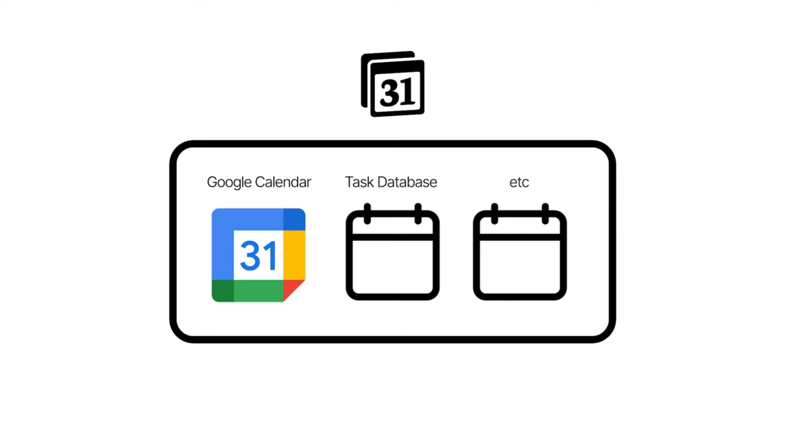

- 03:14
	- DONE 將 Diego 的 Eisenhower Matrix Template 複製 -  [[Mon, 05-05-2025]]  ｜  06:49
		- LATER 作爲自己 OKR 模板系統的決策中心
			- bottlenecks：
				- 對方的 Task Database 單層級，可能不適宜我的多層級 OKR
			- strategy：
			  collapsed:: true
				- DONE 覆盤找出  ((6816d821-06cc-4fc2-bfb6-dd32d17238e7))  的系統層級 -  [[Mon, 05-05-2025]]  ｜  08:53
					- {{embed ((6816d821-06cc-4fc2-bfb6-dd32d17238e7))}}
					  collapsed:: true
						- {{youtube-timestamp 162}}
							- Task 近似我正在用的 KR database
							- 相比 Timelinkr 專注[[時間]]流水帳；KR 更接近[上述影片](https://www.youtube.com/watch?v=z4Ce-IKXZhM&t=1s)提到可專注覆盤的地方
							- Bottlenecks：
								- 對方單靠 Task 即 Habit 同一個 databse 就可以做到 daily 乃至 weekly 和 monthly 的排程
							- Question：
								- Timelinkr VS  Key Result，哪一個 database 更合適時間排程？
							- Strategy 1：看看雷蒙的 [PAI 個人知識管理系統](https://www.notion.so/geng-is-here/PAI-18b459c690fa80de8656d5fa9fe80b95) 有沒有借鑑之處
							  collapsed:: true
								- HIGHLIGHT：
									- Project (P) 抓期限 range 而已
									  logseq.order-list-type:: number
									- Action (A) 抓 Deadline
									  logseq.order-list-type:: number
										- 可覆盤
										  logseq.order-list-type:: number
											- Flashcard
										- 比較像是 Productive Setup 的 Task database
									- Inbox (I) 爲 Project 而已提供來源
									  logseq.order-list-type:: number
										- 而 Diego 的 Inbox 更像 Thomas Frank 的 Task 收集箱（ 沒有 Due 的任務中心 ）
							- Strategy 2：找出 Productive Setup 安排 recurring taks 時，是否動用到不同 databases 的示例
							  collapsed:: true
								- {{video https://youtu.be/QAjj22dM5ZI?si=D4GvYjdh54fsshQm}}
								- {{youtube-timestamp 225}}
									- 這裏開始展示 Google Calendar 用於設置 Recurring Tasks
									- 像是我要理解的 Habits 類事項
									- 但對方改用 Button 一鍵創建 recurring habits
										- 側重於
								- Hypothesis：
									- 假設我當前的 Timelinkr 比較適宜 Single Calendar View
									- 因能同時可視化分別獨立的 KR 和 Habits
								- **Conclusion：**
									- 無效，沒有幫助我確定 single calendar 同時展示 2 個 databases
							- Strategy 3：找出 Productive Setup 用於 Ideal Week 時，動用到不同 databases 的示例
							  collapsed:: true
								- {{video https://youtu.be/SOeCzCbzCLs?si=VH7-NgE9Foi-OXGp}}
								- {{youtube-timestamp 232}}
									- 展示通常只有 1 個 database
										- Notion database
										- Google calendar event
								- {{youtube-timestamp 305}}
									- 展示當第 2 個 databases 同時存在同一個 Notion Calendar
										- 
										- Task： Timed Event
										- Groceries / Spending：Full Day event on Top
								- **Conlusion :**
									- Google Event  = 固定行程
									- 1st DB = 自由拖動的任務
									- 2st DB = 全天事項 = 置頂總覽
							- Hypothesis：
								- 相比 KR 的期限 ( Date-Range ) ， Timelinkr 具碎片時間（ Start, End ）跟具體日期（ StartEnd ），也許更合適用作時間排程
							- Supportive Reasoning：
								- 當初 [Tutorial Database](https://www.notion.so/geng-is-here/d99f99fce67946de99657100c833a4c7?v=22f872345e61427d80ef96c3051ec704) 就是爲了 integrate 現有的 Timelinkr Database 與 Google Calendar 及 Notion Calendar
								- **試驗成果** 明示：
									- 支持彈性編排 Notion Normal Tasks 跟 Google Recurring Event
							- **Conlclusion：**
								- Timelinkr 比 Key Result 更適合用作安排日、週跟月程
							- 被敲房門，暫停於 08:45
							- 08:46 確認後覺得現況不太適合，暫且繼續
			- **Conclusion：**
				- 相比 OKR 尤其 KeyResult 或 Action，相對更加扁平化的 Timelinkr 更值得應用 Eisenhower Matrix
				- 結束於 08:53