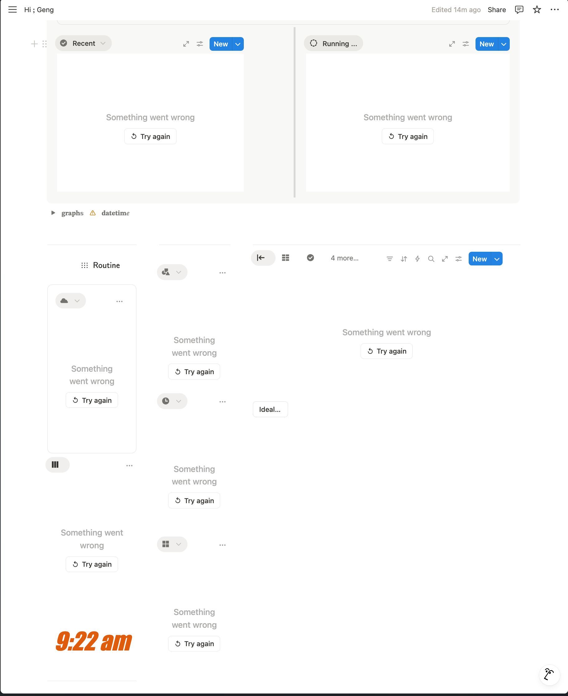

- 04:27 晚餐，沖涼
- 06:07 時間賬
- 06:17 想起剛在吃飯時有的 [[閃念]]，覺得很[[欣慰]]，像是已經[[滿足]]我真正的[[需要]]，且還在持續中
  collapsed:: true
	- 『 我發現接受[[諮商]]至今，我不是為了讓[[諮商師]][[喜歡]]我[[自己]]；相反值得向對方[[借力]]且[[幫助]]我學會更加[[認識]][[自己]] 』
	- 停筆於 06:22
- 06:22 時間賬
- 06:31 分心於小紅書
- 06:40 走動，[[緊張]]，[[心跳]][[加速]]，拍打胸口，遇到 [[Notion]] [[buttons]] [[計算錯誤]] + [[誤設]] End [[時間]]
  collapsed:: true
	- 從 [[Edit properties]] > [[Deleted properties]] 恢復 prop("🚩 [[nextStart]]")
	- 暫時沒造成整個 Notion 變慢或 [[laggy]]
	- 成功[[解決]]於 07:15
- 07:19 優化 formula
  id:: 68b4d6e7-70d9-47a8-a2ef-7481e77b3c94
- 09:11 無論 Desktop 及 網頁版 Notion 都完全沒有反應
	- {:height 317, :width 251}
	  id:: 68b4f7b6-4407-490a-a4ef-4ec871aba5ee
	- 恢復於 09:30
	  id:: 68b4f801-2499-4a32-875c-a86b4280f9e3
	- 09:35 Desktop App 再次崩潰，估計是因為在另一個視窗，試圖打開相同的頁面造成
	- 恢復於 09:37
- 09:38 繼續優對比模板 [𝘞𝘩𝘢𝘵 𝘵𝘰 𝘧𝘰𝘤𝘶𝘴 𝘯𝘰𝘸﹖August 5, 2024 18:36](https://www.notion.so/geng-is-here/August-5-2024-18-36-82f94ab8994a4307b90b4d41b3a2295d?v=abf2f960488642bda898a4c691efbf2d&source=copy_link)  VS  [𝘞𝘩𝘢𝘵 𝘵𝘰 𝘧𝘰𝘤𝘶𝘴 𝘯𝘰𝘸﹖ v2.6.2 (Bak)](https://www.notion.so/geng-is-here/v2-6-2-Bak-256459c690fa80289441d8c9920e5851?v=abf2f960488642bda898a4c691efbf2d&source=copy_link) (bak on [[Fri, 22-08-2025]])
  id:: 68b4f929-9170-4494-9d5d-e8a3be38933c
	- 結束於 23:21
	- 補充於 [[Tue, 02-09-2025]] 03:38
- 23:21 晚餐
  id:: 68b5b9f4-aa0f-45c9-8bb1-1c1375ed47ec