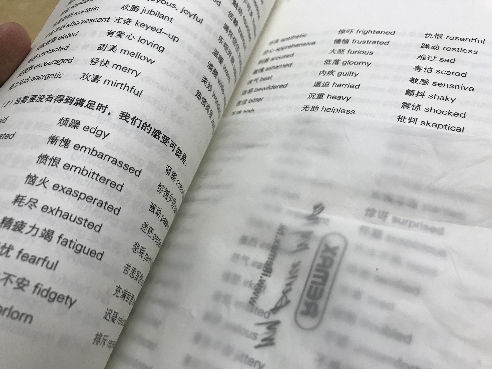

- 00:23 設置[[下]]個星期[[諮商]]的[[時間]]
- 00:25 [[時間賬]]，刷社媒，[[分心]]
- 02:15 成功找回[[自己]]大學 TARUC / TARUMT 的 email address ：ngkk-wh12@student.tarc.edu.my，[[分心]]於想要用它來升級直到 [[Notion]] edu plan，忍尿
- 03:30 排尿，刷社媒
- 03:40 關燈，調鬧鐘，休息
- 09:00 賴床，睡睡醒醒
- 09:37 [[起床]]，[[時間賬]]，走動，猶豫而決，頭兩側緊繃，心臟些許[[不適]]
- 09:47 摘[[下]]牙套，盥洗，早餐，牛奶，[[抑鬱]]，沉默應對提問，
- 10:33 [[時間賬]]，迴避非同居者忽然造訪，[[焦慮]]，[[羞愧]]，擁抱[[自己]]的[[身體]]，同在冥想，[[連結]][[自己]]未[[滿足]]的[[需要]]，[[聽見]]爺爺的孫子不僅用英語和[[自己]]的爸爸交流，且[[幫助]]爺爺處理手機容量的過程也毫不[[拘謹]]地暢所欲言，[[覺察]][[自己]][[難過]]底層的[[渴望]]，[[渴望]][[自己]]也能狗如此自由跟[[安全]]
- 11:11 [[如釋重負]]，[[記錄]][[感受]]時想哭但哭不出來
- 11:21 [[F: [[靈感]]筆記]]，打哈欠
	- 我呀，他啊，你呢
- 11:29 [[時間賬]]
- 11:50 排尿，[[羞愧]]，刻意不發出聲響，[[看見]]底層的[[渴望]]
- 11:58 [[時間賬]]
- 12:02 [[F: [[靈感]]筆記]]
  collapsed:: true
	- 揣摩[[自己]]的爺爺極可能曾向[[自己]]的兒子 Kiong 透露有關我平時和嫲嫲[[溝通]]經常失控這件事
	- 忽然有啟發：不[[希望]]別[[人]]知[[道]]的事情，[[當不幸經過第二個[[人]]口中傳了出去，我估計聰明的[[人]]通常都不會向對方興師問罪；即便再有信心[[聽見]]對方這樣說或那麼做，對方也隨時刻意否認到底
	- [[總結]]：比起控制別[[人]]的嘴巴，我的[[情緒]]與[[渴望]]更[[值得]]由[[自己]][[安撫]]和[[看見]]，從改變其他[[人]]轉為花力氣[[認識]][[自己]]
- 12:09 繼續[[時間賬]]
- 12:20 [[F: [[靈感]]筆記]]
  collapsed:: true
	- [[quick capture]]:  
	- 用類似 matte 霧面的材質放在書頁上，[[移動]]時不僅觸覺上感到療愈，且[[當]]我需逐行查資料時，在不完全屏蔽任何內容的前提[[下]]，還[[幫助]]到[[自己]]更[[直覺]]地選擇性[[專注]]，還有及時[[減少]][[視覺]]干擾
	- [[想法]]：可能也適用於非但有閱讀障礙，且對觸感也相[[當]]敏銳的紙本讀者和甚至文具使用者
	- [[挑戰]]：若造成翻頁過程變得更麻煩，比如必須手動每[[一頁]][[切換]]位置，極可能勸退更多[[人]]
	- [[論述]]：相對實體的書籤，這個霧面紙更[[需要]][[頻繁]]地被[[移動]]
	- 停筆於 12:38
- 12:38 瞭解 [[weary]]、 [[lethargic]] 還有 [[fatigue]] [[之間]]的[[區別]]及個別[[合適]]的使用場景
- 12:52 [[時間賬]]
- 13:30 [[分心]]於[[優化]]共享頁面 [Therapist access only](https://geng-is-here.notion.site/264459c690fa80f8a293c3c5a27bdb6a?source=copy_link)
- 14:22 測試[[軟件]]新功能，ChatGPT 和 Claude 免費[[用戶]]無法使用 [[Notion]] connectors
- 14:37 刷社媒，忍糞
- 15:00 [[蹲廁所]]，[[沖涼]]，[[主動]][[回應]]對方的提問
- 15:17 [[午餐]]，[[羞愧]]，[[緊張]]，[[焦慮]]，[[壓抑]]，[[深呼吸]]，閉目養神，[[允許]]我[[自己]]所有[[感受]]流淌
- [[16]]:36 [[時間賬]]
- [[16]]:38 [[排便]]，[[沖涼]]，狂流鼻涕
- [[16]]:52 Declutter Safari Bookmarks
- 17:29 [[時間賬]]
- 17:36 檢查保費
- 17:39 繼續[[時間賬]]，[[忽略]]式[[哼唱]]
- 18:19 [[不小心]]睡著，打瞌睡，排尿
- 18:23 [[時間賬]]
- 19:42 刷社媒