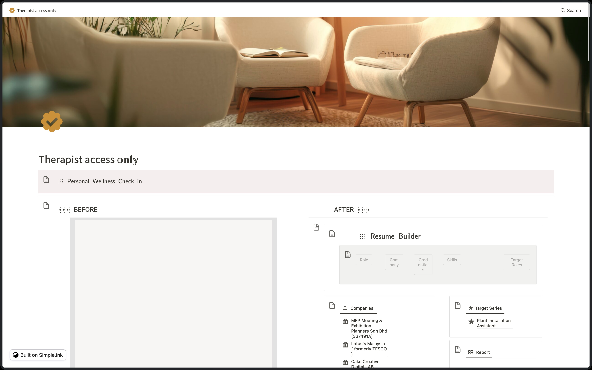
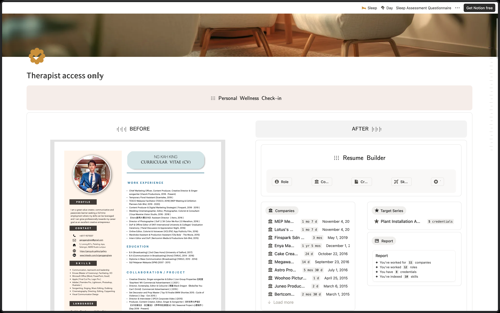

- 02:52 [[時間賬]]
- 04:19 排尿，查實所聽所見，晚餐，清洗廚具，刻意不發出聲響，[[熱水澡]]
  id:: 68cdbab0-5ee5-4085-95d4-e505a425c367
- 05:14 [[時間賬]]
- 05:18 藉助 [[Notion]] [[AI]] Agent，繼續 ((68cda54b-c556-4d64-a7a3-85408d082e63))
- 12:30 [[關燈]]，調[[鬧鐘]]，閉目養神
- 12:34 [[睡覺]]
- 15:48 [[醒來]]，[[賴床]]
- 15:53 [[起床]]，解除[[鬧鐘]]
  id:: 68cdc8cc-29c2-4117-8ac4-6319d192adc0
- 15:54 查實所聽所見，已[[下]]載 PDF 充斥 表格，
- [[16]]:26 [[沖涼]]
- [[16]]:33 [[出門]]，[[深呼吸]]，倒數
- [[16]]:50 [[抵達]][[目的地]]
- 18:05 [[諮商]]環節結束
- 18:18 到家
- 18:30 [[分心]]於強迫地[[確認]]我的 [[Notion]] 共享頁面 [Therapist access only](https://geng-is-here.notion.site/264459c690fa80f8a293c3c5a27bdb6a?source=copy_link) 或[自定義網域](https://wellness.thesimple.ink/)能夠成功被 published 在 [[Simple.ink]]
	- 19:47 經[[確認]]結果不是我[[理想]]的樣子
		- 
	- 相對地，[[Notion]] 原生態發佈的界面已經[[足夠]]美觀 + 整潔
		- 
- 19:50 [[時間賬]]
- 21:09 忍餓，藉助 [[Notion]] [[AI]] Custom Agents，繼續處理 Job 及 My [[Resume]] 相關的瑕疵