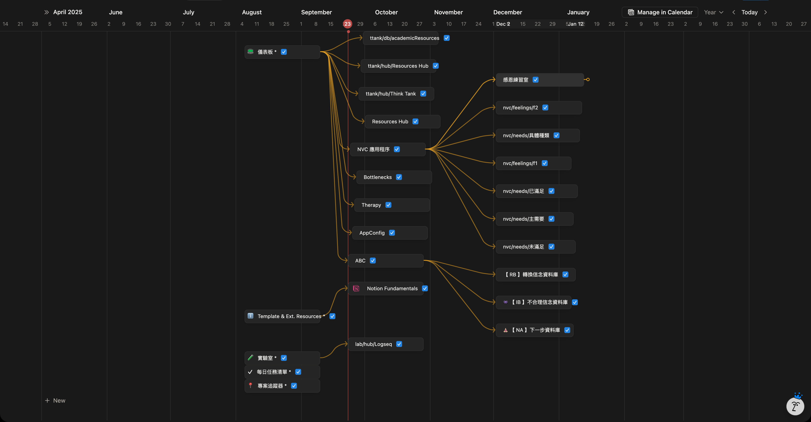

- 02:09 重啟電腦
- 02:12 [[時間賬]]
  id:: 68d03f65-f22f-45df-907d-9cfb713e19dd
- 02:30 補填 [[Sun, 21-09-2025]] 的 [[Sleep Log]] / [[Sleep Assessment Questionnaire]] [[記錄]]
- 02:34 [[時間賬]]
  id:: 68d045aa-91e0-4205-be21-c646e015ba01
- 06:38 排尿
- 06:47 [[關燈]]，休息，哼唱
- 07:02 搜歌《即將上映的美麗》
- 07:17 比較難入睡，脾胃不適
- 15:50 因[[鬧鐘]][[醒來]]，在這之前至少醒過來 1 次；但沒有紀錄
- 15:54 回籠覺
- 17:54 記錄夢境，在這之前因為不適或作夢，至少醒過來 2 次；同樣沒有紀錄
  collapsed:: true
	- 夢見諮商師第一次帶我進到一個比較寬敞的諮商室，但燈光昏暗，只見光線全靠落地窗外的外光照射進來
		- 當我坐下之後，對方先問我覺得怎樣，然後就說這是他們 senior 平時在用的空間
		- 我嘗試在回答的時候，卡住很久，想說挺舒服，但又感覺到很疑惑為什麼要選擇這麼暗的空間，我感到匪夷所思
		- 直到莫名其妙房外來了一個陌生人，我起身迎接對方了以後，才從對方的提問警覺自己剛剛在對話的對象竟是鬼魂
	- 還夢見香港演員張國強是個超狂熱的手辦收藏家，在影片明顯看見他為自己製作一套又一套的 Cosplay 套裝，最誇張的可以進步或狀態化超過 5 層
		- 我像是忽然超越了空間，下一秒出現在對方收藏手辦處附近的座位上，手裡還領著一個空的塑料袋
		- 下一秒，只見張國強向我走來，我連忙羞愧地解釋為什麼自己會出現在這裡，說希望向對方借他其中一套手辦，用作節目上展示，當問起 1 天沒還回來怎麼辦時，我感到不知所措
	- 還夢見跟 Jerry 楊昇碰面，雖然已知對方已經完成自己的博士學位，但從他和另一個人的對話中才得知揚昇自認是個 ADHD 患者
	- 停筆於 18:11
- 18:15 起床、喝水、補充日誌
- 18:24 [[分心]]於將[[需要]]的 [[Notion]] Pages 設為 [[favourite]]，[[目的]]為 [[Notion]] [[Business Plan]] 自動將它們[[下]]載為 [[Offline Mode]] 使用
  id:: 68d12394-8691-4539-a80a-033ded77f346
	- 藉助 [[Notion]] [[AI]] Custom Agents，於 [My Notion 頁面管理中心](https://www.notion.so/geng-is-here/276459c690fa80889016ef4c52ace6f4?v=276459c690fa801b9595000c3232e69a&source=copy_link)，中心化[[管理]]  [[Notion]] 所有頁面，強迫性[[執行]]，[[忽略]]式[[哼唱]]，忍餓
	  id:: 68d1db3d-5db8-44ee-adcc-fd07544197c1
	- 
	- 結束於 [[Tue, 23-09-2025]] 09:03