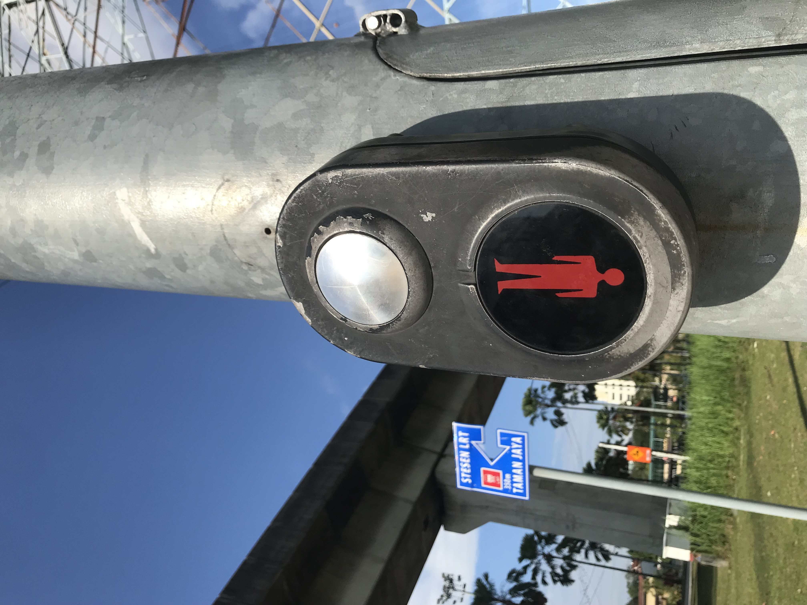

- 03:06 因[[不適]][[醒來]]，排尿，晚餐，反覆回想昨天發生的事，[[焦慮]]，蔬果，吃小食，離子化飲用水
- 03:56 [[時間賬]]，[[整理]] UI，咬嘴皮
- 05:01 更新日曆：[[下]]一次[[諮商]]環節 [[Mon, 13-10-2025]] 15:30 - 17:00
- 05:04 打哈欠，[[強忍睡意]]，咬嘴皮，Notion [[Calendar]] 建立新視圖──Eisenhower 及匹配[[顏色]]，[[調整]] UI，強迫性做事，猶豫而決
- 07:37 [[換衣]]， 喝水
- 07:42 排尿
- 07:50 中途遇到家人干預，爆粗，安撫自己，控制性想法
- 08:46 出門，徒步
- **09:02** [[quick capture]]:  
- 09:15 抵達公園
	- [[quick capture]]:  
- 09:25 時間賬
- **10:44** [[quick capture]]:  
	- 光著腳丫子，一邊踩著水，一邊哼唱，感覺挺滿足
		- Goodbye my love my children
		- 一點點光
		- 聽世界的聲音
- 12:10 到家，修理漏水的水喉，感覺好像中暑，手洗衣物，手洗拖鞋，熱水澡
- 14:29 喝水，換衣，午餐，暴食，急促進食，覺察亢奮，清洗廚具，抗拒，疲倦，
- 15:45 [[F: [[靈感]]筆記]]，[[造句接龍]]
	- 『 會[[忘記]]，也會[[記得]] 』
- 15:46 主動打開冷氣，時間賬，哼唱
- 16:00 [[換衣]]，看視頻，喝水
-