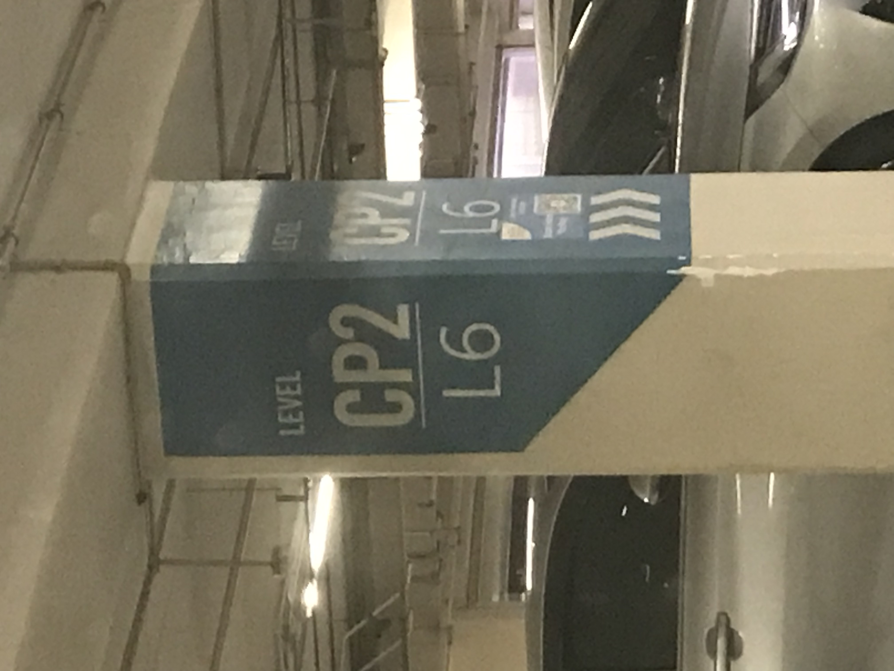

- 01:54 [[排便]]，刷社媒
- 02:14 看視頻，強忍睡意，
- 02:20 關燈，睡覺
- 11:20 因鬧鐘醒來，解除鬧鐘，回籠覺
- 11:38 賴床
- 11:42 喝水，起床，刻意放慢動作，時間賬
- 11:45 藉助 [[Notion]] [[AI]] 為 Habits 資料庫 488 頁做 semantic tags
- 12:57 排尿，[[午餐]]，清洗廚具，[[覺察]][[滿足]]，[[沖涼]]，盥洗，摘[[下]]牙套
- 14:21 藉助 [[Notion]] [[AI]] 為 Habits 資料庫 488 頁做 semantic tags，忍尿，[[聽見]][[家人]][[之間]]的暴力[[溝通]]，[[連結]]未[[滿足]]的[[需要]]，[[覺察]][[焦慮]]，[[輕撫[[自己]]的頭]]，[[覺察]][[感受]]及[[想法]]背後更深層的[[渴望]]
- 17:18 排尿，晚餐，[[聽見]][[家人]]的暴力[[溝通]]，遠離到[[安全]]的地方，[[沖涼]]，[[輕撫[[自己]]的頭]]，[[連結]]未[[滿足]]的[[需要]]
- 18:17 藉助 [[Notion]] [[AI]] 為 Habits 資料庫 488 頁做 semantic tags
- 18:40 [[換衣]]服，查實所聽所見，網搜資訊，看視頻
- 19:25 出門時遇到家人開門，迴避與家人接觸，遠離到安全的地方，猶豫而決，連結未滿足的需要，半躺半坐，回想過往的童年
- 20:16 出門
- 20:49 抵達目的地 CP2, L6
- **20:51** [[quick capture]]:  
-
- 23:23 剛從電影院出來，找不到回到停車的入口，輕拍自己的胸口，緊張
- 23:34 終於找到了停車的位置
	- 回家途中不太順利，繞了遠路，[[害怕]]，[[緊張]]
	- 於 [[Thu, 09-10-2025]] 00:12 [[安全]]到家