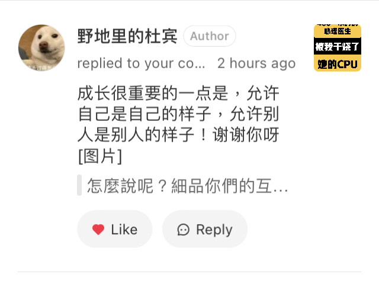
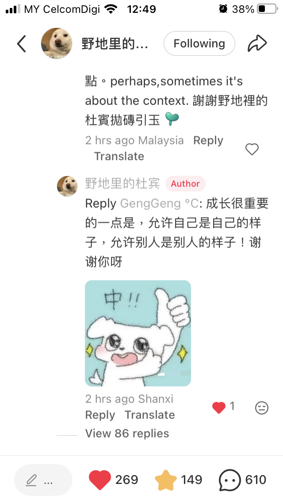

- 07:15 冷斃醒來，走動，主動關閉冷氣，重新蓋被，賴床，看見夢境背後的感受，回想感情的經歷，默哀，覺察孤獨，覺察感受及想法背後更深層的渴望，輕撫自己的頭，頭頂覺壓迫，無風狀態，同在冥想
- 07:32 半躺半坐，緩衝，時間賬
- 07:40 走動，緩衝，晾乾衣物
- 07:52 無風狀態，刷社媒，留言，修正信息，草擬信息，覺察滿足，猶豫而決，亢奮
- 10:56 早餐，走動，泡熱飲，吃小食，確認對方的需求，查實所聽所見
- 12:03 排便
- 12:24 沖涼
- 12:34 刷社媒，讀網評，無風狀態，坐著，覺察滿足
	- 在小紅書野地裡的杜賓貼文留言後，收到對方的回覆時，感到互相鼓勵：
	  id:: 68ff0d0a-240b-417a-b68b-480d76b42665
		- 怎麼說呢？細品你們的互動時，我其實讀到諸位對生命不僅有獨到的見解，且還流露許多好奇和善意，妙的或許是角度方向不同而已。比如說呀當聊著對人或工具的「信任與存疑」這議題，雖佔比比例不同，對「負責」的見解和執行面也未必一致，可是啊諸位一步一腳印的歷程又何嘗不也是鮮活且真實的呢[玫瑰R] 這不禁令我想起《奇葩說》節目上各方棋逢對手一起思辨跟互相交流的情境，時而拷問彼此，時而流露英雄識英雄的曖昧，看得觀眾有時也挺不好意思的。幸運的是呀，聽眾也耳濡目染收穫到更多維的切入點。perhaps,sometimes it's about the context. 謝謝野地裡的杜賓拋磚引玉 [种草R]
		- **12:53** [[quick capture]]:  
		- **12:54** [[quick capture]]:  
		-
		- 成长很重要的一点是，允许自己是自己的样子，允许别人是别人的样子！谢谢你呀
- 12:55 換衣，無風狀態，為外出購物，找不熟悉的舊物，喝冷飲，走動
- 13:48 查信息，收到通知實習[[諮商師]]已經換聯繫號碼，從 016-221 9688 改用 018-202 8869，利用 iMazing，從 [[WhatsApp]] 導入 [[Notion]] 跟 Jacqueline，藉助 [[AI]] [[工具]]回信，草擬信息，修正信息，坐著，暗室直視 3C，咬嘴皮
- 17:05 緩衝，喝水，查信箱，強忍黏膩的皮膚，猶豫而決，Reload Prepaid，暗室直視 3C，咬嘴皮，走動
- 17:30 出門，開車
  id:: 68ff3704-57b5-41f8-90b8-fe46375e90e2
- 17:47 抵達目的地 Star Grocer, Taman Paramount，開始購物
	- 19:39 一共消費 98.30
	- 覺察滿足
- 19:40 開車回家，間中到便利店購買 100 Plus Zeo Sugar x6 和 Ice Lemon Tea x1
- 20:14 到家，收納食材
- 20:35 晚餐，清洗廚具，簡單謝謝對方，強忍黏膩的皮膚，刷社媒，吃小食
	- 結束於 [[Tue, 28-10-2025]] 04:06
-
-