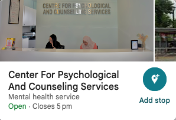
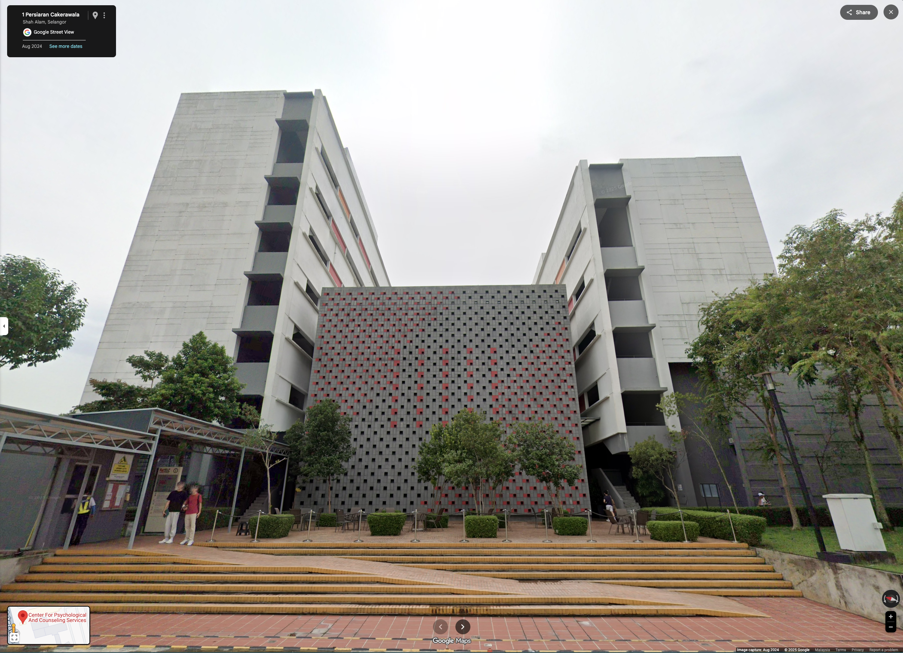

- 02:41 主動關冷氣，腰痠，時間賬，喝水
- 02:45 關燈，皮膚抹上 lotion，閉目養神
- 02:51 睡覺，作夢，睡睡醒醒
- 10:35 緩衝，因冷斃醒來，重新蓋被，抱抱自己
- 10:45 緩衝，走動，
- [[10]]:50 坐著，[[哼唱]]，為明天 [[Tue, 04-11-2025]] 11:30 - 14:30, HELP Uni 的 OCPD Assessment 規劃行程：ASSMT/Therapy: Jacq #14 (Cont. JC 46)
	- 
	- 
	- **Google Maps:**
		- [https://maps.app.goo.gl/RzbkaNphD4at22wj6?g_st=ic](https://maps.app.goo.gl/RzbkaNphD4at22wj6?g_st=ic)
	- **WAZE:**
		- [https://waze.com/ul/hw284nf8vu](https://waze.com/ul/hw284nf8vu)
- 12:24 查看信箱，閱讀，[[覺察]][[滿足]]，刪 email，更新 UNVAILABLE [[Therapy]]: Jacq #16 (Cont. JC 46) 的行程
- 13:05 [[學習]]，入耳式耳機，查實所聽所見 Hurt vs Heard
	- <a onmousedown="(function(e){e.stopPropagation();})(event)" style="width:720px;height:140px" class="link_preview__root" href="https://www.youtube.com/watch?si=-f9na3Rd-835TWQn&amp;v=xg8VegC9-pE&amp;feature=youtu.be" target="_blank">

Free American Accent Training Pronouncing Hurt vs. Heard

SMART American Accent Training with Speech Modification.Start your free trial of our courses: https://courses.speechmodification.com/Join this channel to get...

https://www.youtube.com/watch?si=-f9na3Rd-835TWQn&amp;v=xg8VegC9-pE&amp;feature=youtu.be

</a>
- 13:35 走動，盥洗，摘[[下]]牙套，[[沖涼]]，[[午餐]]，[[排便]]，[[覺察]][[滿足]]，清洗廚具
- 15:06 半躺半坐，坐著，聽[[音樂]]，入耳式耳機，Outline 預設[[專注]]點，[[表達]][[看見]]、[[感受]]、[[需要]]和請求、文字提問，[[覺察]][[焦慮]]，咬嘴皮
- 17:33 咬嘴皮，藉助 [[Notion]] [[AI]] 分析[[下一步]]改善當前的 Productivity Setups 和 Use Cases，坐著，半躺半坐，聽[[音樂]]，入耳式耳機
- 18:33 晚餐，對他[[人]]說教
- 21:56 開[[車]][[出門]]，檢查引擎油，打風，走動，覺察亢奮，喜悅，羞愧，難
- 23:48 到家，排尿，[[主動]]打開冷氣，[[沖涼]]，走動，盥洗，戴上牙套，裸上半身，將新買的 Gatsby Messy Layer 髮蠟保留一部分到 Spiky Edge 粉紅容器裡，修甲
	- 結束於 [[Tue, 04-11-2025]] 01:18