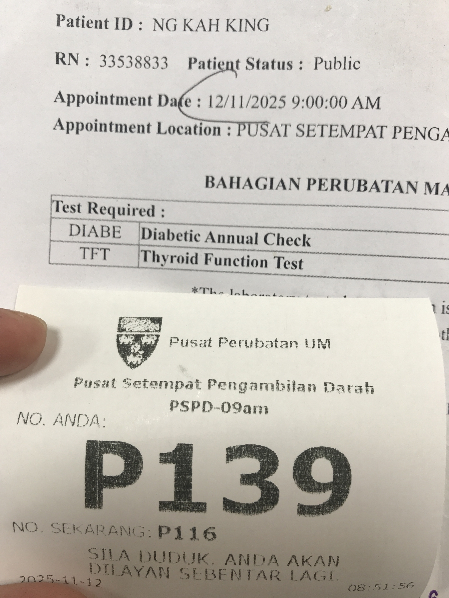
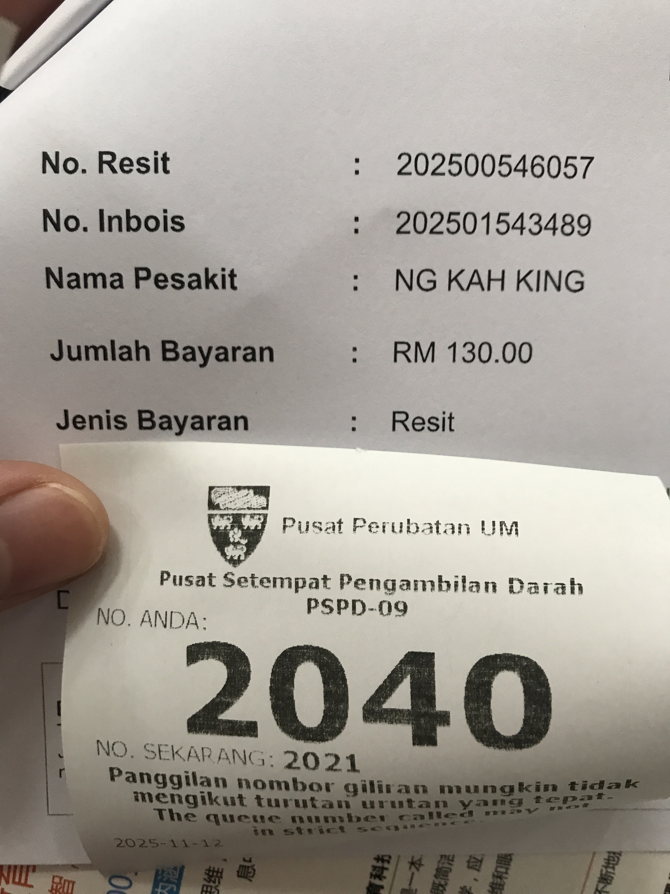
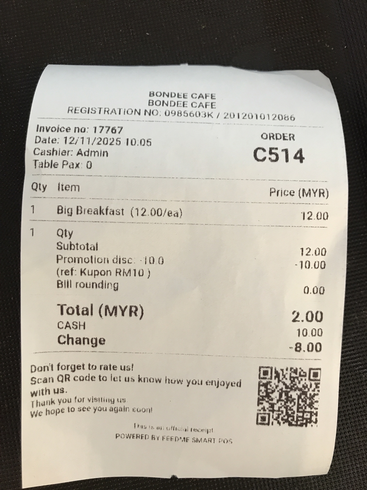

- 00:00 [[確認]]行程，[[確認]]未付驗血[[費用]]，[[確認]]賬戶現金流，坐著，調[[鬧鐘]]
- 00:21 [[關燈]]，皮膚抹上 lotion，閉目養神
- 00:30 睡覺，作夢
  04:58 夢醒，因冷斃醒來，重新蓋被，覺察焦慮
- 06:50 因鬧鐘醒來，解除鬧鐘，賴床
- 06:57 緩衝，走動，時間賬，暗室直視 3C，查實所聽所見，確認未付醫藥費用，喝水
- 07:08 排尿，盥洗，摘下牙套，走動，換衣，猶豫而決，覺察焦慮
- 07:30 開車出門，遇到摩哆客鳴笛，覺察害怕自己阻礙交通，趕快逃走
- 07:37 把車停在 HeadRush Laundry (Seksyen 8) 附近，覺察不安，下車發現前面爆胎
- 07:41 決定改乘公共巴士
- 07:48 等候巴士—PPUM，時間賬，覺察焦慮，害怕，恐懼，猶豫而決，處理 Cepat 登入失敗
- 08:19 上了巴士——PPUM
- 08:45 抵達目的地 PPUM，前往抽血中心，入耳式耳機，聽音樂
- 08:54 掛號，等候，入耳式耳機，覺察焦慮，緊張，輕拍肋骨，抱抱自己
	- 
- 09:19 因眼前事物[[分心]]，順利從 [[Gallery]] 找到過去換輪胎 🛞 的付費紀錄
	- {:height 215, :width 278}
- **09:23** [[quick capture]]:
	- 
	- 
- 09:25 等候，走動，撿起垃圾丟掉
- 09:35 抽血，尿液採樣，排尿
- 09:57 走動，查實所聽所見— Bondee Cafe 食物物價
- 10:03 點餐 Big Breakfast (Ketchup Red Bean, 3 Short Sausages, Salad, Omelette, Garlic Bread x 2 slices) RM12，使用 Coupon RM10，猶豫而決，掛號，等候
	- 
- 10:19 早餐，在外用餐，入耳式耳機，聽音樂，覺察滿足
- 10:34 走動，入耳式耳機，聽音樂
- 10:46 等候巴士——LRT Taman Jaya，坐著，入耳式耳機，聽音樂
- 10:55 上了巴士
- 11:11 到站
- 11:19 走動到 Foreman 車廠，途中改變主意，暫時打消馬上修理車輪胎的念頭
	- 
- 11:26 決定先將已經爆胎的車從 HeadRush Laundry 附近駕回到家門前原位
- 11:38 到家，換衣，打哈欠，疲倦，時間賬，輕撫自己的頭
- 11:49 手上的事停止，發呆，頭頂覺壓迫，輕撫自己的頭，覺察抑鬱，難過
- 12:08 迴避與家人接觸，適當躺一下，抱抱自己，覺察羞愧，焦慮，咬嘴皮
- 12:36 沖涼，吃蔬果，覺察抑鬱，難過，反覆回想成年往事，排尿
- 13:08 刷社媒
- [[14]]:37 OGC，入耳式耳機
- 15:04 排尿，走動，吃蔬果，吃甜食
- 15:33 刷社媒
- [[16]]:40 乾洗 3C 產品，清理雜物，抹地，拖地，手洗風扇，打掃[[自己]]的[[房間]]，中途遇到[[家人]]干預，[[覺察]][[憤怒]]，[[焦慮]]，[[難過]]，流汗，手洗拖鞋
- 20:25 喝水，走動，晚餐，清洗廚具，[[確認]][[自己]]的手尾，[[看見]]大只的蚱蜢🦗，[[覺察]][[害怕]]，[[沖涼]]，喝冷飲，[[覺察]][[滿足]]，吃蔬果，吃小食，修甲
- 21:42 皮膚抹上 Lotion，
- 21:45 OGC，皮膚抹上 Lotion，入耳式耳機
  id:: 69148f67-016e-4d2e-bfb6-aaaac629af61
- 22:42 乾洗 3C 產品，走動
- 23:08 回信，藉助 [[AI]] [[工具]]草擬信息，刷社媒
- 23:48 走動，喝水
- 23:51 半躺半坐，[[整理]] [[Notion]] 的[[模板]] Fundamental
	- 結束於 [[Thu, 13-11-2025]] 00:52