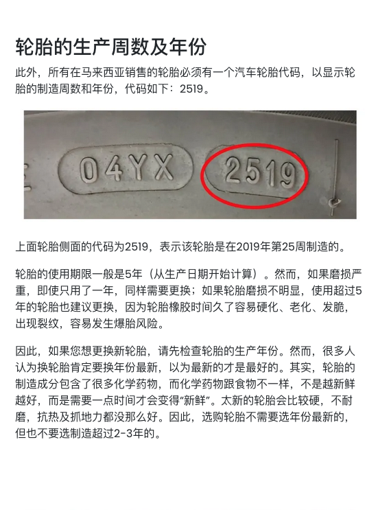

- 00:52 強忍[[大腿]]屁股麻痺，強迫性做事，半躺半坐，網搜資訊，因眼前事物[[分心]]：中途打算讓 [[Notion]] [[AI]] 據新 Productivity System 邏輯來新增追蹤事件，結果陷入手動創建全新的 KR 和討論
- 02:28 因眼前事物[[分心]]，強忍[[大腿]]屁股麻痺，強迫性做事，半躺半坐，
- 02:53 刷社媒，走動
- 03:03 排尿，走動
- 03:09 關燈，閉目養神，聽音樂
- 03:30 睡覺
- 09:00 因鬧鐘醒來，解除鬧鐘，睡睡醒醒，睡睡醒醒，因外部聲音醒來，因疲倦起不了身，作夢，夢醒，回籠覺
- 15:48 因不適醒來，喝水，緩衝
- 15:57 走動，[[緩衝]]，打哈欠，坐著，找出上一次[[車]]爆胎後換輪胎的收條，查實所聽所見 195/55/R15 相關的[[車]]胎標示，猶豫而決
	-    
- 17:30 坐著，[[時間賬]]
- 17:34 盥洗，摘[[下]]牙套
- 19:08 清潔雜物，將昨天打掃房間剩下的灰塵