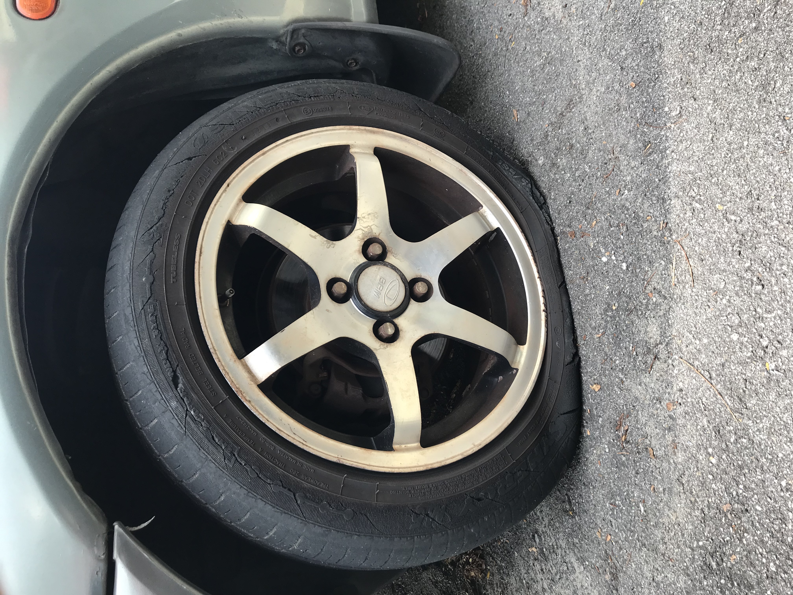
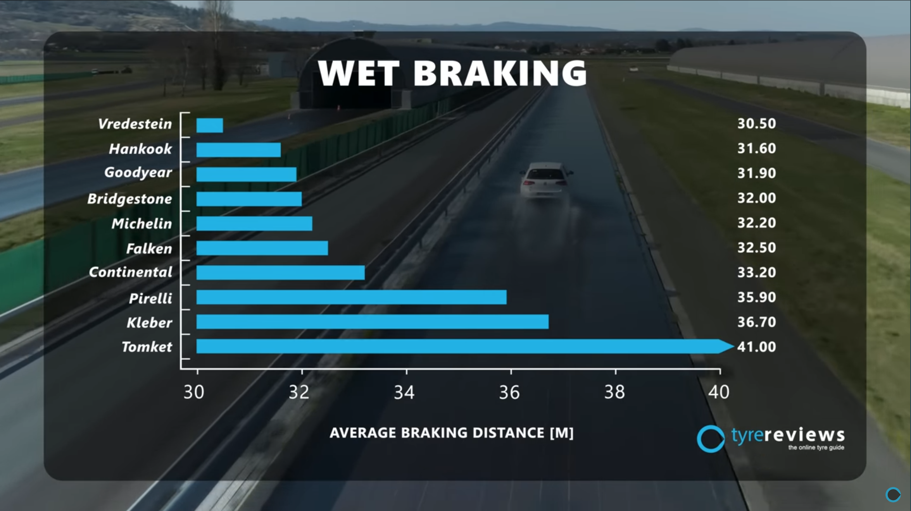
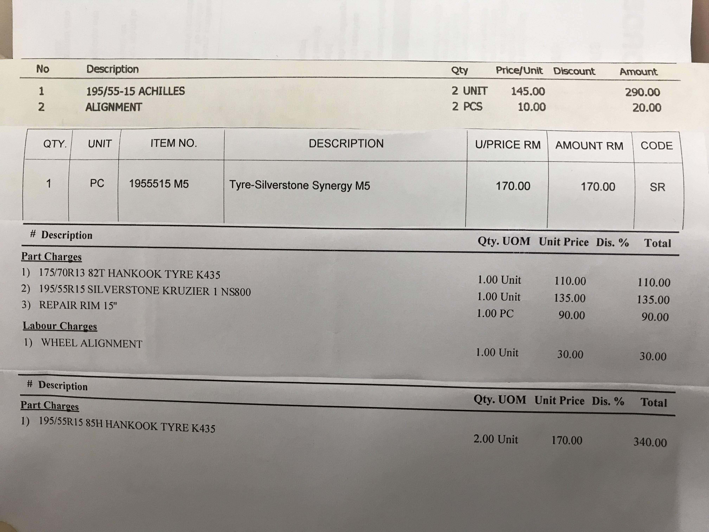
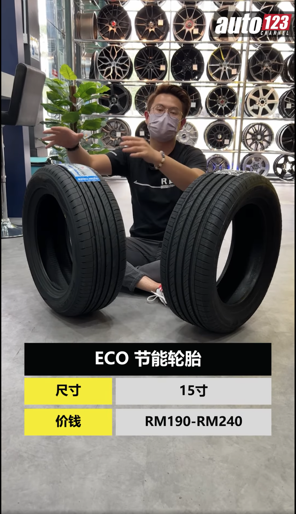
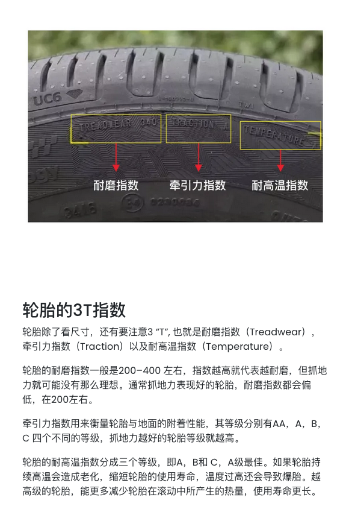
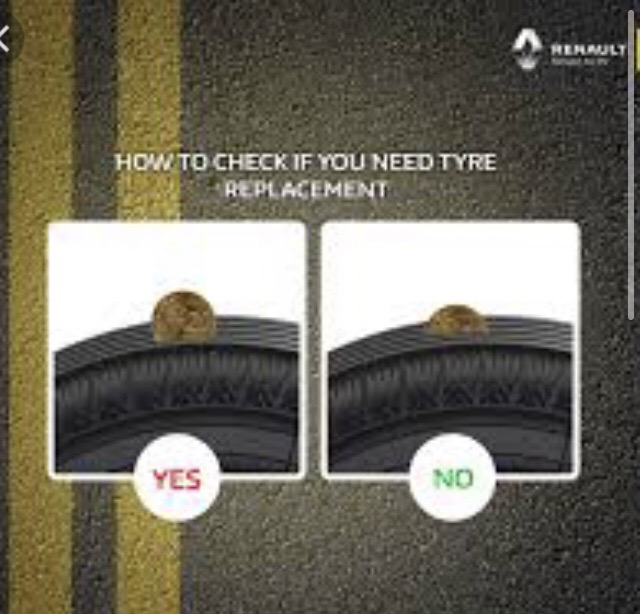
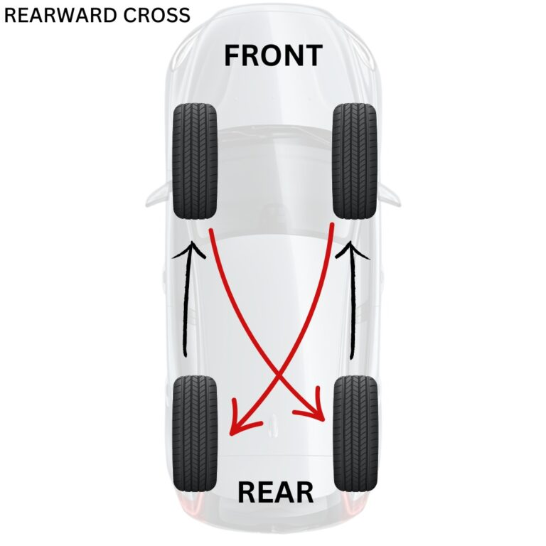
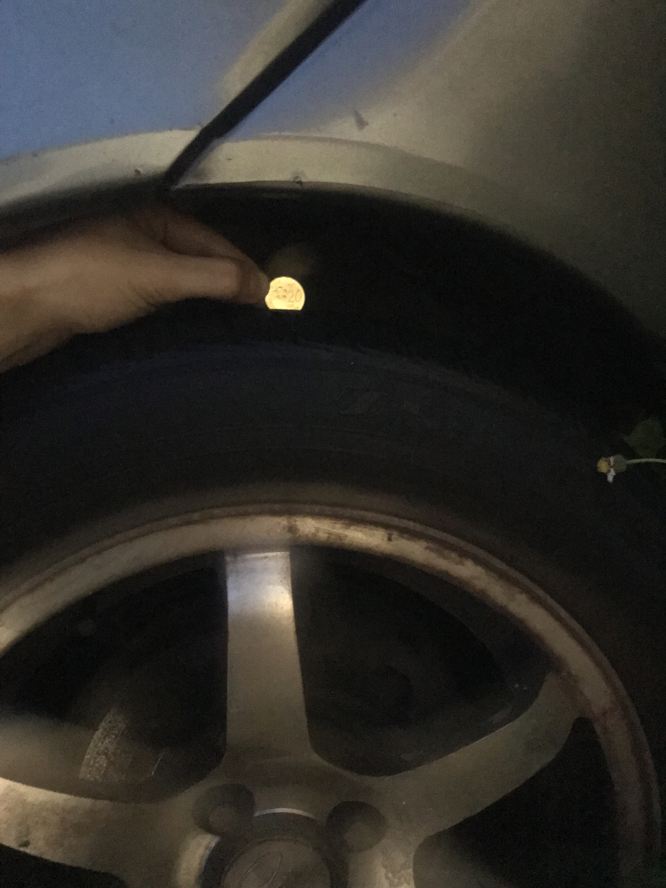
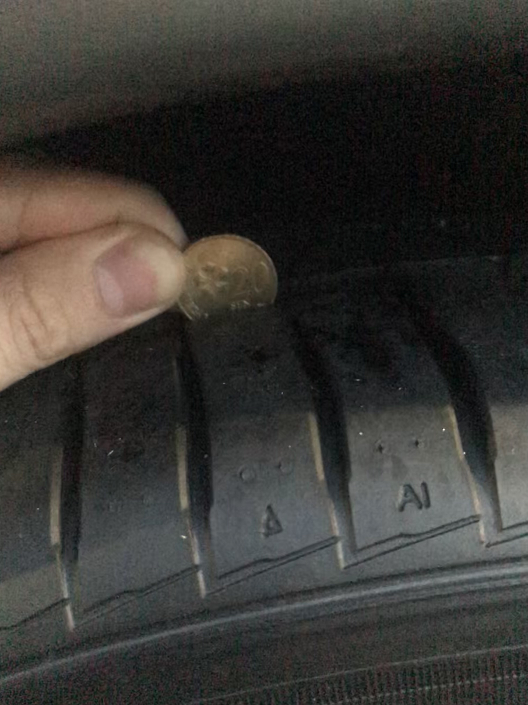
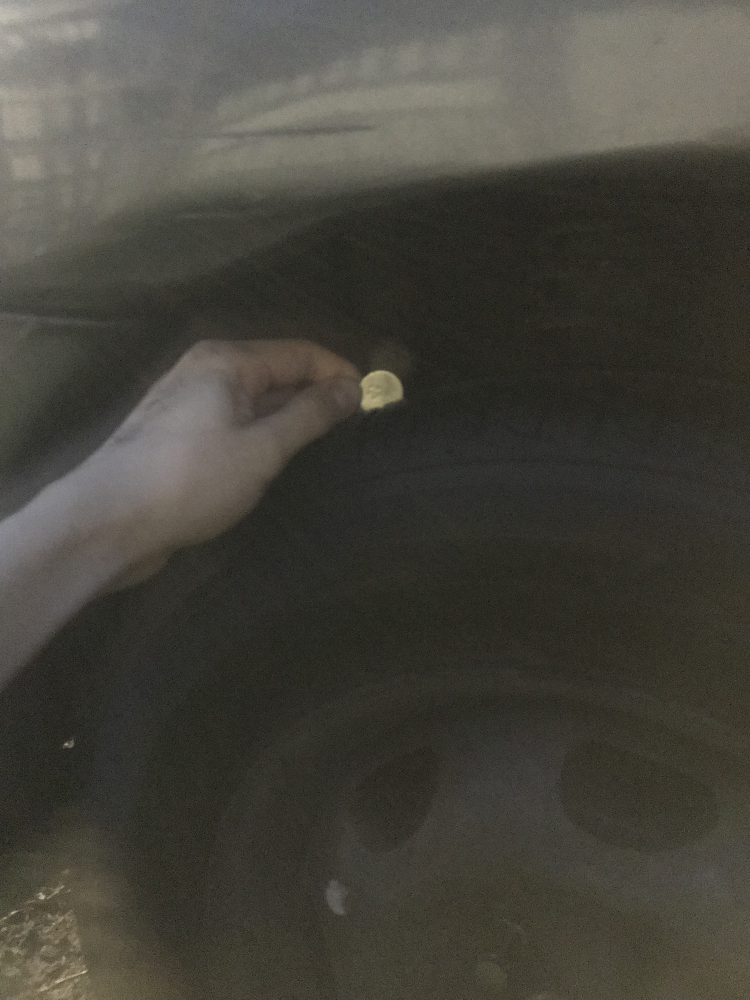

- 00:40 遠離到[[安全]]的地方，流淚，[[覺察]][[難過]]，同在冥想
- 01:[[10]] [[時間賬]]，反覆回想昨日發生的事，發呆，手上的事停了[[下]]來，喝水
- 01:20 盥洗，排尿，猶豫而決，戴上牙套，皮膚抹上 lotion，網搜資訊——莫文蔚《慢慢喜歡你》歌詞
  02:13 聽 ambience，聽音樂，覺察抑鬱，難過，有想要服藥致死的想法，和從非法管道取得安樂死藥物的念頭，且也害怕誤買了毒品，淪為被非法人士操控的誘餌或利用工具，流淚，輕撫自己的頭
- 02:32 聽 ambience，聽音樂，關燈，閉目養神
- 02:40 睡覺，作夢
- 08:30 夢醒，賴床，因冷斃醒來，重新蓋被
- 09:00 走動，[[主動]]關閉風扇，無風狀態，半躺半坐，[[記錄]][[夢境]]
  collapsed:: true
	- 夢見自己在車上主動向 Ah Loh 談起 Kemaman 藏著地下城的傳說，還引用自己不了解的例子——超現實主義，務實主義，浪漫主義
		- 去載建立的過程，我在自個地只顧著表達和說服對方相信我所相信的
		- 到了上班的地方——咖啡廳，客人忽然變多，老闆娘（掌權者）純粹僅落下一聲 「動作快一點，大體到了」，只見每一個員工趕緊就把桌上的碗碟迅速收起來，我也隨著加快動作，卻發現雙手一次性扛住的客人吃完後留下的這些餐具，盤上還有許多廚餘，當下我邊緊張地執行任務，邊恐懼身上的白制服被染上污漬
		- 下一刻，我跟 Ah Loh 站在廚房洗東西，隔著 Ah Loh 的身邊還有 Fu Ji Wei，三個人並列站著，好想在一起護著什麼東西
			- 當我嘗試說話或剛表達完不久，只見 Fu Ji Wei 的手忽然伸向我的所在的位置，這時我條件反射地抓住對方的左手，擔心被攻擊
			- 最後，類似我反問了對方「難道你要他活著嗎！」，指的正是我們洗水盆下[[櫃子裡藏著的[[屍體]]]]
	- 停筆於 09:24
- 09:24 喝水，[[緩衝]]，走動
- 09:35 [[主動]]打開風扇，[[時間賬]]
- 09:39 將[[自己]][[需要]]換的新輪胎或尺寸寫在紙上，網搜資訊，藉助 [[AI]] [[工具]]，Outline [[專注]]點，一起討論關於換輪胎之前[[值得]]做的功課及各種應對秘訣，坐著，強迫性做事，[[覺察]][[焦慮]]，[[表達]][[看見]]、[[感受]]、[[需要]]，請求，文字提問，[[記錄]][[閃念]]，忍餓，手摳耳屎
  id:: 691a7cbf-1c23-4f52-9da4-29555e38ec63
  collapsed:: true
	- 除了衣食住行之外，原來[[印象中[[大人]]對待[[孩子]]的方式]]，同過去的社會等[[無異]]，也[[無益]]
	- 
	- 
	- 
		- 
	- 
	- 
	- 停筆於 16:02
- 16:03 補眠
- 18:20 因冷斃醒來，賴床
- 18:40 緩衝，喝水，走動，換衣
- 18:50 走動，查實所聽所見，用硬幣 🪙 檢查汽[[車]]輪胎 🛞 tread depth
  collapsed:: true
	- 
	- 
	- Left Front Tread Depth (已爆胎）
		- _1763387057752_0.jpeg)
	- Right Front Tread Depth
		- 
		- _1763387253601_0.jpeg)
	- Left Rear Tread Depth
		- 
	- Right Rear Tread Depth
		- 
- 19:34 到家，紀錄剛拍下的四輪 tread depth，無風狀態
	- 停筆於 19:44
- 19:45 排尿，[[熱水澡]]，[[蹲廁所]]，同在冥想，[[覺察]][[滿足]]，晚餐，簡單感謝對方，吃蔬果，盥洗，戴上牙套
- 21:26 [[記錄]][[閃念]]
  collapsed:: true
	- 吃芥菜[[感覺]]到苦；但搭配芽菇一起吃卻驚喜地少了很多苦，這時便聯想到[[生活]][[好]]像也是這樣，覺得太苦的時候很難活[[下]]去是很正常的，或許[[覺察]][[生命]]中其他[[價值]]作為配搭就[[感覺]]還可以走[[下]]去
- 21:26 和 [[AI]] [[工具]]商量明天換新輪胎過程含[[策略]] + [[彈性]]應對 + 新要求的 **終極口袋戰[[術]]手冊**，[[覺察]]頸椎痠痛，強迫性做事，[[焦慮]]
  
  ---
	- # **換輪胎 ([[彈性]]談判[[策略]])**
	  id:: 691b58fa-e231-4867-ac91-2d1f8a4d2808
		- ### **心態與預算 (你的心態與底[[線]])**
			- **我的心態**:
				- 我唔係嚟講價，我係嚟搵信得過嘅師傅，用一個**透明嘅「一口價」**幫我[[解決]]問題。
			- **價格溫度計**:
				- **[[理想]]區 (RM480 或以[[下]])**:  爽快[[答應]]！
				- **談判區 (RM490 - RM590)**:  啟動 **A.[[5]] 計劃 (友[[好]]協商)**。
				- **紅色警戒區 (RM600 或以上)**:  啟動 **B 計劃 ([[緊急]]求生)**。
		- ---
		- ### **A 計劃：完美方案 (你的開場)**
		  collapsed:: true
			- #### **對白內容**
			  
			  **開場**
			  > **粵**: 「喂，老闆！係我啊。我架[[車]]爆咗呔，停咗喺屋企樓[[下]]，第一個就係諗起你，想搵你幫手搞。」
			  
			  **馬**: "Hello Boss! Ini saya. Kereta saya tayar pecah, parking dekat rumah. Orang pertama saya teringat, you lah."
			  
			  
			  **闡述問題 & 提出A計劃**
			  > **粵**: 「我嘅情況係咁，你睇[[下]]我咁樣諗OK 冇？
			  
			  >1. **左前輪爆咗**
			  2. **右後輪用緊 13 寸 spare tyre**
			  3. plan 緊**前面兩條換新**，[[好]]似 **Achilles 或者 Silverstone** 呢啲經濟牌子就夠
			  >4. 再搵個**二手 15 寸鐵 rim**，將我前面拆出嚟嗰條舊 tayar 裝上去。
			  
			  **馬**: "Situasi saya macam ni: **Tayar depan kiri pecah**, **tayar belakang kanan pula pakai spare tyre 13 inci**. Jadi saya plan nak **tukar dua tayar depan baru**. Kereta saya jarang pakai, jadi tak perlu tayar mahal, jenama ekonomi macam **Achilles atau Silverstone** sudah cukup. Lepas tu, cari satu **rim besi terpakai 15 inci** untuk pasang tayar lama depan kanan saya. You rasa plan saya ni OK tak?"
			  
			  
			  **(鎖定「一口價」)**
			  > **粵**: 「我 budget [[希望]]**盡量 keep 喺 RM480 左右**。呢個價錢，係咪可以**『包到完』**？即係包晒兩粒新 tayar、二手 rim、Alignment、**同埋你幫我搞咁多嘢嘅『[[人]]工』**？」
			  
			  **馬**: "Budget saya harap **cuba keep dalam RM480**. Harga ni dah boleh **kira 'nett'** ke? Termasuk 2 tayar baru, rim terpakai, alignment, **dan you punya 'upah'**?"
			  
			  ---
		- ### **A.[[5]] 計劃：友[[好]]協商 (當報價在 RM490 - RM590)**
		  collapsed:: true
			- > **粵**: 「哦，(RM520) 啊？明白。比我 budget 高咗少少喔。我架[[車]][[好]]少揸，想盡量慳啲。價錢方面，你仲有冇得計靚少少？不如咁 ，老闆。你睇[[下]] RM500 搞得掂冇？」
			  
			  **馬**: "Oh, (RM520) ya? Faham. Sikit atas budget saya lah. You pun tahu kereta saya jarang pakai, harga ni ada ruang lagi tak nak bagi cantik sikit? Macam ni lah Boss, you tengok **RM480** boleh tak? Atau you terus bagi saya harga paling ngam-ngam?"
			  
			  
			  **如果對方堅持，大方接受**
			  > **粵**: 「[[好]]啦，信你啦！就照你價錢做啦。」
			  
			  
			  **馬**: "[[Okay]] lah, saya percaya you. Jadi kita on dengan harga ni."
			  ---
		- ### **B 計劃：[[緊急]]求生方案 (當報價 ≥ RM600)**
		  collapsed:: true
			- > **粵**: 「Aiyoh, Boss, 多謝你。不過呢個價錢真係爆晒我 budget。不如咁，我哋淨係買一粒最平嘅新 tayar，同埋一粒二手鐵 rim？將新 tayar 裝左前，舊個粒 tayar 裝落二手 rim 再擺返後右手邊。咁樣住先，大概幾錢？」
			  
			  
			  **馬**: "Aiyoh Boss, terima kasih. Tapi harga ni betul-betul atas budget saya. Macam ni lah, kita **beli satu tayar baru yang paling murah, dengan satu rim terpakai** saja? Tayar baru pasang depan kiri, tayar lama pasang dekat rim terpakai tu letak belakang kanan. Macam ni dulu, agak-agak berapa ya?"
			-
			- 合理成本數學 (你的[[心理]]底價)
			  collapsed:: true
			  TOTAL : RM250 - RM320 [[之間]]
			  ---
				- [[理想]]價 : 
RM 150 + RM 80 + RM 25 = RM 255

				  合理價 : 
RM 170 + RM 100 + RM 35 = RM 305
				  ---
				- 1. 1 x 新輪胎 (最經濟型): 
RM 150 - RM 170
				- 2. 1 x 二手鐵輪圈 (店家幫找): 
RM 80 - RM 100
				- 3. [人]]工費 (拆裝兩條胎、平衡一條): 
RM 25 - RM 35
				-
			- 場景 1 ：對方報價在 RM250 - RM320 [[之間]]
				- 你的反應: 這是公[[道]]價。可以爽快[[答應]]。
				  >粵: 「OK，咁我哋就照咁樣做啦。」
		
				  
				  馬: "OK, harga ni masuk akal. Jadi kita proceed macam ni lah."
				-
			- 場景 2 ：對方報價遠超 RM350
				- 你的反應: 這是警訊。你[[需要]]用一個溫和的方式，[[質疑]]這個價格的合理性。
				  
				  >粵: 「嘩，Boss，雖然係換少咗一粒新呔，但係加埋個二手 rim 都要三百五蚊嘅？我明白樣樣都起價，不過我 budget 真係有限。不如咁啦，你睇[[下]]有冇可能計到 三百二蚊 (RM320) 樓[[下]]？如果做到呢個價錢，我即刻可以 on」
		
				  
				  馬:"Wah Boss, walaupun dah kurang satu tayar baru, tapi tambah rim terpakai pun sampai tiga ratus lebih ke? aya faham semua benda dah naik harga, tapi budget saya memang terhad. Macam ni lah, you tengok ada kemungkinan tak boleh kira bawah tiga ratus dua puluh (RM320)? Kalau dapat harga ni, saya terus boleh on."
			-
		- 價格分析非來自單一來源；而是結合[[下]]列的綜合性分析模型：
		  collapsed:: true
			- 當前市場數據
			  logseq.order-list-type:: number
			- [[未來]]趨勢推算
			  logseq.order-list-type:: number
			- 本地化因素
			  logseq.order-list-type:: number
			- 我提供的消費[[記錄]]
			  logseq.order-list-type:: number
			-
		- ### **價格分析[[方法]] (My Pricing Methodology)**
		  collapsed:: true
			- **基准数据：2023-2024年的当前市价 (Current Market Prices)**
			  logseq.order-list-type:: number
			  整个分析的基石。确定当前（2023-2024年）在馬來西亞 PJ 地區的普遍市價。
				-
				- **大型连锁轮胎店网站**: 
				  例如 Tayaria, Lim Tayar 等网站上公开标示的价格。这些是透明的零售价，是很[[好]]的上限参考
				-
				- **汽车论坛和社群**: 
				  这是最关键的「真实世界」数据来源。
				-
				- **您的消费记录**: 
				  您提供的旧单据是极具[[价值]]的个[[人]]化数据点。它为我提供了一个针对您个[[人]]消费习惯和地点的历史基准。
				-
			- 推算未来价格：通货膨胀与成本增加 (Inflation & Cost Increases)**
			  logseq.order-list-type:: number
			  回答「2025年末」这个问题的关键。汽车行业，特别是轮胎，其成本会稳定上涨。
				-
				- **原材料成本**: 
				  橡胶、石油副产品（合成橡胶）的价格受全球市场影响。
				-
				- **物流与[[人]]工**: 
				  运输费和工[[人]]工资每年都会上涨。
				-
				- **我的推算模型**:
					- 基於一般汽车零件与服务业 **每年 3%-[[5]]% 的温和通货膨胀率** 來进行推算。
					- 例如，一个在[[2024]]年初售价为 RM170 的轮胎，到了2025年末（[[接近]]2年后），其合理价格会是：RM170 * (1.04)^2 ≈ RM184。
					- 提供的价格范围，已经包含了这个合理的上涨预期。
				-
			- **本地化因素：雪州 PJ 地区的市场特性 (PJ Market Specifics)**
			  logseq.order-list-type:: number
			  *   **高度竞争**: PJ地区修车厂和轮胎店非常密集，竞争激烈。这使得价格通常会比偏远地区更透明、更具竞争力。
			  *   **运营成本**: 同时，作为城市中心，店面租金和[[人]]工成本也更高。
			  *   **结论**: 这两个因素相互制衡，使得价格会维持在一个相对稳定但不会是「全马最便宜」的水平。
			  
			  ---
		- ### **参考来源的[[具体]]类别 (Specific Categories of Sources)**
		  collapsed:: true
			- | 来源类别 ([[source]] Category) | 参考[[内容]] (Information Referenced) | 作用 (Purpose) |
			  | :--- | :--- | :--- |
			  | **1. 大型连锁轮胎店网站** (e.g., Tayaria, Lim Tayar) | 各品牌轮胎的公开零售价 (MSRP) | 建立价格**上限**和品牌[[定位]]的基准 |
			  | **2. 汽车论坛和社群** (e.g., Lowyat Forums - Automotive Garage) | 用户分享的真实成交价、店家评价、杀价经验、二手零件（如Rim）的交易价格 | 获取最贴近现实的**「公[[道]]价」**和**「[[理想]]价」**，[[了解]]店家口碑 |
			  | **3. 汽车媒体和消费指南** (e.g., Paultan.org, CarBase.my) | 轮胎评测、品牌技术分析、市场趋势 | [[理解]]各品牌（如Viking vs Silverstone）的**[[价值]]差异**，确保推荐的不仅便宜，而且可靠 |
			  | **4. 您的个[[人]]消费记录** (Your provided receipts) | 您过去为特定品牌支付的价格 | 建立一个针对您的**个性化历史基准**，确保我的建议[[符合]]您的消费水平 |
			  | **[[5]]. 逻辑推理与行业常识** (Logical Deduction & Industry Norms) | Alignment、Balancing等服务的普遍收费标准；二手零件的合理折旧估算 | 填补网上难以查到的零散服务费用，构建完整的**总预算** |
		- ### **总结**
			- 基于「当前市场价 + 合理通胀预期 + 本地化竞争因素 + 真实消费者数据」的「合理[[心理]]标尺」。
			  logseq.order-list-type:: number
			- 进入谈判迅速判断对方的报价是「公道」、「偏贵」、还是「不合理」，从而启动您相应的 A、A.5 或 B 计划。
			  logseq.order-list-type:: number
	- 結束於 [[Tue, 18-11-2025]] 01:27
	- 補充於 [[Wed, 19-11-2025]]  06:38