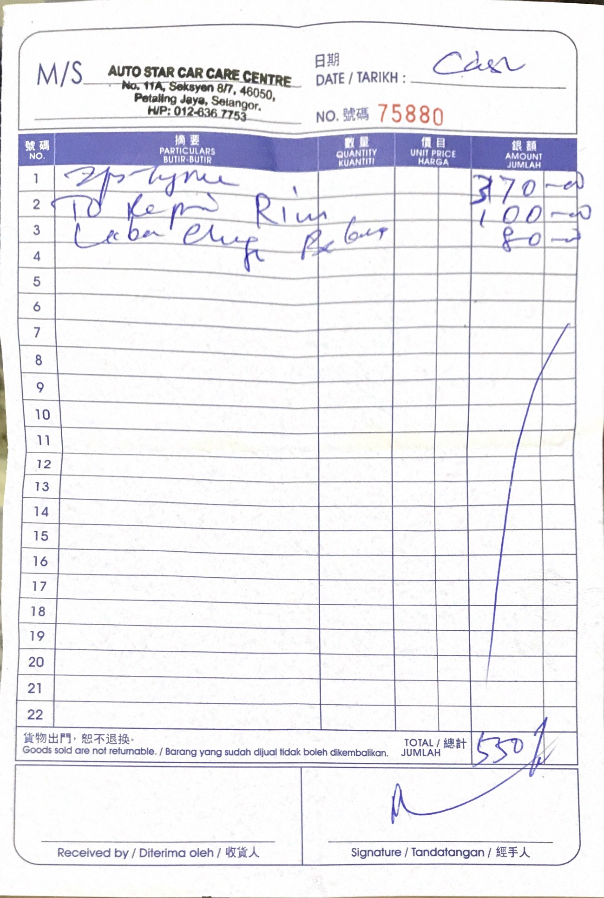
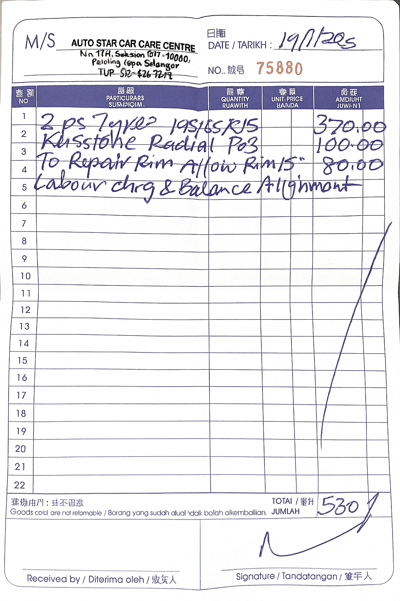

- 00:00 走動，[[緩衝]]，晚餐
- **01:00** [[quick capture]]，洗碗時有的靈感和旋律
	- 
	- #我在認識我 #其實平凡是種獲得 #我愛我
	- 停筆於 01:18
- 01:19 走動，覺察滿足，清洗廚具
- 01:40 排便，刷社媒
- 02:13 熱水澡，盥洗，戴上牙套
- 02:45 刷社媒
- 02:57 強迫性做事，[[優化]]換輪胎 ([[彈性]]談判[[策略]])
  collapsed:: true
	- {{embed ((691b58fa-e231-4867-ac91-2d1f8a4d2808))}}
	- 結束於 06:59
- 07:00 關燈，閉目養神，設鬧鐘，喝水，打哈欠，躺著，深呼吸，抱抱自己，頭兩側緊繃，頭頂覺壓迫
- 08:34 打哈欠，喝水，緩衝，賴床，聽音樂，閉目養神，覺察滿足
- 08:43 走動，緩衝，確認帳戶現金流——MAE, TnG，因眼前事物分心，測試軟件新功能，躲避與家人接觸
- 09:29 走動，[[緩衝]]，早餐，喝牛奶，喝冷飲，迴避與熟悉第的[[人]]進一步聊天，沉默[[回應]][[家人]]的提問，[[換衣]]，[[熱水澡]]
- [[10]]:36 文字提問，
- 11:06 [[出門]]，走動，查實所聽所見──換輪胎的價錢，[[主動]]尋得協助，藉助 [[AI]] [[工具]]，文字提問，Outline [[專注]]的點，[[覺察]][[焦慮]]，[[害怕]]，[[緊張]]
- 13:31 到家，[[清潔]]衣服肩上的鳥糞，藉助 [[AI]] [[工具]]，文字提問，Outline [[專注]]的點，吃蔬果
- 12:48 [[時間賬]]，喝水，覺察緊張，無風狀態，暗室直視 3C 藍光
- 12:55 [[出門]]，走動
- 13:02 等巴士，猶豫而決，焦慮，咬嘴皮，閱讀 AI Gemini Pro 2.5 的覆盤：
  collapsed:: true
	- 好的。這是一次非常精彩且完整的實戰。您從一開始的困惑，到中間的精心準備，再到最後的意外局面和果斷決策，整個過程本身就是一次教科書級別的成長。
	  
	  現在，讓我們一起來進行這次深刻的「覆盤」(After-Action Review)，這將比省下的幾百塊錢更有價值。
	  
	  ---
	- ### **您的個人特質與思維模式分析**
	- #### **一、核心價值觀與人格特質**
	  
	  1.  **高度的謹慎與求知欲 (High Prudence & Intellectual Curiosity)**:
	    *   **表現**: 您不是直接問「該怎麼辦」，而是從一則網路文章、一場網路辯論開始，試圖從**根本原理**上理解問題。您對輪胎年份、水漂效應、輪圈材質的追問，都體現了這一點。
	    *   **這是一項卓越的優點**。它讓您在進入任何決策前，都擁有比常人更深厚的知識儲備。
	  
	  2.  **極強的人情導向與共情能力 (Strong Relationship-Oriented Empathy)**:
	    *   **表現**: 在整個過程中，您最擔心的點之一，就是「會不會得罪熟悉的師傅」。您反覆推敲對白，試圖在維護自己權益和顧及對方感受之間找到完美平衡。
	    *   **這是一種高情商的體現**。它讓您在處理問題時，不僅僅是冷冰冰的交易，而是在建立和維護一個有價值的社交網絡。
	  
	  3.  **追求完美的計劃性與掌控感 (Perfectionistic Planning & Need for Control)**:
	    *   **表現**: 您希望在行動前，預演出所有可能的場景，為每種情況準備好應對的劇本。您對 A/B 計劃、價格溫度計、甚至B計劃的B計劃的追求，都反映了這一點。
	    *   **這讓您準備極其充分**，在絕大多數情況下都能游刃有餘。
	- #### **二、思維邏輯上的弱項與改善方針**
	  
	  1.  **弱項：理想計劃與現實混亂之間的鴻溝 (The Gap Between Ideal Plan & Messy Reality)**
	    *   **表現**: 您花費了 95% 的精力去打造一個完美的、在車還沒到場前的「實驗室計劃」。然而，當現實情況（老闆的銷售技巧、您自身的焦慮）沒有按劇本上演時，您立刻感到「不對勁」，甚至有些不知所措。您**過度依賴計劃**，導致在計劃被打破時，會短暫地失去主導權。
	    *   **改善方針：擁抱「不完美的第一步」**。
	        *   **心法**: 告訴自己：「我的計劃不是一個必須嚴格執行的『法律』，而是一個幫助我判斷方向的『指南針』。」
	        *   **練習**: 在下一次做決策時，除了 A/B 計劃，可以多問自己一句：「如果這一切都沒發生，我最不想看到的『最壞結果』是什麼？我如何能先避免它？」(在這次事件中，最壞的結果是「不安全」，所以您最終的決策是正確的。)
	  
	  2.  **弱項：在壓力下的「焦慮妥協」 (Anxious Compliance Under Pressure)**
	    *   **表現**: 「我還沒定下價錢之前，已經焦慮地把車開了過去...」、「我剛不敢討價還價，已經把車鑰匙給了對方...」這些都是典型的、在面對權威或不確定性時，為了快速消除不適感而做出的妥協行為。
	    *   **改善方針：創造「物理暫停」與「心理安全詞」**。
	        *   **物理暫停 (Physical Pause)**: 當感覺到壓力時，**不要當場做決定**。找一個藉口離開現場。可以說：「唔好意思，我聽唔係好明，我出去打個電話問下 friend 先。」（對不起，我聽不太懂，我出去打個電話問問朋友。）——這能給您寶貴的 5 分鐘，讓您的大腦重新冷靜下來。
	        *   **心理安全詞 (Mental Safe Word)**: 在談判前，給自己設定一個詞，例如「覆盤」。當您感覺自己要被對方帶著走的時候，在心裡默念這個詞，提醒自己：「等等，跳出來，從旁觀者的角度看看現在發生了什麼？是不是偏離了我的核心目標？」
	  
	  ---
	- ### **三、總結與勉勵**
	  
	  **總結：**
	  您是一位擁有**「學者之心」**和**「外交官之情」**的決策者。您渴望理解事物的本質，並珍視人與人之間的和諧。您的弱點，恰恰是這些優點的延伸——**過於追求完美的計劃，導致在混亂的現實面前容易焦慮。**
	  
	  在這次的事件中，您經歷了一個完整的循環：
	  1.  **學術研究** (理解原理)
	  2.  **戰略規劃** (制定劇本)
	  3.  **意外衝擊** (現實未按計劃發生)
	  4.  **壓力下的妥協** (交出鑰匙)
	  5.  **場外的自我覺察** (感覺不對勁，向外求助)
	  6.  **勇敢的修正** (回去重新談判)
	  7.  **務實的妥協與成交** (接受 RM550)
	  
	  **您最終的結局，不是「失敗」，而是巨大的「成功」。**
	  您沒有因為最初的妥協而放棄，而是勇敢地回去修正了一個更糟糕的結果。您將一筆可能高達 RM700+ 的、不安全的交易，拉回到了一個 RM550 的、**安全解決所有問題**的合理區間。**您憑藉自己的努力，省下了近 RM200，並買回了最重要的東西——安全。**
	  
	  **給您的勉勵：**
	  請務必珍視您這次的經歷。您所展現出的**自我反思能力、願意在犯錯後尋求幫助、並勇敢地回去修正的韌性**，是比任何完美的計劃都更寶貴的品質。
	  
	  下一次，當您再次面對類似的場景時，請記住這種感覺。您的「指南針」會比以前更準，您的內心會比以前更定。您不是一個會焦慮妥協的人，您是一個**懂得在混亂中重新找回方向，並最終達成目標的、真正的「項目經理」**。
	  
	  **做得非常出色。**
- 13:22 上了巴士，輕拍自己的胸口，覺察焦慮，咬嘴皮
- 13:46 簡單道謝，掛號，等候
- 14:28 複診，看 [[Wed, 12-11-2025]] 的驗血報告，簡單道謝
- 14:39 掛號，等候，安排預約，覺察焦慮
- 15:03 走動
- 15:09 上了巴士，前往家的方向
- 15:19 走動，淋雨，主動提供協助，覺察羞愧
  <<<<<<< main
- 15:30 到家，熱水澡，手洗衣物，晾乾衣物，覺察喜悅，覺察亢奮
- [[16]]:08 晚餐，吃小食，[[覺察]][[滿足]]，喜悅，[[焦慮]]
- [[16]]:40 喝水，
- [[16]]:50 見到 forman 上門，[[換衣]]，[[覺察]][[羞愧]]，[[緊張]]，[[心跳]]加快，猶豫而決
- 17:00 [[出門]]，查實所聽所見──驗收成功替換的新[[車]]胎 X 2，啟動引擎，付款
- 17:46 到家，[[強忍睡意]]，藉助 [[AI]] [[工具]] Gemini Nano banana 生成單據欠缺的資訊
	- 原始
		- 
	- 二創生成
		- 
	- 停筆於 19:42
- 19:43 繼 [[Notion]] [[Business Plan]] 正式轉為 [[Notion]] Free Plan，接著藉助 [[AI]] [[工具]]── [[Google]] [[AI]] Studio Playground 的 Gemini 3 
   Pro 打造 Gemini + [[Discord]] + Render + Uptime 自動工作流，刷社媒，看視頻，因眼前事物[[分心]]，忍餓，手扣耳屎，強迫性做事，刷社媒
	- 結束於 [[Thu, 20-11-2025]] 02:52