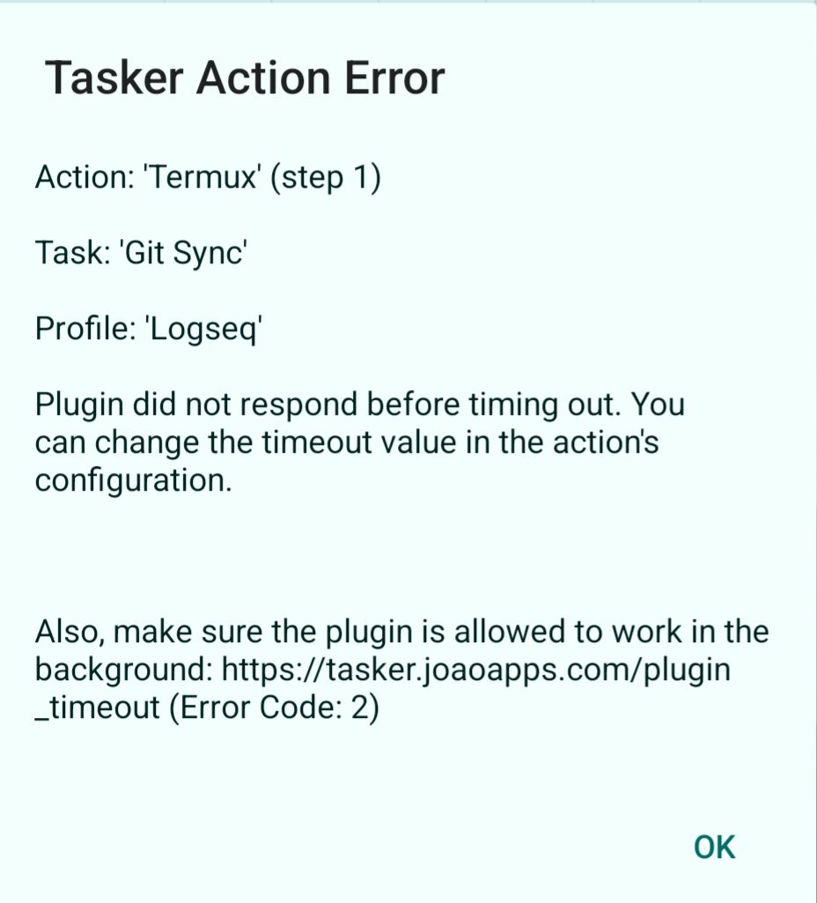

- 04:41 因冷斃醒來，夢醒，走動，時間賬
- 04:50 安裝軟件，無風狀態，忍餓，調整 UI，喝水
- 05:15 走動，[[緩衝]]，無風狀態，忍餓，iPhone 端 [[Logseq]] 提交失效，Troubleshooting，查實所聽所見，在 [[Android]] 端設置沿用 [[GitHub]] 現有的 [[Logseq]] [[同步]]
- 06:59 無風狀態，忍餓，[[確認]]一[[下]] [[Android]] 端 Gitsync 能否如期提交到 Github，回顧 Gallery，刪照片，Troubleshooting ，借助 [[AI]] [[工具]]，文字提問，與他[[人]]討論，透過 Termux 及 Tasker [[實現]] [[Android]] 端 Logse 更[[智能]]的自動流—— [[切換]] App 時自動提交到 Github，強迫性做事
- 09:58 無風狀態，忍餓，測試第一次：成功
- [[10]]:01 無風狀態，忍餓，刷社媒，取關社媒賬號，強迫性做事，坐著，[[覺察]][[焦慮]]，[[滿足]]，自責與[[迎納]]
- 12:35 回信實習[[諮商師]] Jacqueline，修正信息，[[覺察]]猶豫而決，確定預約[[時間]]：
	- 明天（六）[[Sat, 29-11-2025]] ｜ 13:00 - 15:00
	  id:: 6929268a-9399-4bc2-97c5-2034923c8fe5
- 12:44 無風狀態，忍餓，喝水
- 12:51 發現問題，借助 [[AI]] [[工具]]，Troubleshooting，強迫性做事
  collapsed:: true
	- 
	- 測試結束於 13:14
- 13:15 咬嘴皮，強迫性做事，更新日曆── ((6929268a-9399-4bc2-97c5-2034923c8fe5))
- 15:35 加強社媒賬號安全，測試軟件，強迫性做事，坐著，忍餓，強迫性做事，無風狀態
- 15:36 下載軟件，走動，緩衝，午餐，離子化飲用水，清洗廚具，覺察喜悅，滿足
- 17:12 修正舊筆記，時間帳，排便，紀錄閃念
	- 比起規避將來的痛苦；現在更值得的是趁當前的逆境，積攢下一回對自己足夠多的允許跟函容
	- 停筆於 17:42
- 17:42 走動，緩衝，中途遇到家人的干預，他人的請求，沉默應對家人的敘事，覺察排斥，理所當然，查實所聽所見，換洗浴巾，喝水
- 18:08 熱水澡，刻意放慢動作，覺察焦慮，著急
- 18:32 換衣，吃蔬果，喝水
- 19:22 設置
- 19:52