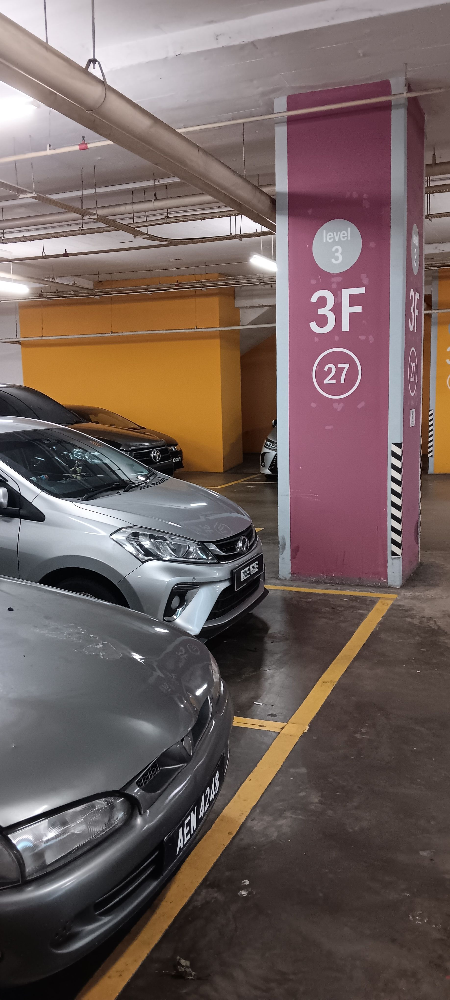

- 01:42 看視頻，強忍睡意，強迫性做事
- 05:59 排尿，走動
- 06:08 關燈，睡覺，睡睡醒醒，夢醒，因外部聲音醒來，覺察受驚嚇
- 15:10 因不適醒來，走動，時間賬，記錄夢境
	- 夢到一個所有動物都成了氣球狀生物的城市，斑馬能飄在空中和飛翔之類的
	- 在一次的公眾活動上，自己似乎有義務地在負責後台的工作
	- 但為了不影響現場，一直處於特別謹慎跟緊繃的狀態下，去維護流程還有領導者指派的任務
	- 停筆於 15:21
<<<<<<< main
- 15:21 喝水
=======
- 15:21 午晚餐，急促地進食，暴食，排尿，反覆回想成年往事，覺察厭倦，沖涼，同在冥想，覺察自責與迎納
- 17:13 刷社媒，半躺半坐
- 17:43 選電影院和座位，遇到問題──Mae Secure2U 因更換手機忘了重啟
- 19:32 查實所聽所見，盥洗，沉默應對家人的提問，換衣
- 19:43 開車出門
- 20:25 到了目的地
	- 
- 20:26 覺察緊張，心跳加快，呼吸急促，kiosk 購票時刷卡不通過，一邊快步急著找 Maybank ATM，一邊搜免費的 WiFi，[[ATM]] 轉賬過程系統故障，即便著急，謝謝自己重新再試多一次
- 21:09 過程發現另一個人和我一樣在 [[GSC]] [[ticket]] [[kiosk]] 購票遇阻，發現訣竅是將自己的銀行卡觸碰機器 2 次即可，最後成功付款，臨走前還倉促地告訴對方一聲「Good Luck!」
- 23:09 找到停車的位置，覺察如釋重負，開車回家，哼唱，覺察喜悅，滿足
- 23:49 到家，戴上牙套，刻意不發出聲音，走動，換衣
- 23:58 坐著，無風狀態，時間帳，哼唱
	- 結束於 [[Mon, 08-12-2025]] 00:11
>>>>>>> origin/main
