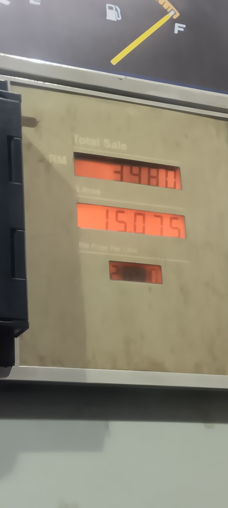
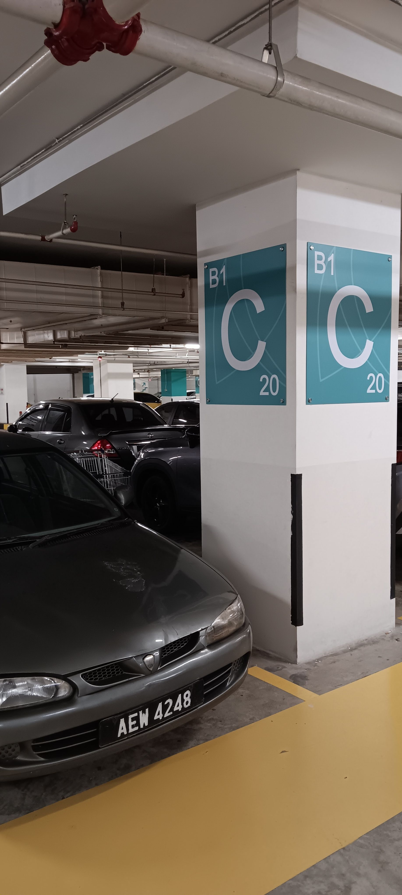
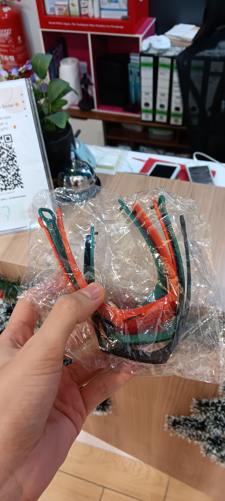
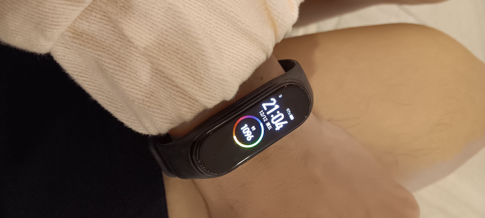
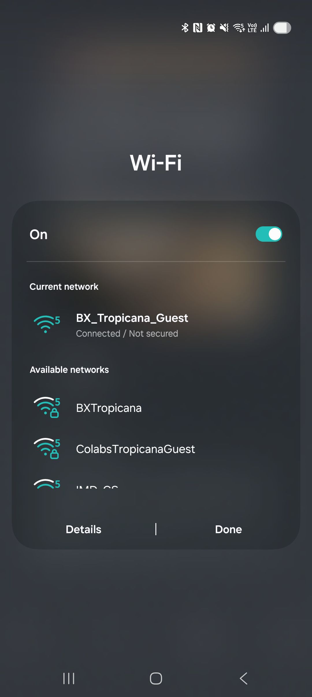
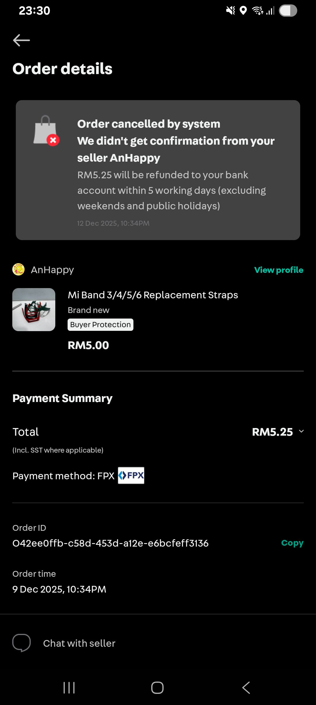

- 01:12 喝水，熱水澡
- 01:57 覺察頭頂和兩側不適，時間帳
- 02:05 同在冥想，深呼吸 4-4-4-4，覺察頭頂微微暈眩
- 02:13 關燈，睡覺，聽音樂
- 05:52 夢醒，因冷斃醒來，重新還被，標記聽見不錯聽的音樂，賴床，聽歌，暗室直視 3C 藍光
- 06:00 記錄夢境，聽歌
  collapsed:: true
	- 夢見一個男人和另一個男人出現在屋頂的陽台上，周圍充滿古風的風景
	- 其中一個人主動先坐下來，然後說「 我演我的老婆，你演我，要不然到時我忽然說菜市裡講的那些的話你聽不懂 」
	- 另一個人男人下一秒聽了以後，不僅偷笑了一下
	- 停筆於 06:08
- 06:09 閉目養神，聽音樂
- 06:24 聽音樂，走動，緩衝，開燈，同在冥想，覺察如釋重負
  collapsed:: true
	- 聽著 Spotify 播放韓劇 Hotel Del Luna 的 OST，想起自己還看過另一部劇 Vagabond
		- 畫面閃過自己曾在陳麗晶面確認過對方也看過時，提起網友推論很有可能還有續集，還有印象當時對方還回應說「 那我想看 」
		- 現在想回來才更加釋懷，即便生活上很可能也看過同樣的作品，卻因為將對方應該懂得或者不懂，也理所當然地不再了解彼此和甚至放棄探索
		- 想到了這裡，我終於願意在自己的心裏嘀咕說「 我值得遠離陳麗晶，也值得遠離這段關係，一段充滿理所當然卻理不清它們平時從何而來的不對等關係 」
		- 足夠了
	- 停筆於 06:35
- 06:35 喝水，走動，煮，早餐
- 07:18 [[F: [[靈感]]筆記]]
	- 最好的童年時光 vs 第二美好的當下
- 07:20 早餐，牛奶，覺察滿足，喜悅，如願嘗試得到比起油煎翻炒，炒過的米粉經過蒸熱後不僅保持美味，還不沾鍋，清洗廚具，中途遇到家人干預，覺察排斥，焦慮，害怕，沉默應對家人的提問，
- 07:53 記錄閃念
- 07:57 回信 https://www.carousell.com.my/inbox/2061919122/
  collapsed:: true
	- >>
	  > Hi Miss Anhappy, thanks for your patience.
	  >
	  Just wanted to let you know that Today between 4pm - 7pm,  I'll drop by 
	  iCare Dental in IOI Mall Damansara and collect those straps ya
	  >
	  > Would appreciate if you could leave a reply when you notice this 
	  message.
	  > .
- 08:[[14]] 因眼前事物分心──手機端不僅無法複製 [[Carousell]] Chat 的鏈接，更無法如願在 browser 上登錄，改為到電腦端 browser 登錄，哼唱
	- 結束於 08:26
- 08:26 哼唱，時間帳，打哈欠
- 08:30 測試昨天下載的 Notion Template，哼唱
- 08:35 半躺半坐，借助 AI 工具，手機 A14 安裝 Trime 輸入法，測試軟件，強迫性做事，強忍睡意
- 14:24 半躺半坐，打哈欠，時間帳
- 14:29 半躺半坐，強忍大腿屁股麻痹，強忍睡意，刷社媒，
- [[14]]:43 因眼前事物分心
- [[14]]:50 蹲廁所，看視頻，沖涼，抱抱自己，同在冥想，衣物收進室內
- 15:43 OGC，暗室直視 3C 藍光，入耳式耳機
- 15:53 走動
- 15:56 查實所聽所見，網搜資訊
- [[16]]:[[16]] 排便，看視頻，覺察難過，同在冥想，沖涼
- [[16]]:41 換衣，無風狀態，儀容裝扮，
- [[16]]:50 藉助 [[AI]] 工具──瞭解 BUDI95，查看路程
- 18:30 換衣，猶豫而決，
- 18:36 開車出門，添汽油
	- 
	- 更新於 [[Sat, 13-12-2025]] 11:38
	- 通過 [[Debit Card]] 享有 [[BUDI95]] 的記錄不會更新到 Touch 'n Go App
		-
- 20:05 抵達目的地
  collapsed:: true
	- 
- 20:06 排尿，覺察焦慮
- 20:13 領取 Straps
  collapsed:: true
	- 
	- 完成於 20:16
- 20:16 逛櫥窗，同在冥想，逛寵物店，看見這些小動物被困在透明的籠子裏，感到難過，因爲我好希望它們不僅回到大自然，而且還會收到協會的保護，同時也看見感受和想法更底層的渴望——獲得自由
- 21:02 記錄閃念，適度坐一下，爲自己買到高性價比的 Mi Band Straps x 5 感到喜悅
  collapsed:: true
	- 
	- 停筆於 21:12
- 21:12 測試軟件
- 21:19 繼續走走，在 Book Xcess 發現免費 WiFi，網速支持看 YouTube
  collapsed:: true
	- 
- 22:28 開車回家，單靠 Waze offline map 繞了遠路，後來經過 Lapagan Terbang Subang > Glenmarie LRT Station > Jalan Kuala Lumpur-Perlabuhan Klang > Petaling Jaya
- 23:19 到家，時間帳，咬嘴皮，無風狀態，坐着，換衣，因眼前事物分心，強迫性做事，猶豫而決，簡單道謝對方
	- 通知二手環帶商家我已付的錢將可能因逾期被迫強制退回
	  collapsed:: true
		- 
		  id:: 693c39bd-2729-4b3d-b5e1-452a3b8392b3
- 23:50 晚餐，猶豫而決，延遲滿足，吃蔬果，吃小食，走動，清洗廚具，刻意不發出聲音，熱水澡，盥洗，帶上牙套
	- 結束於 [[Sat, 13-12-2025]] 01:35
	  =======
- 18:30 開車出門，添汽油
  >>>>>>> Stashed changes