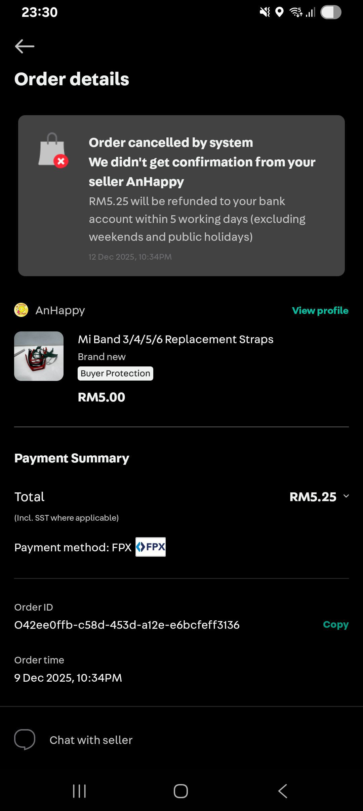
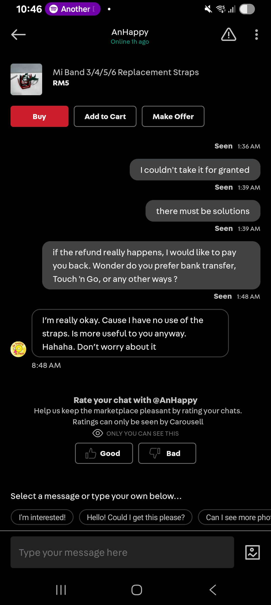
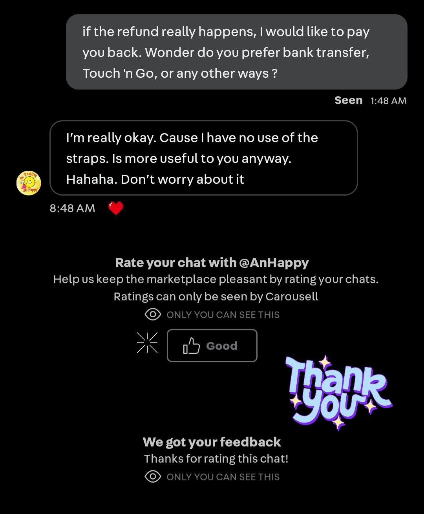
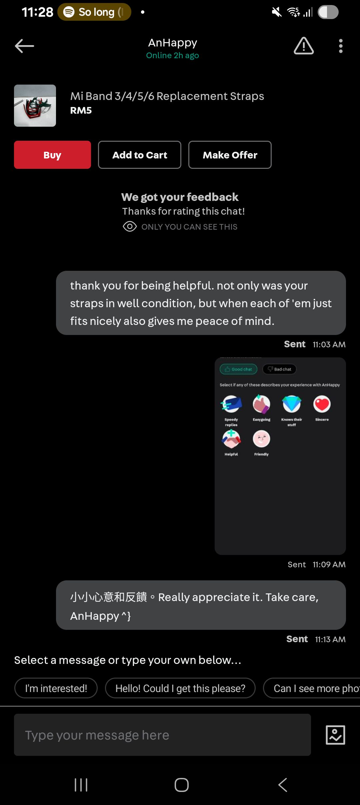

- 01:35 半躺半坐，回信息
  collapsed:: true
	- 繼 ((693c39bd-2729-4b3d-b5e1-452a3b8392b3))，看見對方表達將這些環帶送給我，我感到相當羞愧，於是嘗試回應自己願意付對方錢且確認她比較傾向哪種收款的渠道
- 01:49 時間帳，半躺半坐，打瞌睡，強忍睡意
- 02:43 暗室直視 3C 藍光，強忍睡意，因眼前事物分心，咬牙
- 02:59 關燈睡覺，聽音樂
- 09:25 夢醒，被自己的夢話驚醒—— [[Fuck You]] ，賴床，聽音樂
- 09:28 聽音樂，因冷斃醒來，主動調整風扇方向，緩衝，了解昨晚睡眠狀態，解除鬧鐘，測試軟件，刪 apps
- 09:52 聽音樂，時間帳，半躺半坐，測試軟件——Notify for Mi Band，調整 UI，強迫性做事
- 10:30 聽音樂，回信，截屏，修圖，覺察感謝，寫留言反饋
  collapsed:: true
	- 
	- 
	- 
	- 
	- 
	- 停筆於 11:29
- 11:29 走動，刷社媒
- 11:58 走動，卸下牙套，喝水，午餐，吃蔬果，沈默應對家人的提問，覺察排斥，沖涼，盥洗，修甲，覺察羞愧，晾乾坐墊
- 13:09 時間帳，哼唱，半躺半坐
- 13:14 喝水，走動
- 13:19 測試軟件，忽略式哼唱，暗室直視 3C 藍光
- 13:34 打哈欠，強忍睡意，挑選曲目，猶豫而決，聽音樂，半躺半坐
- 13:50 聽音樂，因眼前事物分心，強迫性做事，調整 UI，刷社媒
- 14:20 閉目養神，預設間隔
- 14:40 不小心睡着，因眼前事物分心，做惡夢，
- 15:24 夢醒，被警醒，時間帳
- 15:31 停播音樂，記錄夢境
	- 夢見被人追殺，那菜刀往我身上丟過來
- 15:33 半躺半坐，打瞌睡
- 15:40 喝水，走動，坐墊收進室內
- 15:45 覺察特別睏，半躺半坐，查看信箱，刪 email
- 15:53 時間帳，逛櫥窗，覺察疲倦，刷社媒，走動
- 16:12 同在冥想，深呼吸，聽音樂，聽 ambience，適當躺一下
- [[16]]:29 喝水，停播音樂，打哈欠，強忍睡意，走動
-