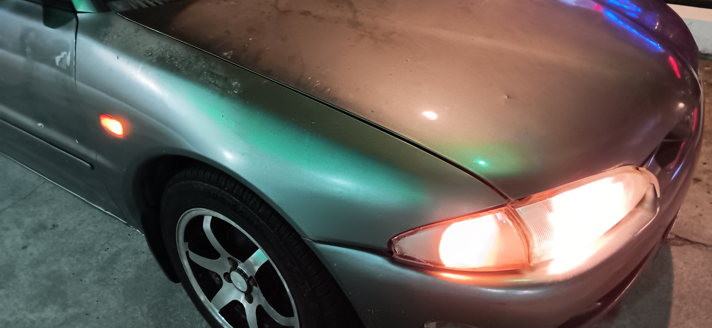
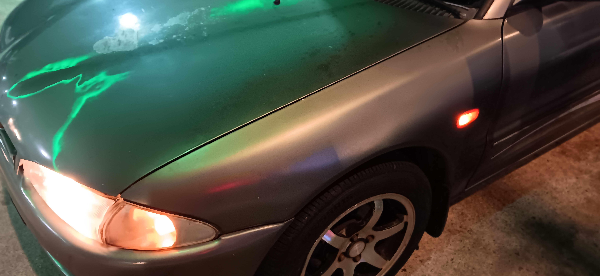
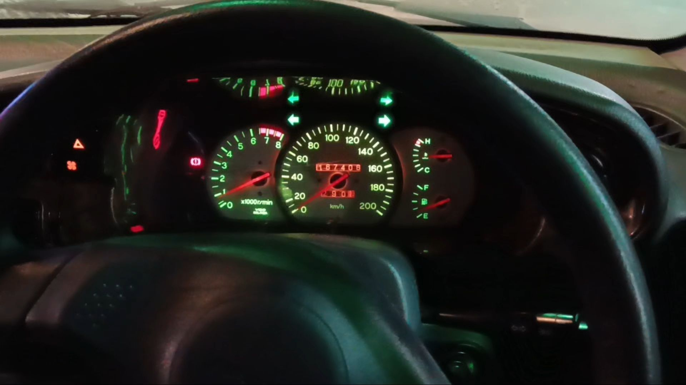
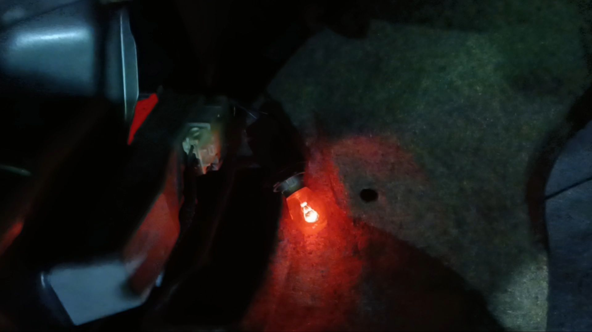
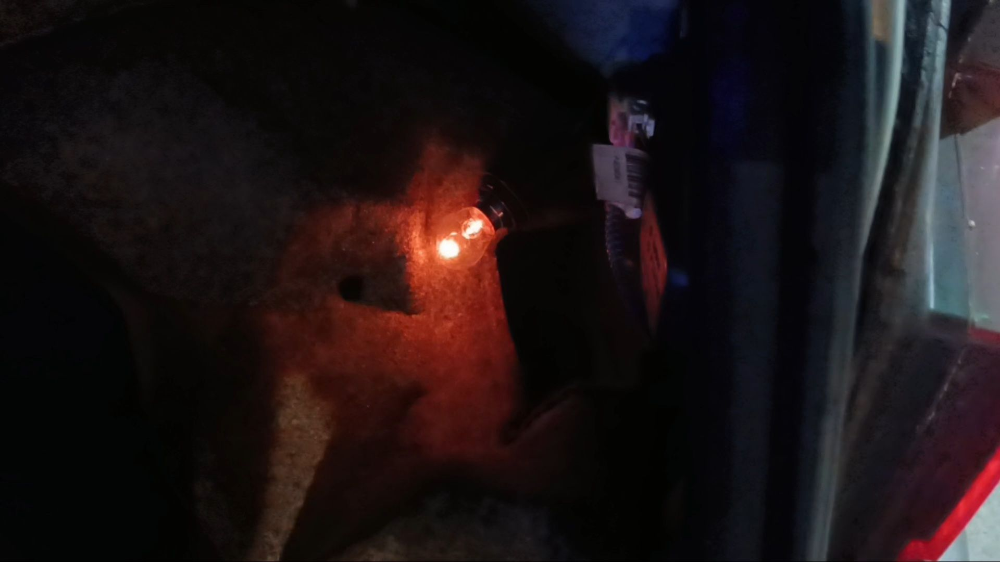
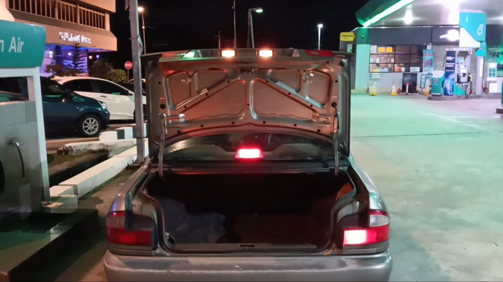
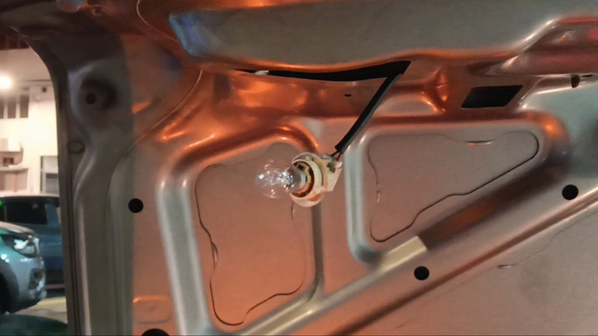
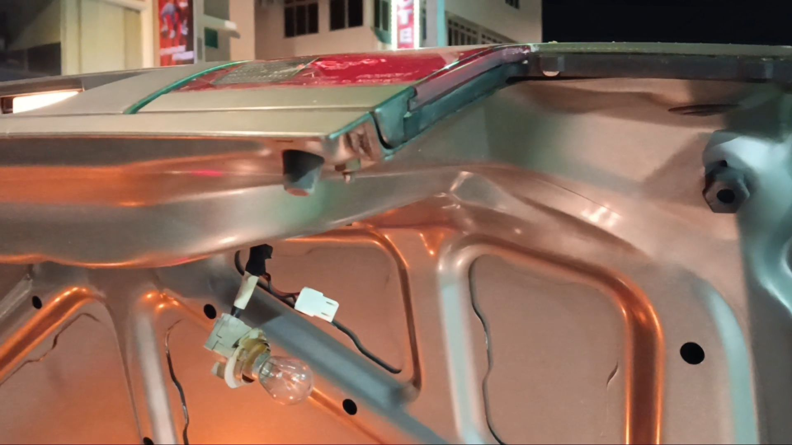

- 00:02 走動，緩衝，晚餐，覺察羞愧，清洗廚具，刻意不發出聲音
- 01:32 下一秒忘記要做什麼，走動，嗅到家裏客廳及二廳難聞的異味，從儲物間看見工具箱被雞蛋拖格，覺察排斥，憤怒，失望，拿了螺絲起子後馬上遠離現場
- 01:45 到了車上，吹冷氣，時間帳，藉助 AI 工具，文字提問，Outline 專注點，坐着
	- https://chatgpt.com/share/693f45f5-239c-8006-b9a7-c91e62a1cfd6
- 02:31 開車到加油站爲輪胎打風
- 02:41 到了 JALAN 222 的 PETRONAS 加油站，也爲後車廂的備胎打風
- 03:17 將 Dashboard 外殼卸下，查實所聽所見 —— 因Emergency Button/Double-signal 導致分別左右的 Signal 失去功能，修理硬件，無風狀態，流汗，卸下後的 Dashboard 外殼特別艱難重新組裝回去，察憤挫敗，憤怒，失望，還有這些感受和想法背後更深層的渴望 —— 事與願違時，允許自己的情緒波動，走動，緩衝，檢查水槽，清理腳墊的沙塵，
  collapsed:: true
	- **06:01** [[quick capture]]: 
	- 
	- 
	- 
	- 
	- 
	- 
	- 
	- 
	-
	- 結束於 04:49
- 05:49 坐着，時間帳，吹冷氣，哼唱
- 06:11 開車回家
- 06:33 到家，查實異味，因眼前事物分心，將曾翻曬過的坐墊套上布，整理客廳的椅上、沙發和玻璃桌子，清理雜物，沖涼，
- 07:11 時間帳，手摳耳屎，無風狀態，因眼前事物分心，咬嘴皮，檢查睡眠記錄
- 07:25 煮，走動，喝水，喝牛奶，喝冷飲
- 08:19 乾洗 3C 產品，強迫性做事，無風狀態，覺察如釋重負，強忍皮膚黏膩
- 08:45 沖涼，覺察如釋重負
- 09:01 覺察疲倦，強迫性做事，查實所聽所見，時間賬
- 09:19 強忍睡意，藉助 [[AI]] 工具 ── 實現 [[Mi Smart Band 4]] > [[Sleep]] [[Data]] > [[Notion]] [[database]]
-