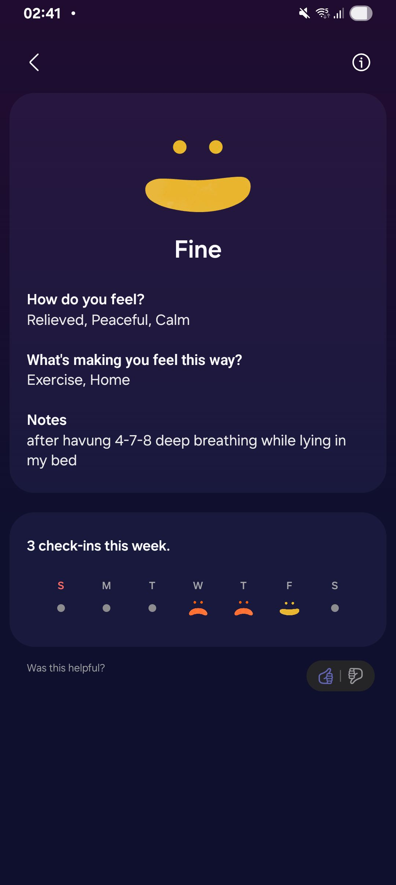

- 00:03 走動，喝水，排尿，晚餐，覺察抑鬱，排便，清洗廚具，熱水澡，盥洗
- 02:19 記錄閃念
  collapsed:: true
	- [[可持續性]]本質上可以是時間及能耗性，概念上也可以是個思考的角度，也能夠是喚起覺察的契機
	- 停筆於 02:23
- 02:23 時間帳，調整鬧鐘
- 02:39 深呼吸，躺着，閉目養神，覺察如釋重負
  collapsed:: true
	- 
	-
- 02:46 躺着，時間帳，調鬧鐘
- 02:53 關燈，睡覺
- 04:40 因不適醒來，哼唱，反覆確認睡眠記錄，覺察不甘心，強迫性做事，喝水，半躺半坐
- 05:13 刷社媒，半躺半坐
- 06:46 反覆回想童年往事，覺察混亂，抱抱自己，閉目養神哦哦莫自己的頭
- 07:11 走動，喝牛奶，早餐
- 08:00 中途遇到家人干預，覺察抗拒，他人的請求，坐着，喝水，表達看見、感受、需要、請求，爆粗，覺察憤怒，失望，複述對方的話，追問對方我說過的話
- 10:26 閉目養神
- 11:00 時間帳，記錄閃念
- 11:10 覺察頸背酸，躺着，閉目養神，反覆回想今日發生的事，抱抱自己，摸摸自己的頭
- 11:40 晾乾衣物，打哈欠，走動