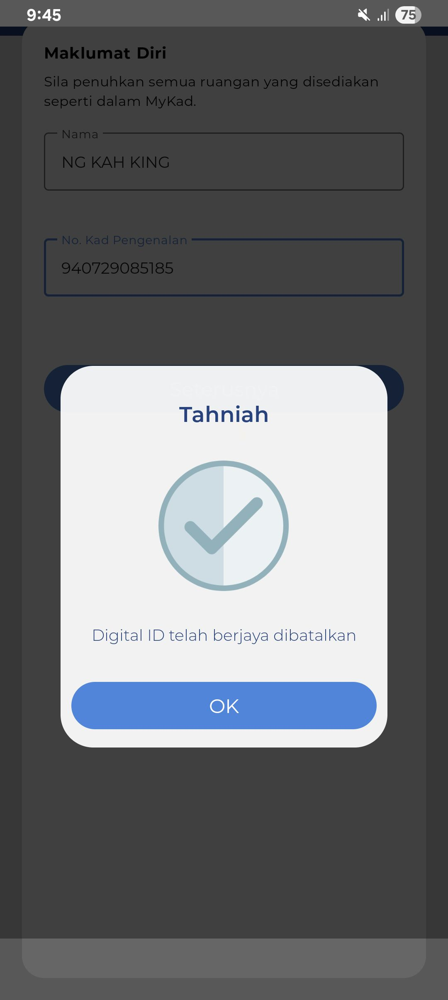
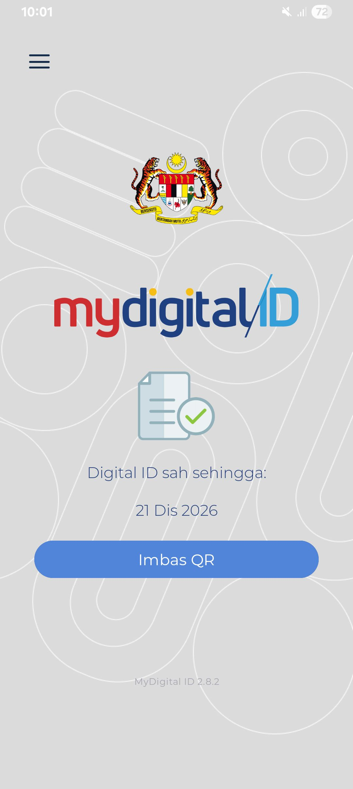

- 06:25 夢醒，走動，檢查睡眠記錄，強迫性做事，覺察焦慮，緊張，不甘心，Troubleshooting
- 06:44 看見 [[Zepp]] 和 [[Notify for Mi Band]] 終於和 [[Mi Smart Band 4]] 成功連接上且追蹤 [[Fri, 19-12-2025]] 的睡眠記錄，覺察如釋重負，時間帳
- 06:46 排尿，走動，緩衝，盥洗，摘下牙套，煮，早餐，覺察羞愧，猶豫而決，準備食材，替蘋果切片跟除芯時用力不適結果不小心將其中一片裂開，覺察失望，緊張、焦慮，急促地進食，刻意放慢動作，吃蔬果，覺察滿足，嚐到[[蘋果]][[浸泡]]在[[檸檬汁]]和配搭[[黑胡椒]]的香氣，發現煎的[[薄餅]]皮若不夠熟[[面皮味]]影響[[味覺]]；太熟易硬且影響[[口感]]和[[嚼勁]]，清洗廚具，排尿，沖涼
- 09:[[16]] 時間賬，喝水，無風狀態
- 09:26 趁 CelcomDigi 需求綁定，注銷 MyDigitalID 舊賬戶；在新設備 [[Samsung Galaxy A14]] 上重新註冊，過程成功註冊 1st 次；下一秒卻在 CelcomDigi 重新導向至 MyDigitalID 得知剛成功註冊的賬號保留失敗，結果再註冊第 2nd 次，覺察失落
	- 
	- 
	- 截止於 [[Sun, 21-12-2026]]
	- 結束於 10:16
- 10:16 時間帳，走動，咬嘴皮，覺察疲倦
- 10:41 閉目養神，深呼吸，喝水