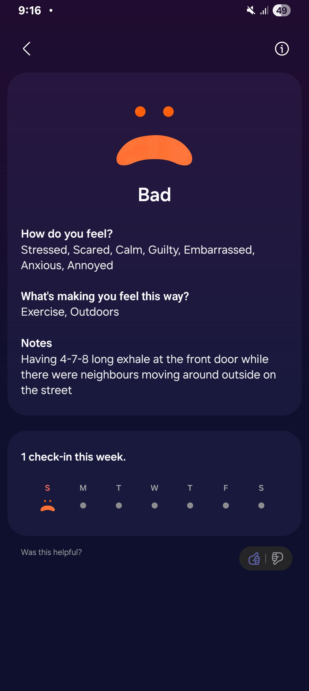

- 07:53 因不適醒來，頸背和頭兩側覺壓迫，因鬧鐘醒來，解除鬧鐘，檢查睡眠記錄，強迫性做事，忍尿
- 08:22 喝水，排尿，盥洗，摘下牙套，主動回應對方的提問
- 08:42 曬太陽，曬毛毯，時間帳，記錄閃念
  collapsed:: true
	- 洗腳時，想起昨天客廳的[[沙發]]被替換成另一套二手的傢俬，心裏卻嘀咕着不屑，不僅覺得這件事不曾和我提起過，而我對這看似突如其來的變化升起了排斥的感受
	- 看到同樣的場景，其他合拍的家人可能會透過問互動的方式，將沙發視爲其中一個話題
	- 幸運的，我覺察到那樣的想法和感受很可能跟受到[[對錯]]框架下的挾持也有關係
	- [[對與錯]]，或許對做事跟下[[判斷]]起到[[立竿見影]]的效果；卻不一定對[[可持續的關係]]有所幫助
	- 另一邊，這還令我想起平時凌晨廚房餐桌上放着的甜品，雖然當下因擔憂含糖過高而心裏嘀咕着不吃，可是當吃飯時間到了且肚子也餓了就會很願意地也將甜品吃完
	- 或許，無論面對舊的固有信念和新的變化，比起對與錯，我更需要[[時間]]幫助自己[[消化]]
	- 停筆於 09:04
- 09:04 閉目養神，深呼吸，摸摸自己的頭
  collapsed:: true
	- 
- 09:16 走動，遠離到安全的地方，無風狀態，時間帳，喝水
- 09:18 主動打開風扇，哼唱，半躺半坐，測試軟件 ── [[One Hand Operation +]] 不僅屏幕邊緣可操作 [[Back key]]，附加 [[Long swipe]] 和還能實現 [[Quick tools]], [[Quick launcher]] 和 [[Task switcher]] [[平替]]，覺察好奇，驚喜，喜悅
- 09:41 喝水，走動
- 09:46 躲避與家人接觸，打遊戲，暗室直視 3C 產品，半躺半坐，入耳式耳機，覺察不甘心
- 11:45 走動，喝水，排尿，午餐，猶豫而決，吃甜食，沖涼
- 13:15 喝水，半躺半坐，看視頻 ——《 [[再見，愛人 5]] 》，覺察難過，好奇，亢奮，咬嘴皮
- 20:26 晚餐，頭兩側覺緊繃，暗室直視 3C 產品，入耳式耳機，看視頻，覺察觸動，喜悅，清洗廚具，覺察抗拒
- 22:39 排便，看視頻
- 23:07 熱水澡，盥洗，戴上牙套
- 23:47 看視頻，喝水