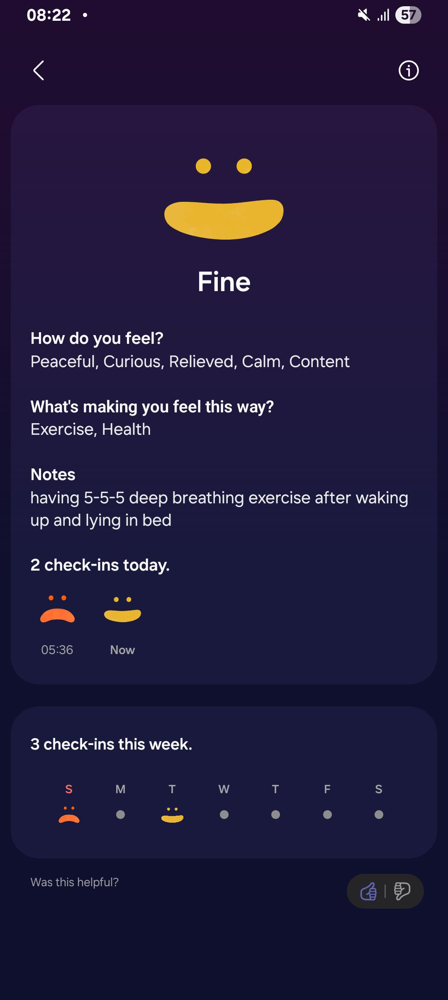

- 00:18 時間賬，喝水，刷社媒，藉助 [[AI]] 工具 ── 在 A14 的 [[Tasker]] 導入按鈕，等待眼前事物響應
- 00:49 OGC
- 01:16 關燈，睡覺，聽音樂，作夢
- 05:07 因不適醒來，因三急醒來，夢醒，覺察恐懼，懷疑音樂的音質也變得陰森了，排尿，頸背覺壓迫和缺氧，安撫自己的情緒
- 05:14 喝水，聽音樂，記錄夢境，主動打開燈
  collapsed:: true
	- 醒來之前，最後夢見的畫面是自己被迫選擇了公路跑向另一處，路上還遇到熟人，經過時還不忘喊着：「 難道你忘了大嫂平時怎麼跑的嗎？ 」
	- 實際上，我們好像都知道之所以越跑越慢，是因爲深夜降臨後某種靈異的超自然現象，迫使我們放棄逃跑
	- 充滿恐懼
- 05:24 聽音樂，檢查睡眠記錄，咬牙，坐着
- 05:28 深呼吸，躺着，閉目養神
- 05:37 閉目養神，躺着
- 05:45 回籠覺
- 07:59 因不適醒來，頭兩側覺緊繃，賴床，查看睡眠記錄，打哈欠，深呼吸，聽 ambience，輕拍自己的胸口，覺察如釋重負
  collapsed:: true
	- 
- 08:23 賴床，聽歌，覺察孤獨查實所聽所見
- 08:39 忽略式哼唱，因眼前事物分心，調整 UI，測試軟件，坐着，刪照片，喝水
- 09:25 走動，排尿，摘下牙套，午餐，喝牛奶，
- 11:50 **[[quick capture]]:** #voice-memo
  collapsed:: true
	- **BE**
		- 
- 12:00 藉助 AI 工具 —— Android 實現  Voice Recorder-Logseq 自動同步流，哼唱，強迫性做事，覺察焦慮
  collapsed:: true
	- 結束於 19:34
- 19:34 喝水，走動，強迫性做事
- 19:57 走動，沖涼，晚餐，吃蔬果，盥洗，戴上牙套，熱水澡，沈默應對家人的提問，覺察排斥，孤獨，難過，焦慮，亢奮，清洗廚具
- 21:55 坐着，刷社媒，覺察猶豫而決
<<<<<<< HEAD
- 22:02 喝水，居家看電影《 [[The Great Flood 巨洪]] 》，強忍睡意
=======
- 22:02 喝水，居家看電影《 [[The Great Flood 巨洪]] 》 ，強忍睡意
  collapsed:: true
>>>>>>> a8350e7361fc3f3fd8ae1eabb69dbe527cce88cb
	- 結束於 [[Wed, 24-12-2025]] 00:33