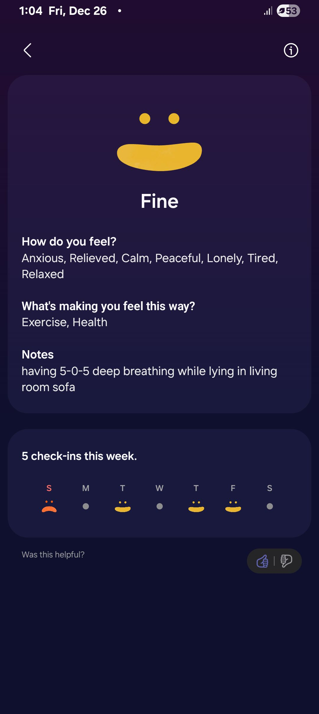

- 01:22 OGC，入耳式耳機
- 02:05 走動，喝水
  id:: 694d72c3-1069-4587-bd20-e70ae390a3db
- 02:[[10]] 居家看電影，半躺半坐
- 02:47 設鬧鐘，關燈，睡覺，聽音樂
- 10:20 因不適醒來，因冷痹醒來，記錄夢境，查看睡眠記錄，打哈欠，半躺半坐
	- 夢見自己不斷修正自己手機的鍵盤
- 10:36 喝水，午餐，喝牛奶，吃蔬果，沖涼，盥洗，摘下牙套，喝水，哼唱，覺察羞愧
- 12:53 閉目養神，深呼吸，躺着，輕拍自己的胸口
  collapsed:: true
	- 
	-
- 13:17 走動，喝水
- 13:20 記錄閃念，因眼前事物分心，走動，查看信箱，刪 email，[[嗶哩嗶哩]]取關博主，哼唱，聽歌，覺察喜悅，強迫性做事，覺察焦慮，
  collapsed:: true
	- [[KTV 想點唱的歌單]]
	- 結束於 15:15
- 15:16 喝水，哼唱，