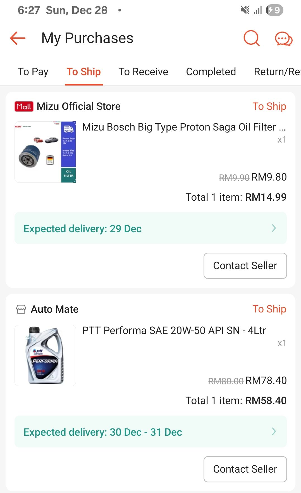
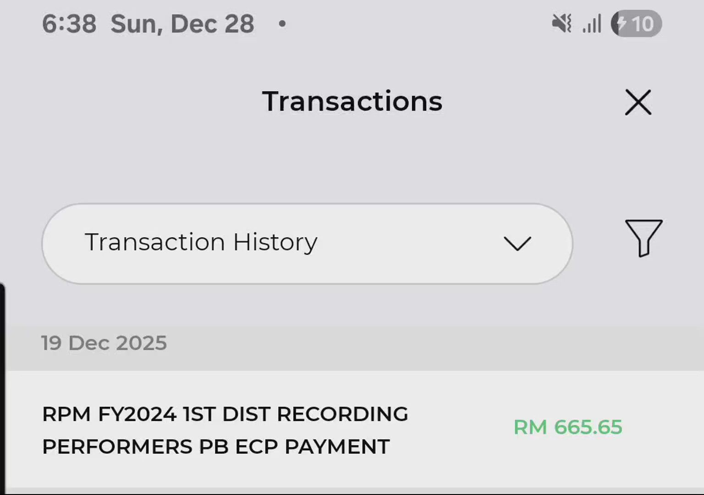

- 00:03 看視頻，入耳式耳機，暗室直視 3C 藍光，半躺半坐
- 01:30 關燈，打哈欠，深呼吸，躺下，閉目養神
- 1:57 睡覺
- 07:03 中途醒着，被外部聲音驚醒，賴床，記錄夢境，覺察受驚嚇，困惑，好奇
  collapsed:: true
	- 夢見自己在 [[pasar pagi]] 替別人看顧其中一個攤位，結果離開不遠後，攤位的一隻鎮店之魚被人偷走了，我因此被追責且要求趕緊找回那隻魚
	- 醒前，我和阿嬤還在[[登嘉樓]] [[Kemaman]] 的屋子前討論怎麼處理一條還沒死去的魚
	- 停筆於 07:22
- 07:22 回籠覺，睡睡醒醒，因外部聲音醒來，因冷痹醒來
- 10:21 因冷痹醒來，主動關閉風扇，走動，半躺半坐
- 10:29 無風狀態，吃甜食，閉目養神，坐着，喝水，
- 11:01 因外部聲音分心，覺察失望，憤怒，移動到安全的地方，躲避與家人進一步聊天，午餐，吃蔬果，躲避非同居者造訪，同在冥想，中途遇到家人干預，沈默應對家人的提問，覺察不耐煩，排斥，沖涼，排尿，清洗廚具
- 14:10 時間帳，哼唱，喝水，無風狀態
- 14:14 走動
- 14:21 [[quick capture]]: #voice-memo
  collapsed:: true
	- **[[當你覺得冷你就需要暖]] DEMO**
		- 
- [[14]]:22 藉助 [[AI]] 工具 ── 復習及優化購買指南 ── [[engine oil]] + [[oil filter]]，線上購物，支付
  collapsed:: true
	- 
- 18:35 留意到賬戶收到自 [[RPM]] 發放 2024 年的表演 [[royalty]]，覺察觸動
  collapsed:: true
	- 
- 18:42 走動，喝水，晚餐，煮，清洗廚具，覺察喜悅，如釋重負，因外部聲音分心，覺察焦慮，刻意迎納不舒服的感受，沖涼，哼唱，盥洗，
- 20:32 時間帳，
- 20:36 OGC，同在冥想，閉目養神，躺下，覺察輕盈
- 20:46 喝水，走動
- 21:00 坐著，網搜資訊，刷社媒， [[Avatar]] [[IMAX]] [[Laser]] [[3D]] 電影院及路線規劃攻略
- 23:09 排便
- 23:52 網搜資訊，Outline 專注點，文字提問，修正信息，繼續 [[Avatar]] [[IMAX]] [[Laser]] [[3D]] 電影院及路線規劃攻略，選購購票
  collapsed:: true
	- 我正爲今年的最後一天 2025 年 12 月 31 日計劃着一場電影馬拉松 + Rapid KOTA 一日游跑透透 + 獨自跨年的行程如下：
	- ## 31 Dec 2025
	- ### 9:00 AM - 10:30 AM
	  **5, Lorong 8/1c, Seksyen 8 Petaling Jaya, Petaling Jaya, Selangor to Sunway Velocity Mall**
	  https://maps.app.goo.gl/pPXMMawY2DisUnvH7
	- ### 11:30 AM - 15:00 PM
	  TGV IMAX 3D, Sunway Velocity
	  **Avatar: FIre And Ash**
	- ### 15:40 PM - 17:40 PM
	  TGV Deluxe, Sunway Velocity
	  **Back to the Past 尋秦記**
	- ### 18:00 PM - 18:30 PM
	  **Sunway Velocity Mall to Persiaran TRX**
	  https://maps.app.goo.gl/AdHwjNvsiiYMJmq6A
	- ### 18:30 PM - 19:45 PM
	  **Windows Shopping @TRX**
	- ### 19:45 PM - 21:30 PM
	  **Persiaran TRX to Sunway Square Mall**
	  https://maps.app.goo.gl/Xnkr1hrYCP7PYgf49
	- ### 22:00 PM - 01 Jan 2026  01:30 AM
	  **Windows Shopping + 2026 Countdown @Sunway Square Mall @The Library ( Book Xcess )**
	- ## 01 Jan 2026
	- ### 01:30 AM - 02:30 AM
	  **Sunway Square Mall to Asia Jaya**
	  https://maps.app.goo.gl/64YpXsMgbs79X28j7
	  
	  
	  我對這次行程的重心是電影和探索， priority 如下：
	  1)  電影
	  2)  探索新去處
	  3)  安全與輕盈
	  
	  我需要你據我附上的截屏即 2 場不同的電影，針對它們各自著重不同程度的視聽覺體驗，首先為我分析目前仍在選擇的 Halls 及 seats 是否仍屬於最佳的範圍且不會造成被迫於仰頭或左右搖頭的觀影窘境，邏輯為何？
	  
	  接著，你才進一步分析我整天的行程安排，好比從理想與現實的層面、時間與距離的維度、精力與耗能的考驗等深入研究當前的計劃是否合適，過於緊湊或哪裡值得微調。比方說據 Rapid KL 官媒 https://x.com/myrapidkl/status/2004451253468750142?s=20 所釋出的 Lanjut Waktu Operasi Sempena Ambang Tahun Baharu 2026 公告，文中提到 BRTSunway, bas & ROD terpilih hingga 2:30 pagi，請問我目前計劃 01:30 AM 才開始從 Sunway Square Mall 走路到 SunU-Monash 站搭 BRT，會不會太遲呢？
	- 結束於 [[Mon, 29-12-2025]] 04:42