- 04:52 強迫性做事，購電影票，Troubleshooting
  collapsed:: true
	- [[Avatar]] 3: Fire and Ash
	  collapsed:: true
		- 
	- [[尋秦記 ｜ Back to the Past]]
	  collapsed:: true
		- 
		-
- 05:21 關燈，睡覺，睡睡醒醒，夢醒
- 11:48 因外部聲音醒來，因冷痹醒來，走動，主動關閉風扇，檢查睡眠記錄，覺察難過，排斥，半躺半坐，測試軟件，強迫性做事，無風狀態
- 12:25 打哈欠，走動，摘下牙套，盥洗，排尿，午餐，沖涼
- 13:33 OGC，半躺半坐，暗室直視 3C 藍光
  id:: 6952128d-011b-42a9-a8a7-094ac48ee042
- 14:28 走動，喝水，刷社媒，坐着
- 14:48 搜電影，暗室直視 3C藍光，坐着 咬嘴皮，手環設置通知，
- 15:16 居家看電影《 [[Avatar]] 》
- 17:28 接受及拆包裹，走動
  collapsed:: true
	- 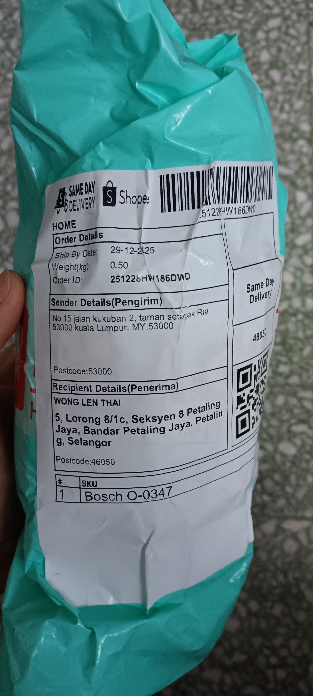
	- 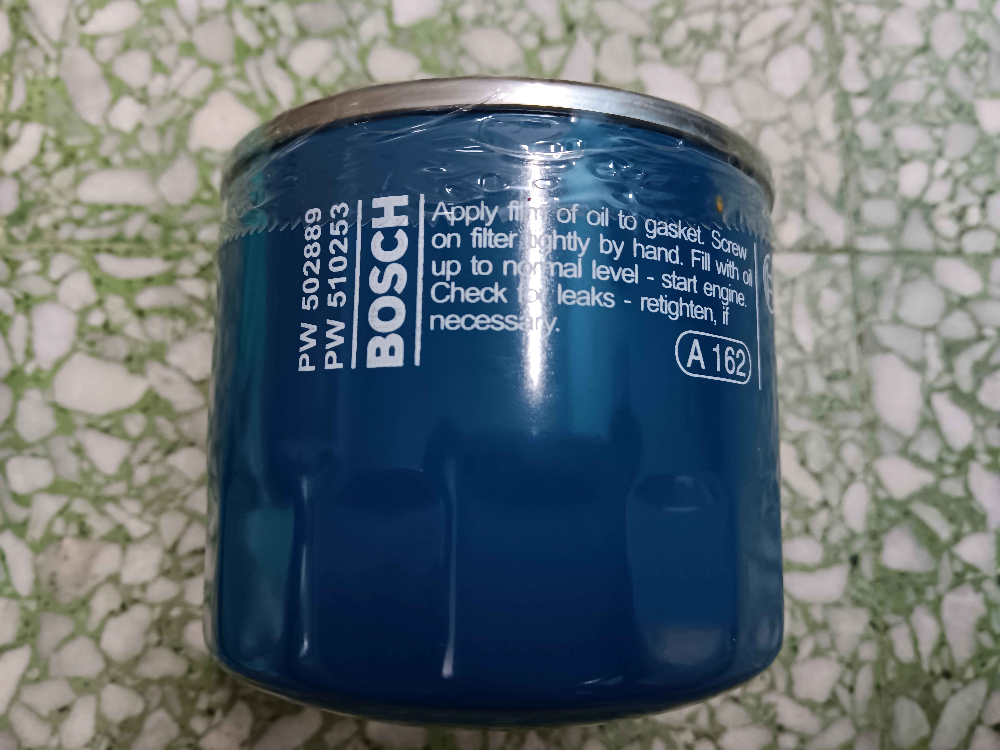
	- 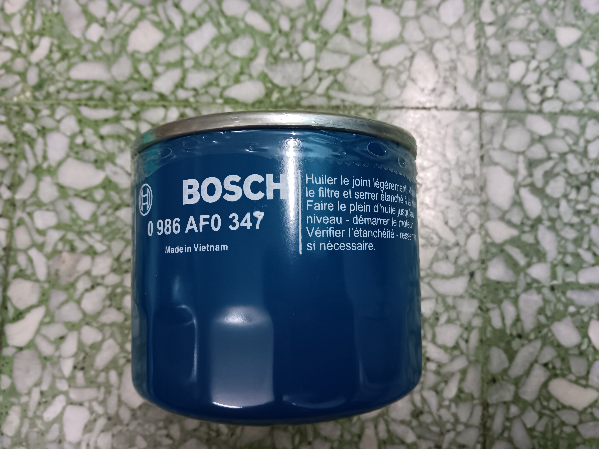
	- 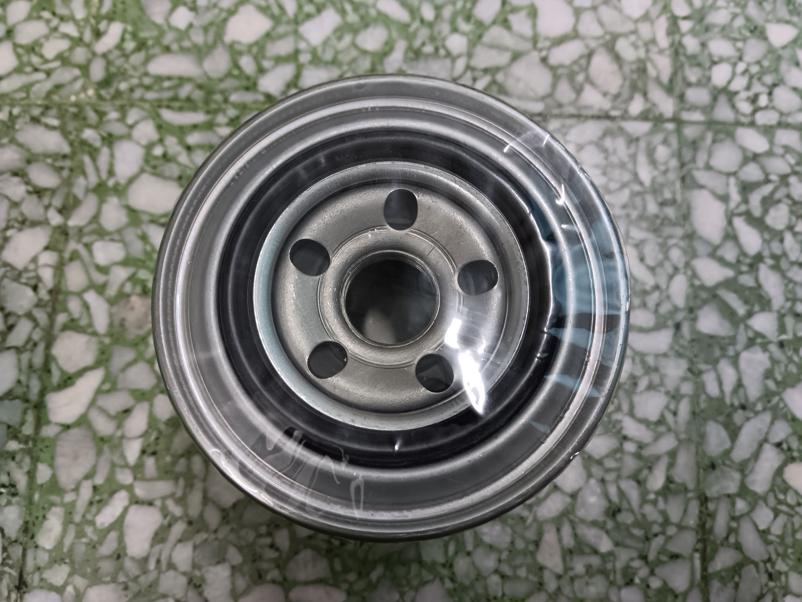
	- 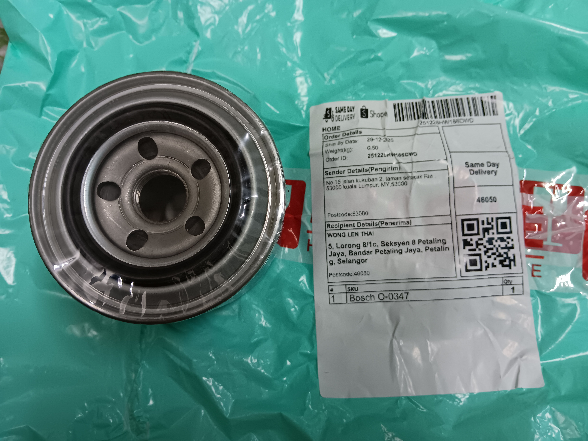
- 17:43 藉助 AI工具 ── 驗證貨品真僞，猶豫而決，咬嘴皮，躲避與家人接觸，遠離到安全的地方
  collapsed:: true
	- 安排 [[return]]/[[refund]] 退貨或退款
	  collapsed:: true
		- 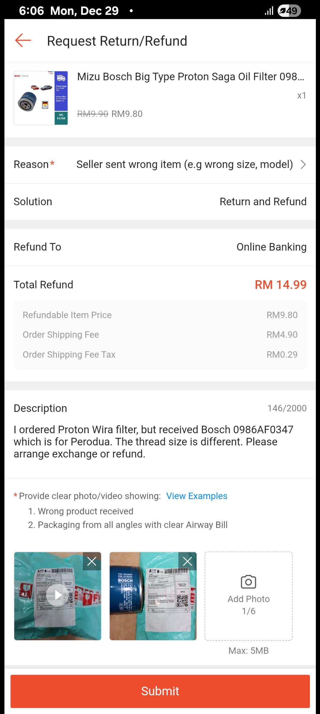
		- 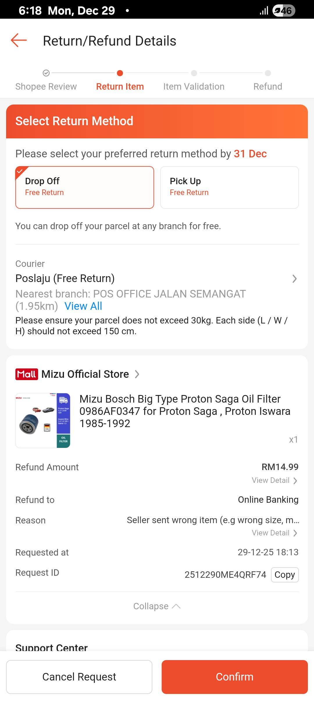
		- 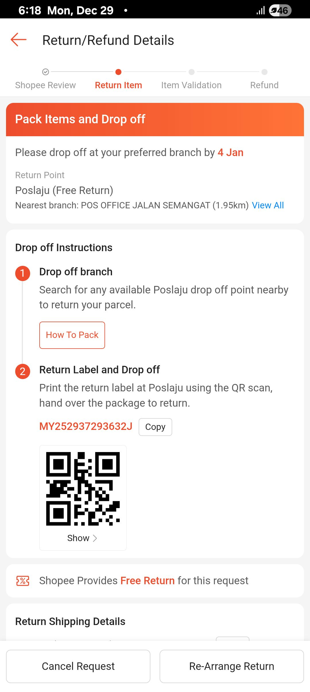
	- 規劃明天 [[drop off]] 寄回包行程
	  collapsed:: true
		- ### 总结明天的行动剧本
			- **9:00 AM 出发**。**
			  logseq.order-list-type:: number
			- 不拿号码**，直接找机器。**
			  logseq.order-list-type:: number
			- 丢给柜台**，走人。**
			  logseq.order-list-type:: number
			- 出门右转**（如果不塞车），去附近的 Spare Part 店买新油格。**
			  logseq.order-list-type:: number
			- 扫码 -> 印单 -> 贴单**。
			  logseq.order-list-type:: number
				- 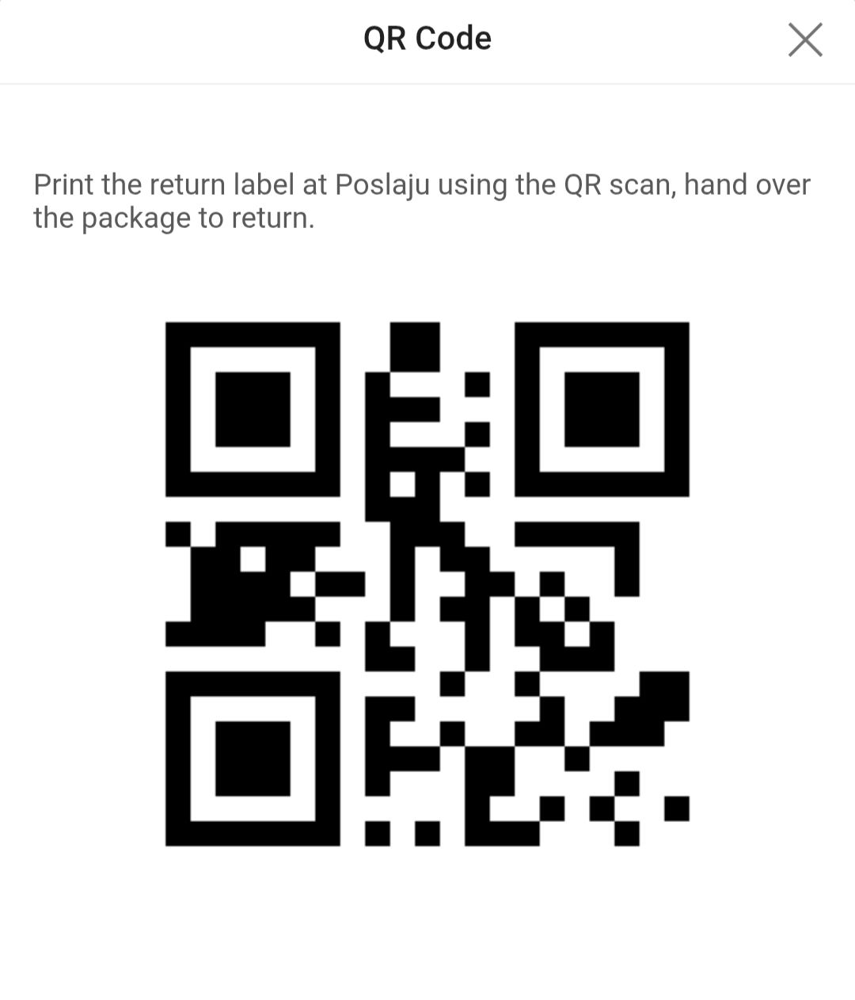
				  logseq.order-list-type:: number
- 18:45 走動，將貨品重新包裹，排尿
- 18:58 藉助 AI 工具 ── 回信誤送貨的賣家 + 明天選購 oil filtet 實體店攻略，整理筆記，半躺半坐，咬嘴皮
  collapsed:: true
	- 面對賣家疑忽悠回覆
	  collapsed:: true
		- 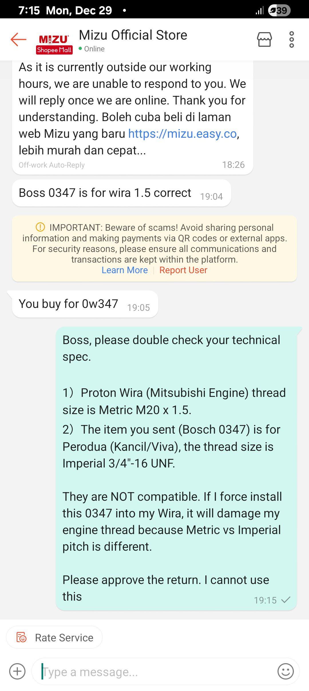
	- 實體店 Priority
	  collapsed:: true
		- ## 总结明天的行车路线 (Waze / Google Maps)
			- 起点： 家 (Section 8)
			- 第一站 (9:00 AM): Pos Laju Jalan Semangat (Drop off 包裹)。
			- 第二站 (9:15 AM): Waze 搜 "Jalan 21/17, Sea Park"。
			  看到一排修车店和零件店就停下来。
			  走进 Kam Meng 或 PH Auto。
			  买下 Bosch Oil Filter (Wira 1.5)。
			- 终点： 回家等黑油送到。
			  祝你明天像特种兵一样，任务完美达成！
		- 第一站：Sea Park 零件街 (距离 Pos Laju 约 1.5 KM)
		  logseq.order-list-type:: number
		  collapsed:: true
			- 导航策略： 从 Pos Laju 出来，转个弯过个红绿灯就到了。这里有 3-4 家店连在一起，这里买不到的机率几乎为零。
			- Kam Meng Auto Suppliers (甘明汽车零件) - ⭐⭐⭐ 首选推荐
			  logseq.order-list-type:: number
				- 为什么选它： 既然你要买 Bosch Filter，找代理商最稳，肯定有货且肯定是正品。
				  logseq.order-list-type:: number
				- 预计价格： RM 10 - RM 13。
				  logseq.order-list-type:: number
				  话术： "Boss, nak Oil Filter Wira 1.5. Bagi yang Bosch Big Type (Nombor 346)."
				- 距离： 最近，且招牌上有大大的 Bosch Logo（他是 Bosch 的代理商）。
				  logseq.order-list-type:: number
				  位置： Jalan 21/17, Sea Park (和 PH Auto 同一排)。
			- PH Auto Enterprise (PH 汽车零件)
			  logseq.order-list-type:: number
				- 位置： 就在 Kam Meng 隔壁几间 (No. 7, Jalan 21/17)。
				  logseq.order-list-type:: number
				- 特点： 也是老字号，货很全。如果甘明没开，就来这家。
				  logseq.order-list-type:: number
				- 预计价格： RM 10 - RM 12 (APM 红罐可能 RM 8 - RM 10)。
				  logseq.order-list-type:: number
			- Suan Huat Auto Supply (PJ)[1]
			  logseq.order-list-type:: number
				- 位置： 同一条街。
				  logseq.order-list-type:: number
				- 特点： 连锁大店，价格透明。
				  logseq.order-list-type:: number
		- 第二站：回程顺路 (Section 8)
		  logseq.order-list-type:: number
		  collapsed:: true
		  如果你在 Sea Park 没买到（机率极低），或者你不想去 Sea Park 塞车，想直接回家顺路买。
			- Syarikat Auto Spare Parts (Section 8)[2]
			  logseq.order-list-type:: number
				- 位置： No. 10, Jalan Sungai Jernih, Seksyen 8 (就在你家附近，警察局后面那一带)。
				  logseq.order-list-type:: number
				- 距离： 离你家几百米。
				  logseq.order-list-type:: number
				- 策略： 这是你的保底选项。寄完包裹直接开车回 Section 8，去这家买，买完回家。
				  logseq.order-list-type:: number
				  关键战术问答
	- Q1: 带着那个“买错的包裹”去店里有帮助吗？
	  collapsed:: true
		- 答案：带着！但不要把它拿出来“用”。
		- 为什么带着？ 它是你的**“实物参照物”**。万一那个店员是个新手，或者是个外劳，听不懂 "Wira Big Type"，你可以把这个错的拿出来，指着它的螺丝口说："Ini Kancil punya (kecil), saya TAK MAU ini. Saya mahu Wira punya, lubang besar."
		- 更有用的做法： 你的手机里最好存一张 Bosch 0986AF0346 的照片（或者直接把我们之前的对话截图给他看）。这比拿实物更有用。
	- Q2: 价格区间与转头就走的原则
	  collapsed:: true
		- 合理入手价： RM 10 - RM 15。
			- RM 10 - RM 12 是良心价。
			- RM 13 - RM 15 是正常市价。
		- 被“砍菜头”警戒线： 超过 RM 18。[3]
		  如果老板开价 RM 20 或 RM 25，你可以礼貌地说 "Mahal sikit boss, biasa beli RM12 je"，然后转头去隔壁（Sea Park 那里有 4 家店，不用怕没得选）。
- 19:36 回信，請教對方糾正且學習地道的馬來文
  collapsed:: true
	- 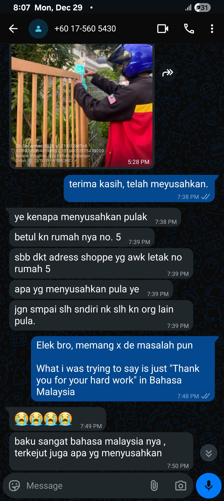
	- 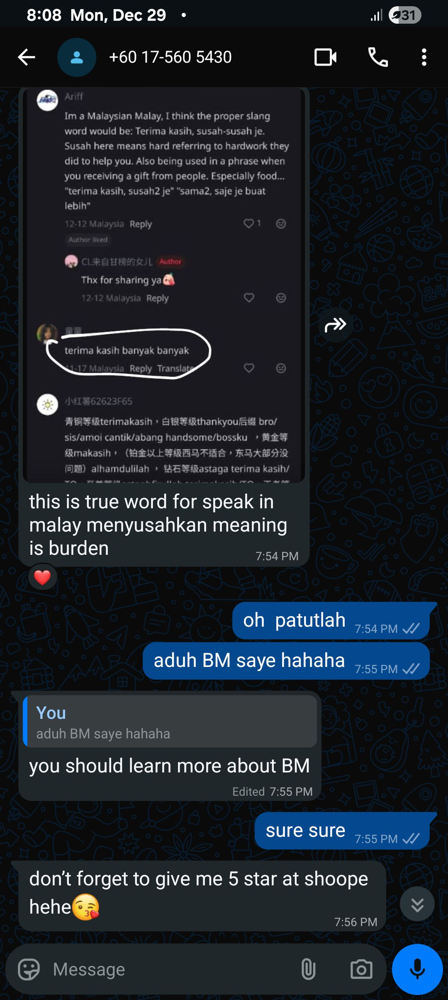
	- 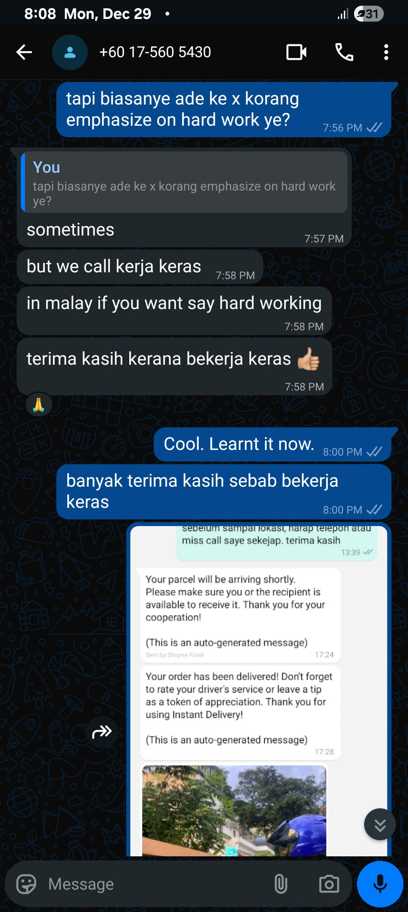
- 20:13 居家看電影《 [[Avatar]] 》
- 21:17 晚餐，清洗廚具，沖涼，