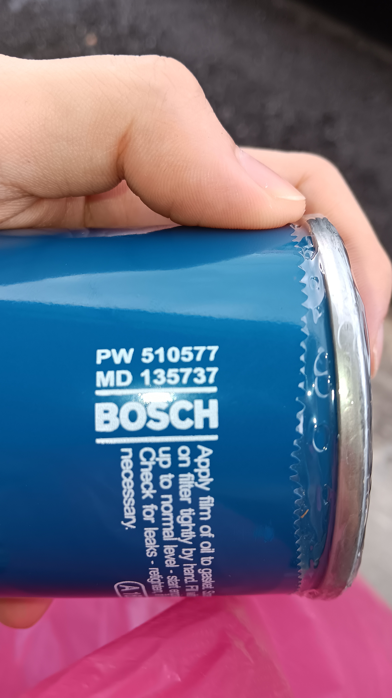
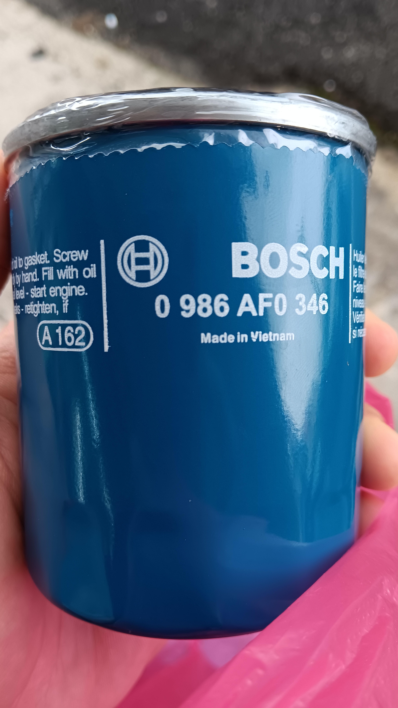
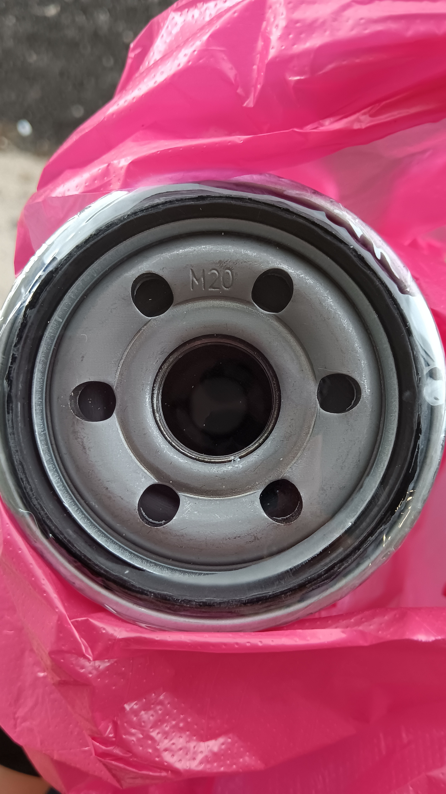
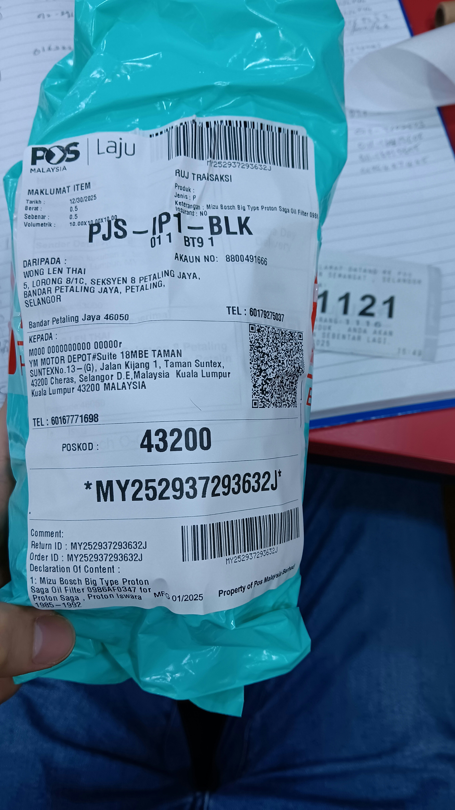
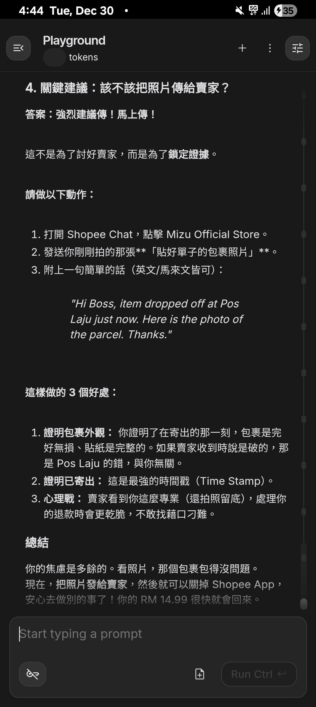
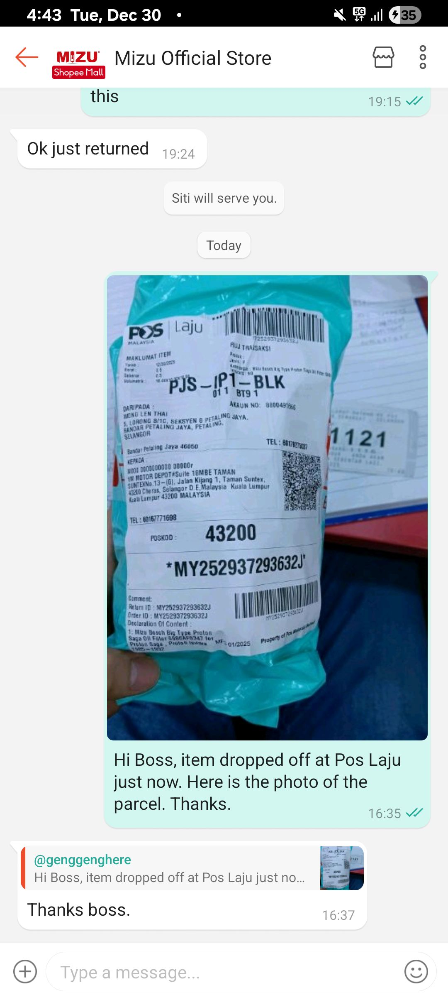

- 00:00 關燈，閉目養神，深呼吸，輕拍自己的胸口，心口覺悶，渾身不適，覺察疲勞
- 00:10 睡覺，下載《 [[Avatar]] 2: The Watwr Way 》
- 09:00 因鬧鐘醒來，解除鬧鐘，賴床，回籠覺，睡睡醒醒，因疲倦起不了身
- 09:44 因不適醒來，因冷痹醒來，因手環震動醒來，半躺半坐，喝水，摸摸自己的頭，走動，[[reload]] & [[purchase]] [[pre-paid]] [[plan]]，暗室直視 3C產品，覺察焦慮，反復確認 Google AI Studio.聊天記錄，檢查銀行及 [[Touch 'n Go]] [[e-Wallet]] 現金流
- 10:53 走動，熱水澡，盥洗，摘下牙套，喝水，早餐，喝牛奶
- 11:47 排便，刷社媒
- 12:27 走動，晾乾衣物，換衣，喝水，覺察焦慮，中途因其他臨時事物分心
- 13:15 開車出門
- 14:00 藉助 AI 工具 ── 覆盤從 [[Kam Meng Auto Suppliers (甘明汽车零件)]] 詢問關於油格的售價
- 14:56 到了 PH Auto Enterprise 問價
  collapsed:: true
	- **15:28** [[quick capture]]: 
	- 
	- 
	- 
- 15:28 前往 [[Pos Laju]] [[Jalan Semangat]] 寄回 [[Mizu]] [[Shopee]] 誤送的油格
- 15:53 到了 [[Pos Laju]] 掛號
	- 
- 16:04 回到了車上，藉助 AI 工具 ── 覆盤寄貨程序，回信
	- 
	- 
- 16:44