- 00:06 傳輸《 [[Avatar]] [[2]] : [[The Way of Water]] 》 從 [[MacBook]] 至 A14，網搜資訊 ── 中文字幕 srt
- 00:44 清潔雜物，走動，強迫性做事，覺察著急，焦慮
- 00:56 居家看電影《 [[Avatar]] [[2]] : [[The Way of Water]] 》，暗室直視 3C 藍光，半躺半坐，覺察觸動，難過，入耳式耳機
  id:: 6954043f-6075-4498-8dd4-f85dcd2d5f98
- 04:[[14]] 打哈欠，查看今日行程，半躺半坐，
- 04:30 睡覺
- 07:42 因外部聲音驚醒，中途遇到家人干預，他人的請求 ── 嬤嬤臨時需要我幫助她留意廣告裏的廚具，覺察猶豫而決，困惑，確認對方的需求，說教，覺察憤怒，失望，排斥，表達看見、感受、需要，請求，爆粗，因對話中斷而僵持，動作變得賣力，聽見隔壁鄰居從廚房發出聲音和爺爺進出廁所時，覺察到更加焦慮，證明性行爲，熱水澡，摸摸自己的頭，同在冥想，覺察感受及想法背後隔壁更深層的渴望 ── 希望對方優先問我是否有空，才考慮是否請求我的幫助，覺察如釋重負，
- 09:13 早餐，走動，儀容裝扮
- 09:47 出門，走動到 [[LRT]] [[Asia Jaya]]，覺察焦慮，緊張，擔心來不及趕到 [[Sunway Velocity Mall]], [[TGV]] 觀賞電影《 [[Avatar]] [[2]] : [[The Way of Water]] 》
- 09:59 排隊購通行證 [[rapid KOTA]]
  collapsed:: true
	- 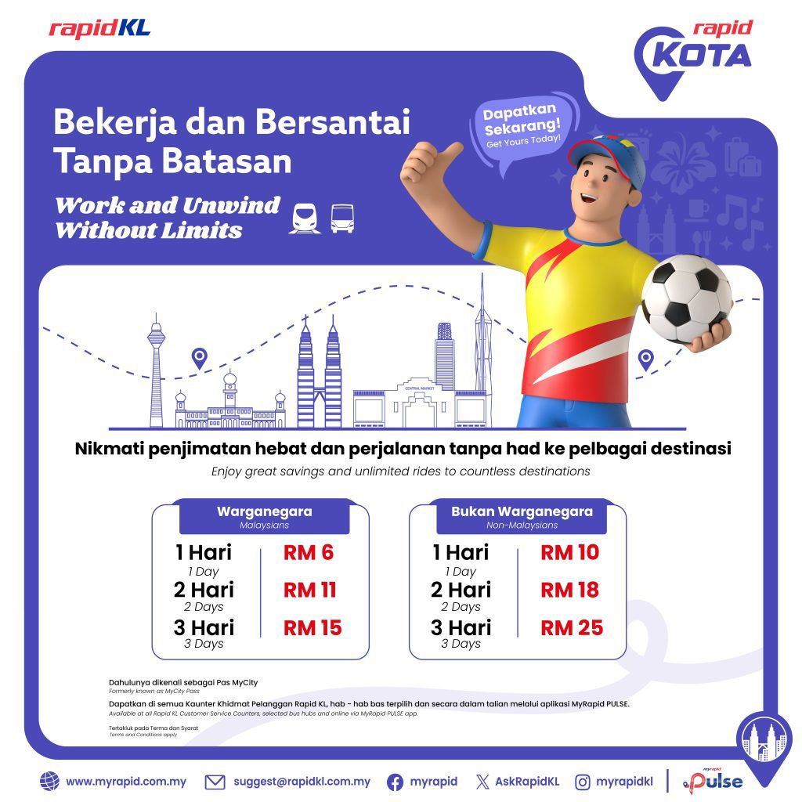
- 10:03 搭 [[LRT]] [[Asia Jaya]] > [[Pasar Seni]]，坐着，覺察不安，時間帳，[[覆盤]]今早剛發生的[[衝突]]
- 10:20 找尋轉接站，覺察焦慮，心跳加快，害怕找不到，從實體的路線圖嘗試確認當前的位置，原本打算詢問出口櫃檯處；後來因爲等不到結果嘗試依循直覺擇一出口，結果順利看見熟悉的路標，覺察如釋重負
  collapsed:: true
	- 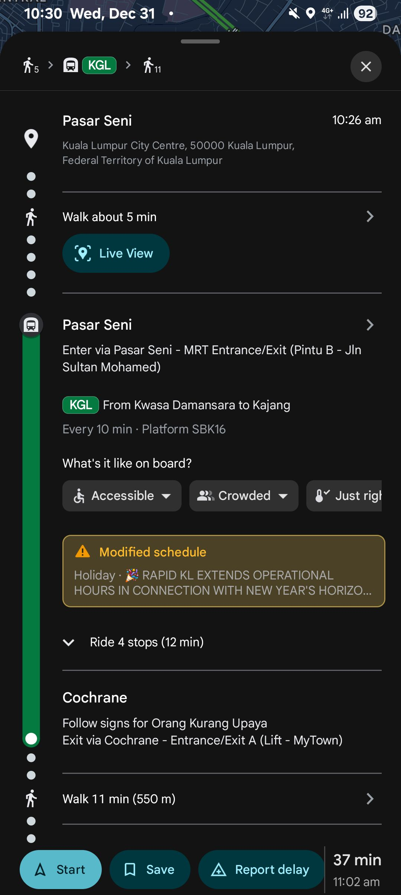
- 10:31 終於找到了 [[KGL]] [[Kwasa Damansara]] > [[Kajang]] 路線的轉接站
- 10:34 [[KGL]] 路線搭 [[LRT]] [[Pasar Seni]] > [[Cochrane]] kok crane，站着，時間帳，覺察焦慮
- 10:45 走動從 [[LRT]] 站 [[Cochrane]] > [[Sunway Velocity Mall]]
- 10:53 到了 [[Sunway Velocity Mall]] 外邊，前往 [[TGV]]
- 10:57 終於看到 [[Nanjing Entrance]]，上廁所，找尋目的地圖中害怕他人的眼光 ── 自己走錯路
- 11:10 從另一端 [[food court]]， 終於走到了 [[TGV]] 電影院的入口，覺察如釋重負，適當地坐一下，休息，閉目養神
- 11:26 走進了全馬最大間的 [[IMAX]] 影院，觀賞電影《 [[Avatar]] [[2]] : [[The Way of Water]] 》，覺察難過，喜悅，觸動，中途肚子發出聲音，覺察羞愧，害羞
  collapsed:: true
	- 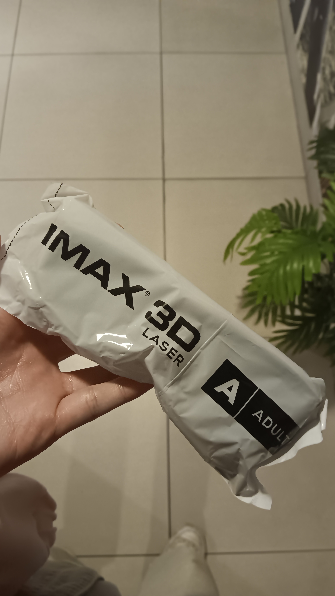
	- 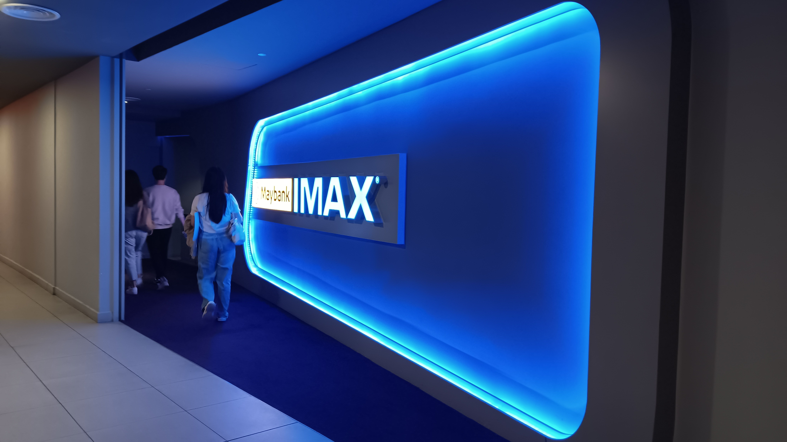
	- 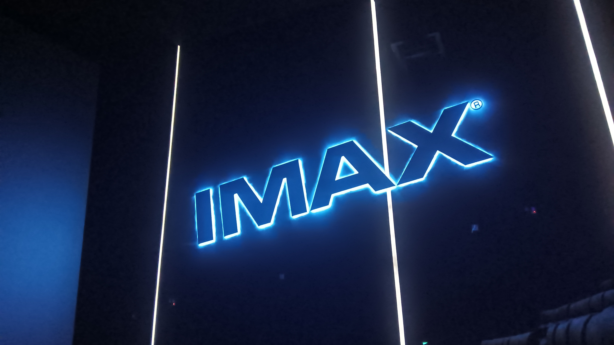
- 14:57 電影 credit roll
- 15:03 上廁所，走動，不斷調整衣着打扮，覺察焦慮
- 15:18 回信
  collapsed:: true
	- 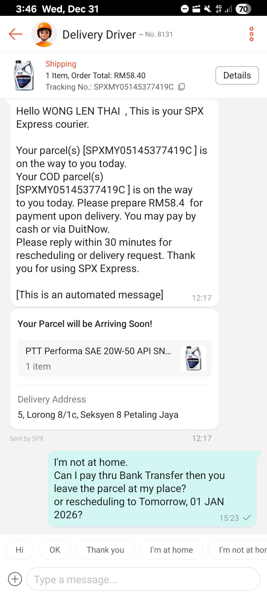
- 15:40 入場觀賞電影《 [[尋秦記 ｜ Back to the Past]] 》
- 17:48 電影結束，回信，發現自己錯過了快遞員 missed calls X 2，覺察焦慮
  collapsed:: true
	- 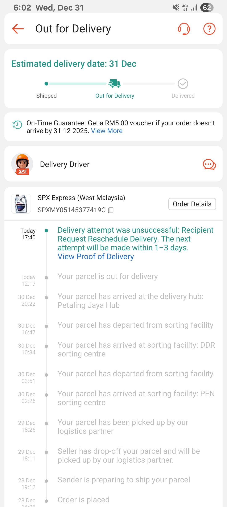
- 18:03 逛櫥窗，找便利食品
- 18:45 晚餐，覺察滿足
  collapsed:: true
	- 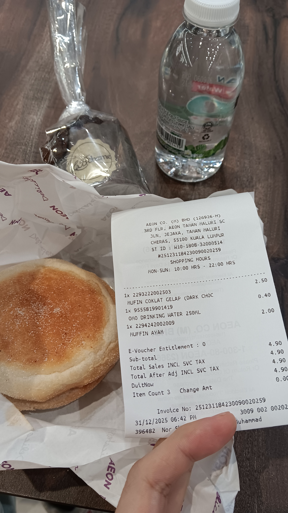
- 19:02 前往 [[TRX]]，前往 [[Cochrane]] 的天橋途中遇到路人打破魚油玻璃罐，幫助將一顆魚油和玻璃碎片撿起來
- 19:23 [[LRT]] [[Cochrane]] > [[TRX]]
- 19:27 抵達 [[TRX]]，逛櫥窗，覺察焦慮，同在冥想
- 20:16 坐着，覺察疲倦，時間帳
- 20:22 走動，再次回到 [[Apple Store]] 旗艦店，結果如願享受到  嘗試通過有守衛的柵欄，發現其實跟自己想象的阻礙要容易一些 ── 和守衛確認後，只需換另一個入口即可探索新區域，覺察滿足，看見自己的努力，試衣
- 22:11 走動到 [[TRX]] 的 [[MRT]] 站，途中人潮開始變多
- 22:19 轉接站 [[MRT]] [[TRX]] > [[Sunway Square Mall]]
- 22:44 經過長長的地下道，終於先抵達 [[KL Sentral]]，在 [[KK Mart]] 便利商店猶豫是否買礦泉水，結果選擇暫時[[強忍]][[口渴]]
- 22:46 搭 [[KJL]] 路線，從 [[Pasar Seni]] > [[USJ 7]]，時間帳，咬嘴皮，站着
  collapsed:: true
	- 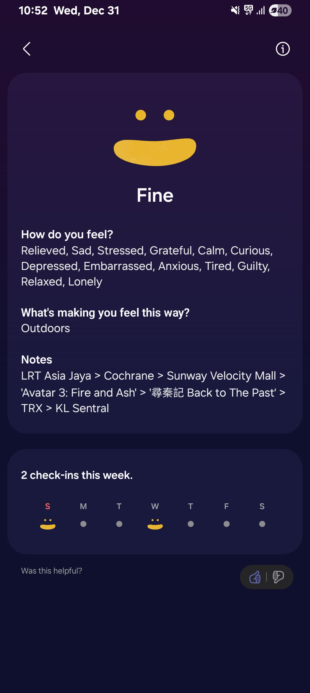
- 23:08 坐着，輕鐵上填寫 [[My Rapid]] 的反饋表單，咬嘴皮
  collapsed:: true
	- 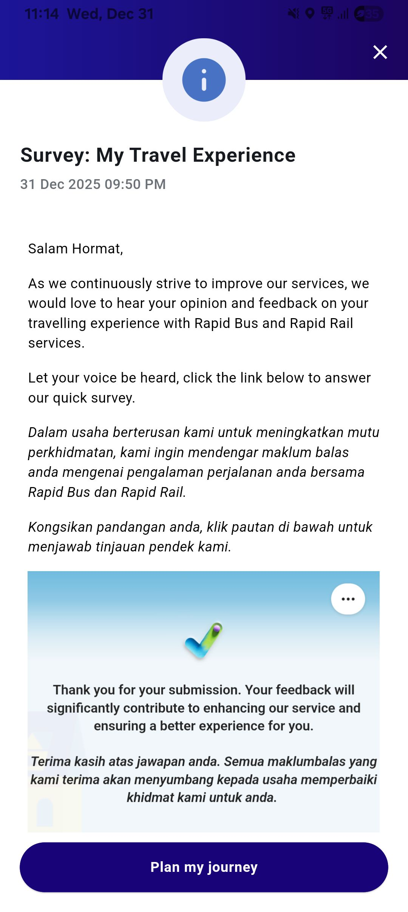
	- 23:15 抵達 [[Subang Jaya]] 站
- 23:25 轉搭 [[BRT]] [[USJ 7]] > [[SunU-Monash]]
- 23:33 上了 [[USJ]] 的 [[BRT]]，第一次坐[[巴士]]，渴望來得及在 [[Thu, 01-01-2026]] 00:00 之前抵達 [[Sunway Square Mall]] 或觀賞煙花秀
  collapsed:: true
	- 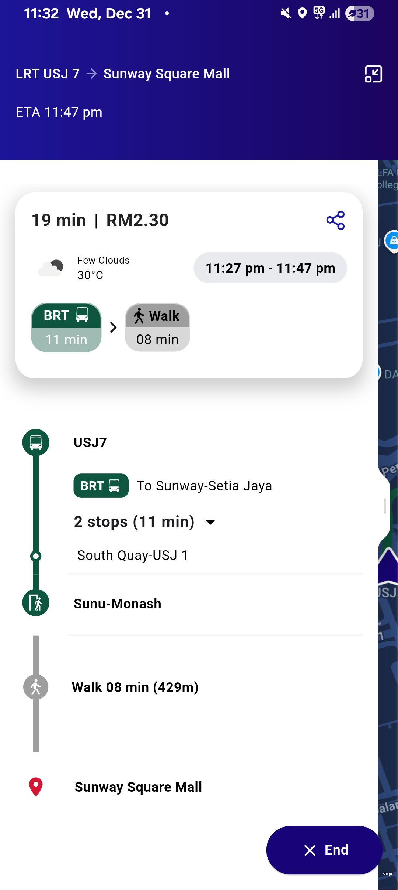
- 23:45 抵達 [[SunU-Monash]] 的 BRT 站，走動到 [[Sunway Square Mall]]，途中不知方向，依循前方陌生人的腳步
- 23:45 抵達目的地
- 23:59 觀賞煙火秀
	- 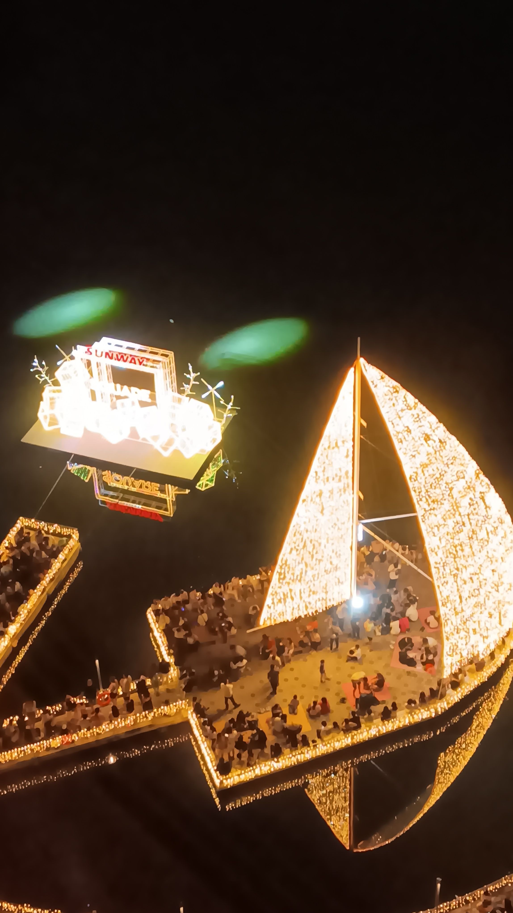
	- 結束於 [[Thu, 01-01-2026]] 00:11