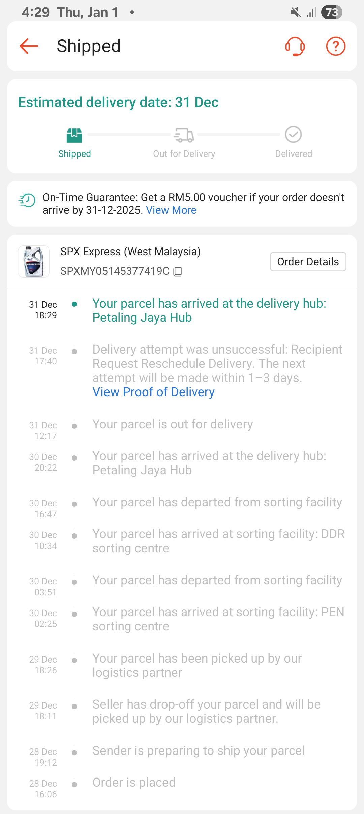
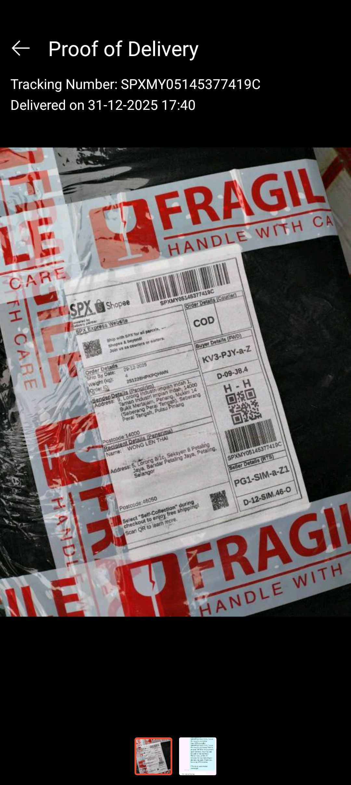
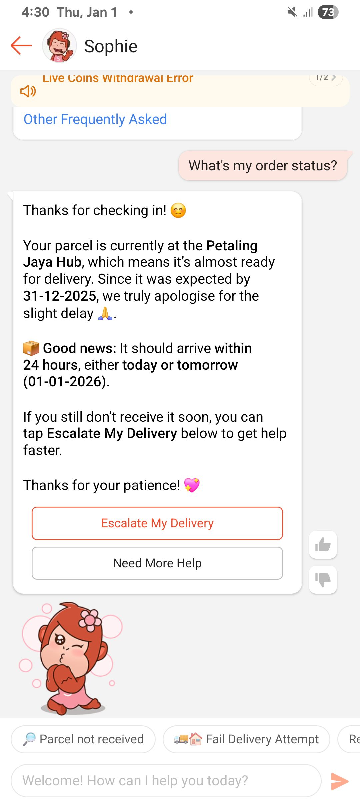
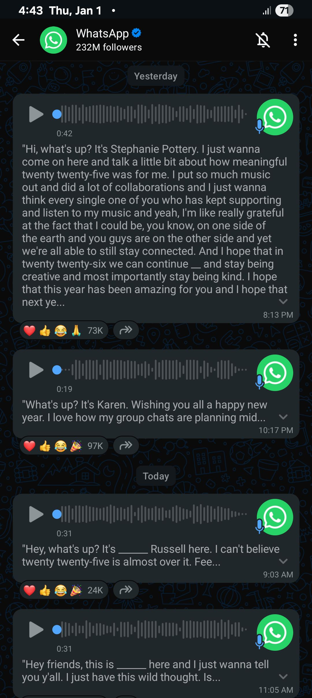

- 00:11 覺察羞愧，慌張，快走，遠離到下一個目的地
  collapsed:: true
	- 00:25 抵達 [[The Library]] @ [[Sunway Square Mall]]，找飲料喝
- **00:25** [[quick capture]]:
  collapsed:: true
	- 口渴，着急，買水
	- 
- 01:00 適當地坐一下，覺察疲倦，抑鬱，刷社媒
- 01:25 走動，因走動多大腿前肌微微作痛因 [[The Library]] 許多門已經關閉，加上事前不敢問人，後來繞了特別特別遠的路，包括上下幾層階梯和反覆循環早經過的路，覺察緊張，心跳加快，焦慮，害怕，咬嘴皮，輕拍自己的胸口，深呼吸
- 02:03 終於安全上了 [[SunU-Monash]] > [[USJ 7]] 的 [[BRT]] 巴士
- 02:08 到 [[MRT]] 站 [[USJ 7]]，確認前往目的地 [[Asia Jaya]] 的路線 from [[Putra Heights]] to [[Gombak]]，感到慌張
- 02:12 等候，
- 02:17 上 [[LRT]] 前，一位看似職員的馬來姑娘趁我還在低頭用手機時，不僅提醒了我一下輕鐵到了，且還順口說了句最後一班車，我頓時感到欣慰，簡單點頭示意感謝，覺察如釋重負，時間帳
- 02:45 到站 [[Asia Jaya]]，走路回家，覺察輕盈，哼唱
- 03:00 到家，刻意不發出聲音，覺察羞愧
- 03:09 時間賬，換衣
  03:25 排尿，離子化飲用水，弄熱食物，清洗廚具，刻意不發出聲音，覺察羞愧，喝水，熱水澡，盥洗，戴上牙套
- 05:20 時間帳，喝水，走動
- 05:31 OGC，入耳式耳機，強忍睡意，強迫性做事
- 06:05 緩衝，強忍睡意
- 06:15 不小心睡着，關燈，睡覺
- 10:40 因外部聲音醒來，賴床，因疲倦起不了身
- 10:47 回籠覺
- 16:21 因不適醒來，賴床，查看信箱，
  collapsed:: true
	- 
	- 
	- 
	-
- 16:39 測試軟禁新功能 ── [[WhatsApp]] 支持將語音 [[transcripe]] 成文字
  collapsed:: true
	- 
- 16:45 抱抱自己，賴床，回想昨天發生的事，看見自己的努力和嘗試
- 17:09 喝水，緩衝，排尿，晚餐，
- 17:29 查看信箱，喝水，走動，
- 17:34 晚餐
  id:: 69563eda-3c31-4068-970f-20338873a567
- 19:11 適當坐一下，覺察抑鬱，想象阿嬤未來的告別式上可能會遇到的場景，人，感受及因應方式
- 19:18 無風狀態，修正昨天日程記錄，半躺半坐，哼唱，覺察不安，固執，下載軟件 ── [[Samsung MAX VPN]]，測試新功能 [[Ultra Data Saving]]，刷社媒，查看睡眠記錄
- 20:40 喝水，主動打開風扇，走動
- 20:41 藉助 [[AI]] 工具 ── 覆盤距離  [[Tue, 23-12-2025]] 在 Users/mac/Desktop/Notion-Intelligence-Core，與之確認 Timelinkr 驗證可寫；但自動流策略需 debug，強迫性做事
  id:: 69566b89-17a2-4e24-aa0d-f8793ba98aac
- 23:24 晚餐，走動，清洗廚具，喝水，戴上牙套，盥洗
	- 結束於 [[Fri, 02-01-2026]] 00:10