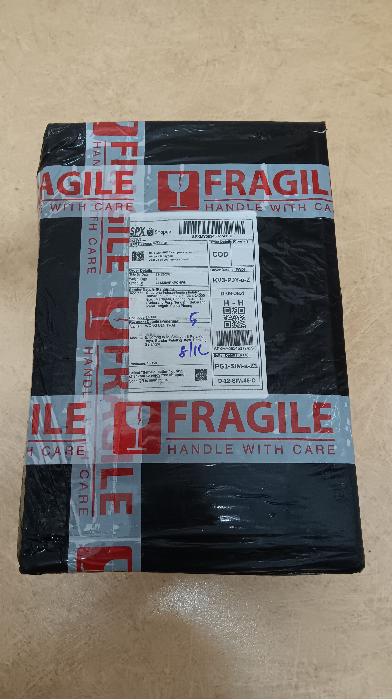
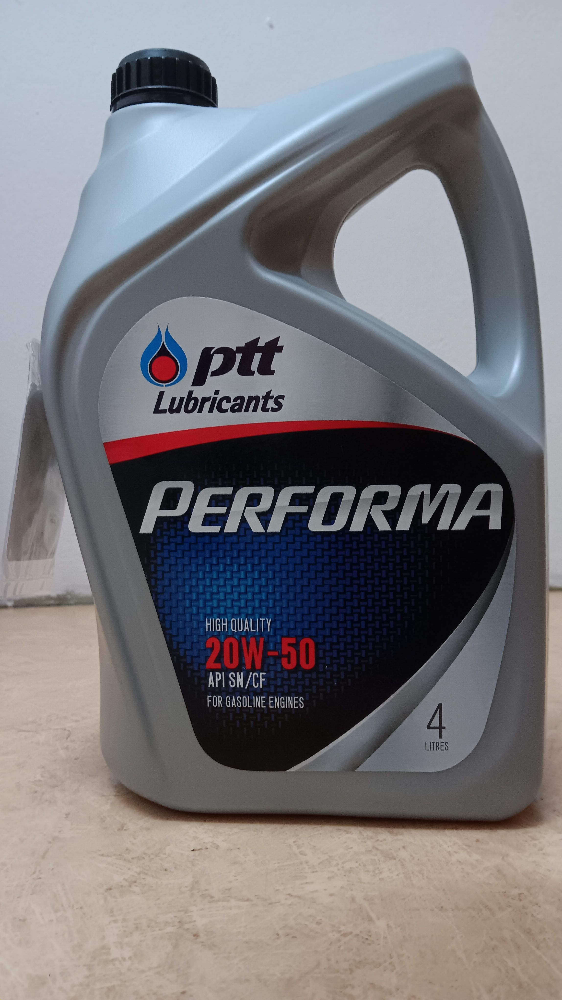
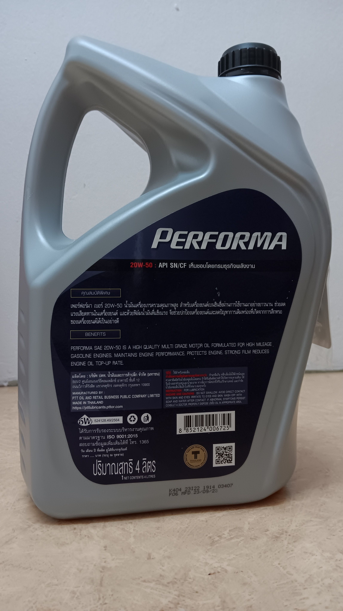
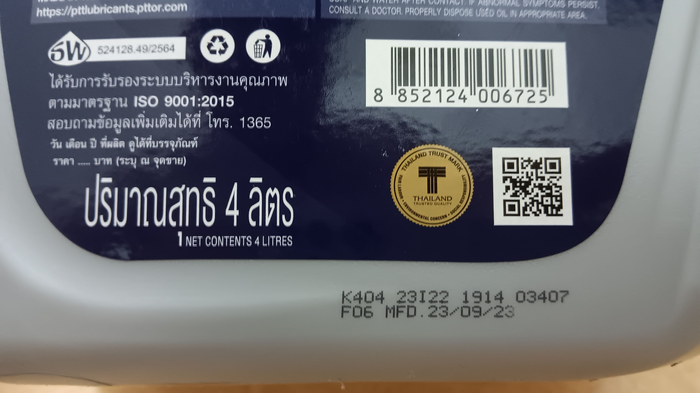
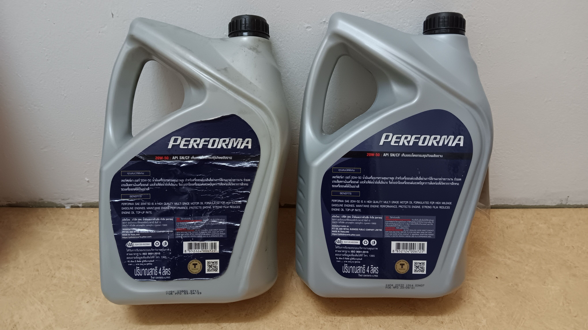
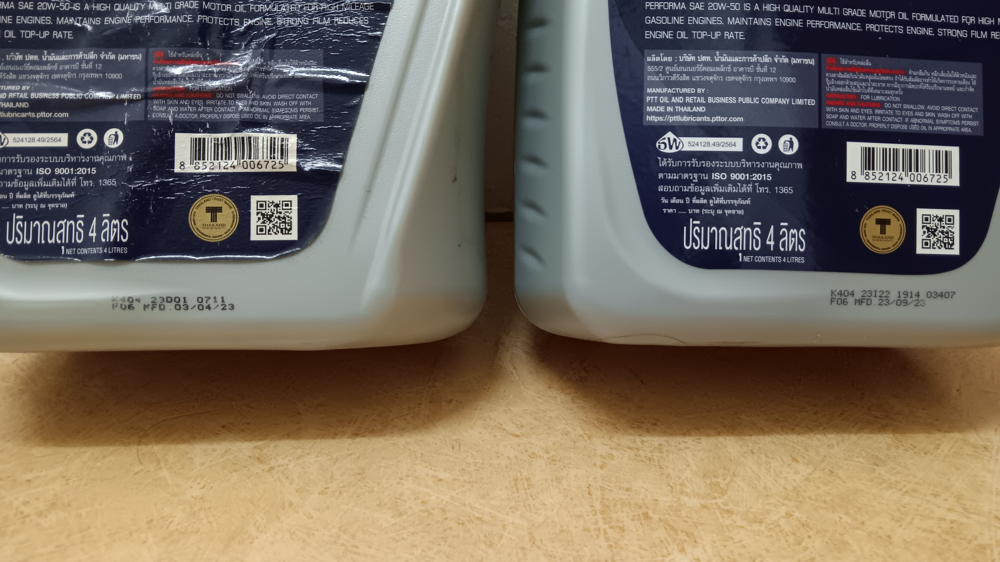
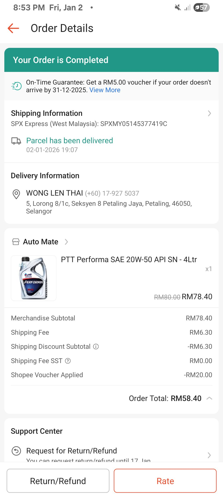
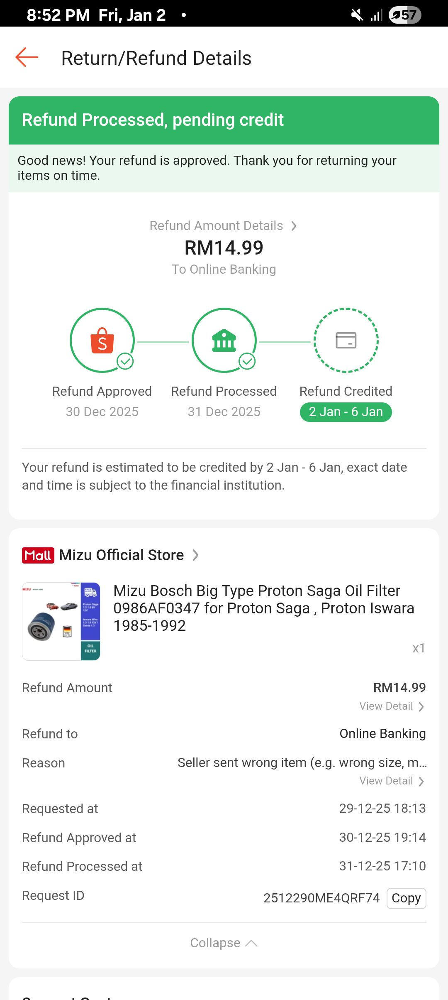
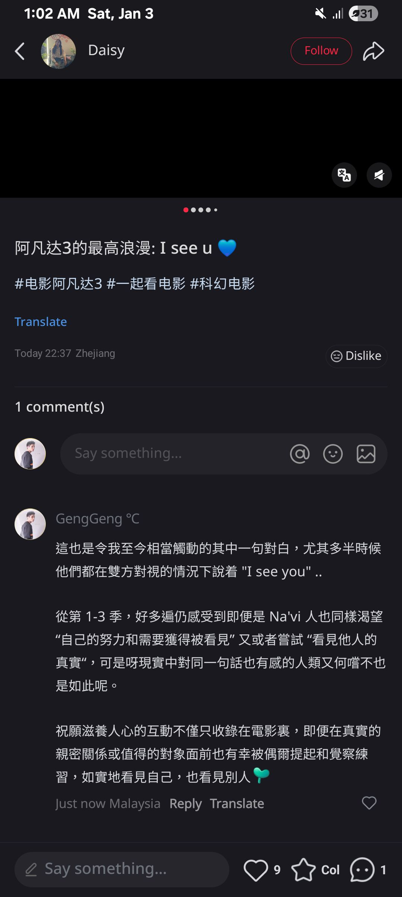

- 00:10 覆盤
  id:: 69569a02-cb3d-4473-8a01-c08f175a52ed
- 02:49 走動，查實所聽所見，預防居家安全隱患 /  即刻處理屋頂漏水，覺察好奇，喜悅，看見儲物間收著另一組 [[Proton]] 原裝 ** [[三角警示牌 (Warning Triangle)]] **
- 03:18 藉助 [[AI]] 工具，強忍睡意，看視頻，因等待眼前事物響應分心
- 07:22 排便，刷社媒
- 07:39 熱水咋哦，覺察身體極其疲勞，強忍睡意
- 08:06 關燈，刷社媒，等頭髮干一些
- 08:16 躺着
- 08:19 睡覺
- 12:29 因三急醒來，強忍睡意，走動，排便，刷社媒
- 12:43 走動，沖涼
- 12:53 躺着，刷社媒
- [[14]]:05 無風狀態，預先打開和緩衝 [[Antigravity]] [[IDE]] ，查看信箱，回信快遞員，手環上設置來電通知
- 15:18 午餐，走動，清洗廚具
- 16:00 走動，適當坐一下，喝水
- 16:07 躺在沙發，閉目養神，深呼吸，聽音樂
- 16:10 聽見家人到家，遠離到安全的地方，覺察羞愧
- 16:16 無風狀態，躺着，閉目養神，深呼吸，聽音樂
- 16:29 無風狀態，不小心睡着，睡覺，睡睡醒醒，因疲倦起不了身
- 18:30 因身體不適醒來，因悶熱醒來，查看信箱，賴床，時間帳
- 18:36 排便，刷社媒，咬嘴皮
- 18:51 熱水澡，走動，中途快遞到家，聽見家人高聲問話和害怕令快遞員久等，下半身圍了毛巾走到家門口，支付時 [[Maybank]] App [[MAE]] 因另一款軟件 [[Long Shot]] 阻礙使用， [[Touch 'n Go]] [[e-Wallet]] 因餘額無法順利轉賬，後來選擇付紙鈔，覺察後悔，遺憾無法順利支付，焦慮，羞愧
- 19:20 時間帳，無風狀態
- 19:27 檢查剛收到的包裹，安放到車上，從擋風鏡將長年暴曬後殘留的貼紙用硬幣清除時體驗像是刮彩卷，倒掉後車廂的積水，未能及時確認漏水的源頭，屋子兩道門暫時開着，看見隔壁鄰居從他們家走出來，快速閃躲進到車內，覺察羞愧，擔心別人的評價
  collapsed:: true
	- 
	- 
	- 
	- 
	- [[舊]] vs [[新]]
		- 
		- 
- 20:35 時間帳
- 20:41 覺察疲倦， 咬嘴皮，[[Shopee]] App 上點擊 [[order]] [[received]]，賬戶確認 [[Wed, 31-12-2025]] 已收回[[退款]] [[refund]] RM 14.99
  collapsed:: true
	- 收回[[退款]] [[refund]] RM 14.99
	- 
	- 
	-
- 21:01 晚餐，清洗廚具，吃小食，吃甜食，看見未整理整齊的塑料袋，覺察排斥，難過，沈默應對家人的提問
- 21:50 喝水，半躺半坐，刷社媒，看視頻，留言，反覆修正信息，停不下來，覺察好奇，羞愧，擔心，難過，遺憾
  collapsed:: true
	- 
	- 特效天花板！火与水：阿凡达电影制作特辑 独家揭秘年... http://xhslink.com/o/7y4byqKM3pZ 
	  Copy and open Xiaohongshu to view the full post！
	- 結束於 [[Sat, 03-01-2026]] 04:24