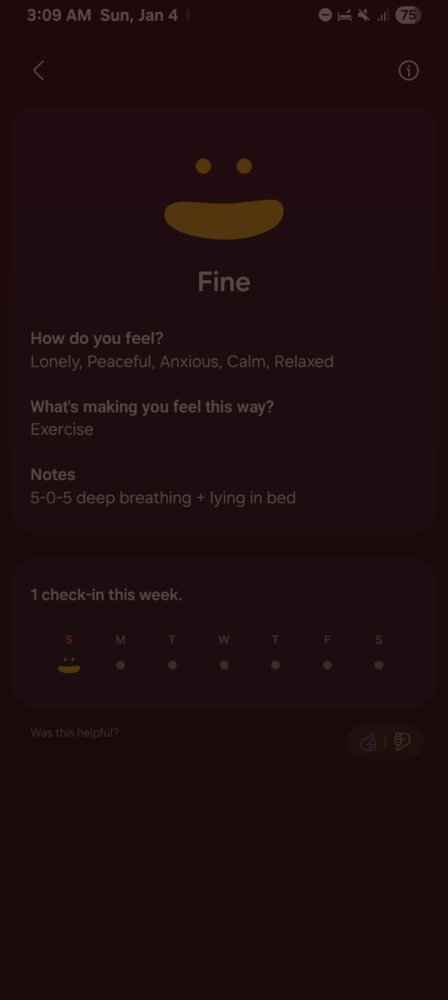

- 01:38 走動，晚餐，清洗廚具，排尿
- 03:00 躺着，深呼吸，聽音樂
  collapsed:: true
	- 
- 03:06 聽音樂，時間帳，躺着
- 03:10 閉目養神，聽音樂
- 03:25 睡覺，聽音樂，作夢，夢醒，[[夢遺]]，睡睡醒醒，因外部聲音醒來
- 15:38 因三急醒來，賴床，記錄夢境，忍尿，聽音樂
  collapsed:: true
	- 夢見自己和好多人都處在末世，困在了一棟建築物，是不是就有外面的怪物侵襲和甚至吃掉人類
	- 過程，我和幾位常待在一起的伙伴，儘量互助和抗敵，也經歷過死傷無數
	- 也有機會和異性發生關係和做愛，印象中有一次因夢遺醒來
	- 停筆於 15:47
- 15:48 坐着，查看睡眠記錄，忍尿，喝水，發呆，猶豫而決
- 16:03 排尿，晚餐，嚐到肉骨茶經過冷藏再弄熱味道變酸，只吃肉不喝湯，
- 17:46 自主修髮，確認自己的手尾，掃地，清潔洗臉盆
- 19:13 沖涼
- 19:40 時間賬，換衣，無風狀態
- 19:45 走動，喝水，排尿，[[主動]][[回應]]對方的[[提問]] ── 我暫時不需要吃乾撈麵，不久聽見對方說『想要煮的時候，還有麵』，我應激地反問對方剛聽見我回應什麼，且在對方反應自己知道以後，我才放下防備且自動跳過追問，覺察到我的[[非合理信念]]或[[自動導航]]思維 ── 當我對一個人的提問已作出回應，可不久對方卻再次[[交待]]相關事情時，我便很快[[認定]]了那樣的[[表達]]是種[[忽視]]或[[聽不見]]我早前的回應
- 19:57 無風狀態，時間賬
- 20:09 喝水，主動打開風扇，藉助 [[AI]] 工具 ── [[iPhone]] 端 [[Logseq]] 及 [[Working Copy]] 重新部署
	- 結束於 22:25
- 22:25 測試 iPhone 提交
- 22:31 測試第二次
- 22:43 第三次
- 22:55 第四次
-