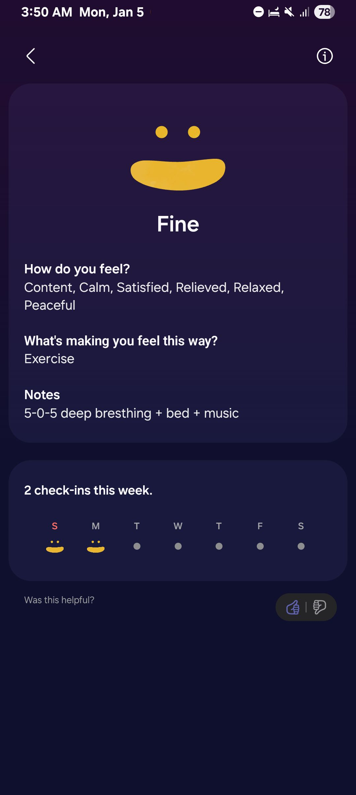
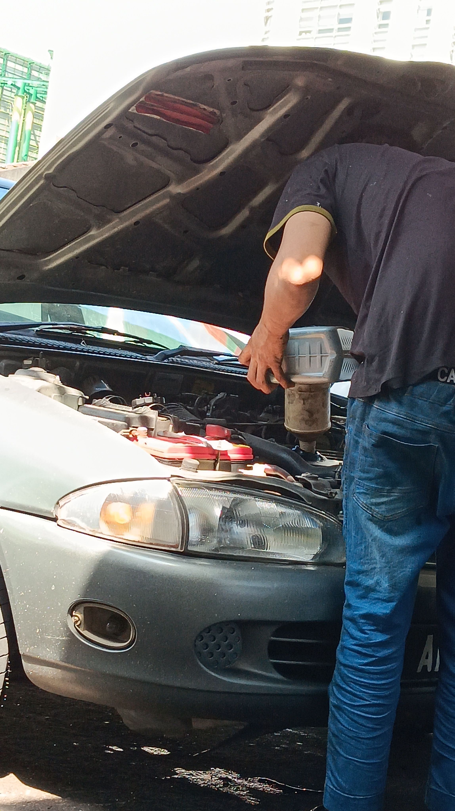
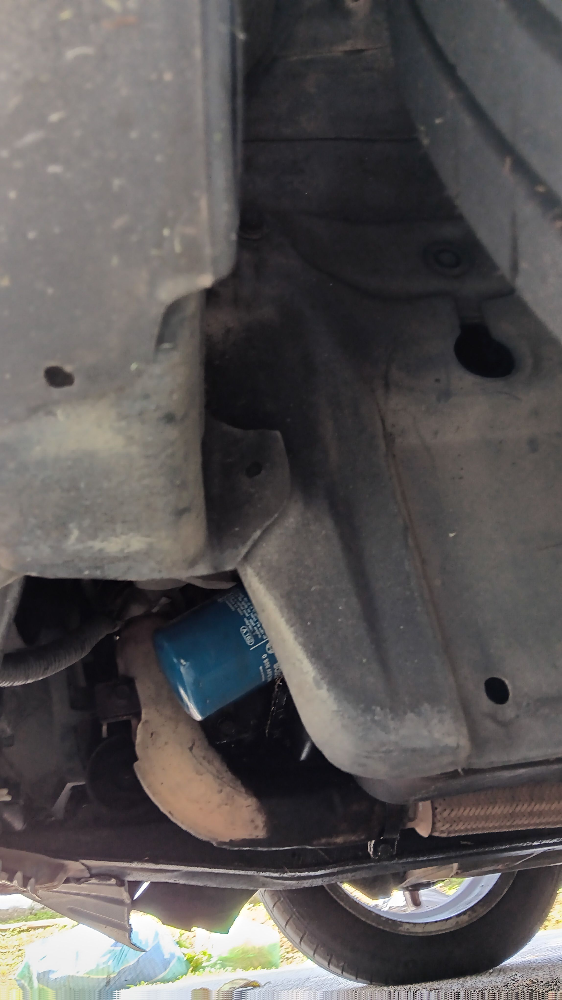
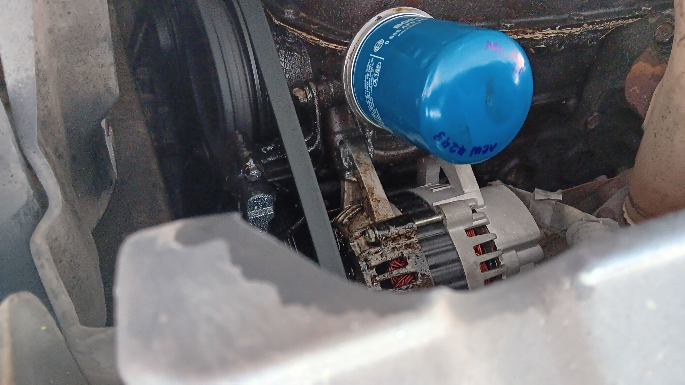

- 00:02 盥洗，戴上牙套，走動，離子化飲用水
- 00:36 因眼前事物分心，刪照片，查看信箱，刪 email
- 01:33  藉助 [[AI]] 工具 ── 討論明早換黑油的人工費策略，強迫性做事，覺察焦慮，擔憂，手摳耳屎
  id:: 695aa451-df8c-4dc4-a9f3-266656b1ce2d
- 03:31 排尿，走動
- 03:40 聽音樂，深呼吸
  collapsed:: true
	- 
- 03:51 聽音樂，打哈欠，比較難入睡，深呼吸，輕拍自己的胸口，回想起童年往事 ── 在親戚家泳池溺水時因 [[James Sheng Han]] 獲救卻事後在各自家長追問下選擇怪罪對方帶自己游泳，覺察當初說謊時也渴望出現一個像《 [[非暴力溝通]] 》書中 [[Billie]] 的爸爸那樣嘗試引導和一起面對
- 05:13 睡覺，聽音樂
- 07:35 因冷痹醒來，重新蓋被，因外部聲音醒來，聽見家人之間的暴力溝通，覺察心跳加快，心慌，練習迎納，安撫自己，賴床
- 07:45 半躺半坐，時間帳，查看睡眠記錄，記錄夢境
  collapsed:: true
	- 夢見自己在水裏浮沉和遊動
- 07:57 喝水，排尿，摘下牙套，浸泡衣物，早點，盥洗
- 09:10 蹲廁所，網搜資訊， [[KTV 想點唱的歌單]]，刷社媒
- 09:49 手洗衣物，腰酸，處理垃圾，晾乾衣物，出門時覺察到鄰居在附近，覺察羞愧
- 10:48 沖涼，換衣，晾乾衣物，喝水，走動
- 11:10 開車出門，猶豫而決把車停在哪裏，問價
- 11:37 藉助 AI 工具 ── 問價獲得 RM 20 人工費，情況如何，咬嘴皮，覺察焦慮，羞愧，當老闆忽然坐到身旁時，放下手機，接着從老闆閒聊中得知汽車冷氣唯獨天氣熱的情況下失常極可能因爲 [[compressor]] 的緣故，另外據對方經驗見過 [[Proton]] [[Wira]] 最長車齡 27 年，暫時沒見過超過 30 年
  collapsed:: true
	- 
	- 結束於 12:00
- 12:05 現場付款，蹲下檢查[[油格]] [[oil filter]] ，把車駕走，拍照
	- 
	- 
	-
- 12:13 坐着，吹冷氣，時間帳，咬嘴皮
- 12:21 藉助 AI 工具 ── 覆盤