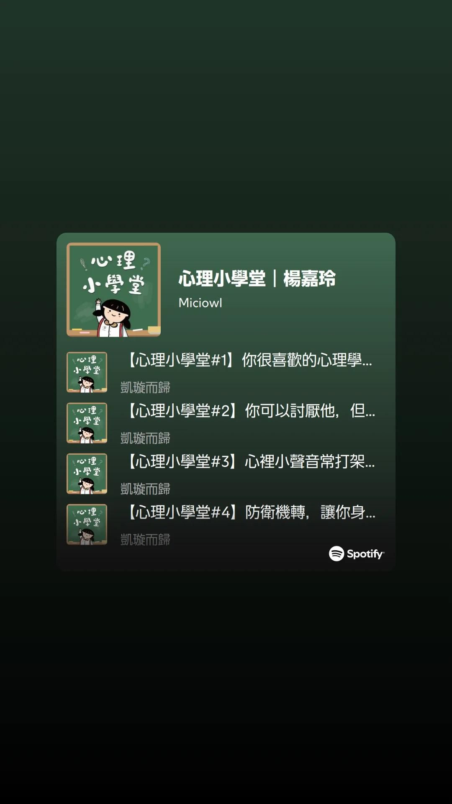

- 00:30 排尿
- 00:38 煲劇，半躺半坐，打瞌睡，強忍睡意
- 05:33 睡覺，睡睡醒醒
- 18:50 因外部聲音醒來，賴床，覺察排斥，孤獨
- 19:55 時間帳，記錄夢境，喝水
	- ‘夢見自己魔法的世界四處逃竄，還有和別人角力
- 20:12 記錄閃念
	- [[可靠]] vs [[可有可無]]
- 21:10 [[KTV 想點唱的歌單]]，離子化飲用水，吃小食，走動，喝中國茶
- 21:20 中途遇到家人干預，被提問關於我車的 [[road tax]] 是否還沒更新時， 中途還聽見來自隔壁鄰居走路的聲響，選擇性沈默應對家人的提問，直到對方再次追問下，反問對方坐下意味什麼，接着開始一連串[[機關槍]]地說話、反問、泄憤，追責，引述不了解的例子，覺察排斥、憤怒、失望
- 22:18 對話中斷時陷入僵持，覺察焦慮
- 22:29 回想今日發生的事，覺察理所當然，走動，喝水
- 22:52 坐着，在 [[Spotify]] 預備自己的 [[playlist]] 《 [[心理小學堂]] 》by  [[楊嘉玲]] ｜ [[啓點文化]]，中途才發現其他用戶已經制作一串，可
  collapsed:: true
	- 
	  collapsed:: true
		- https://open.spotify.com/playlist/1OBQNTRwTq5tCcPbMHblL1?si=iwqPCfygT4qxajPV_rysqw
- 22:20 中途遇到家人干預 ── 嬤嬤將現金放在我眼前的餐桌上，確認對方是否願意坐下 ── 無論上廁所前後，趁對方上廁所時閉目養神，深呼吸，同在冥想，覺察羞愧，緊繃，焦慮，見到對方如廁後回到自己的房間，我選擇尾隨，複述對方的需求，請求對方複述我說的話，結果對方理解成我不需要時，覺察憤怒，排斥，失望，難過，警告對方
	- 結束於 00:34