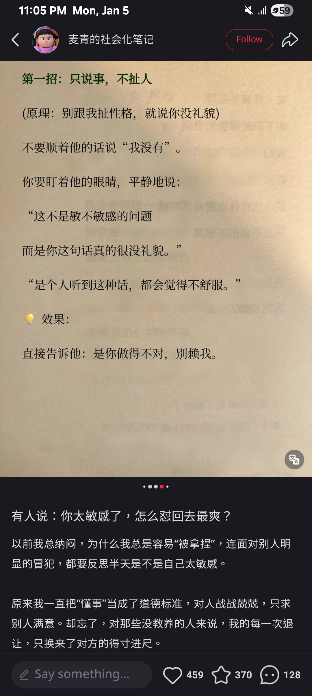
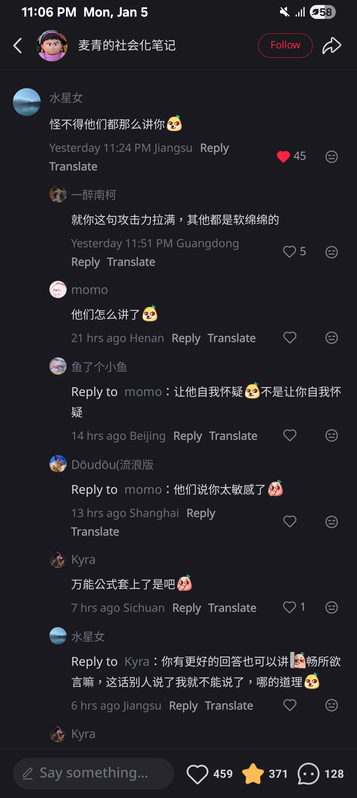
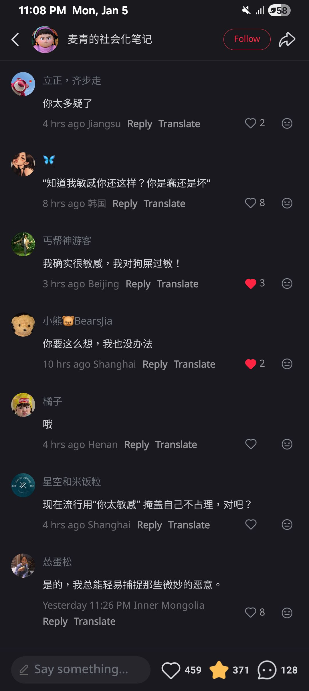
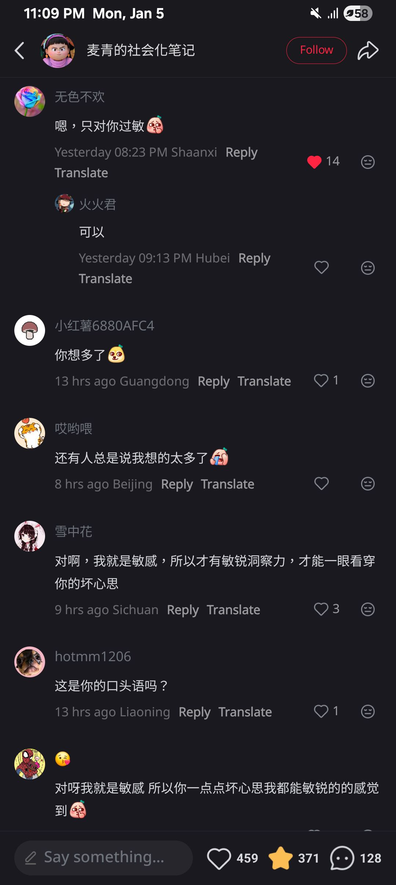
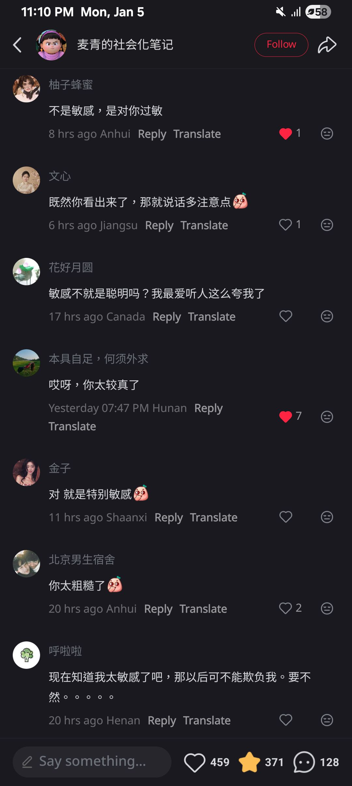
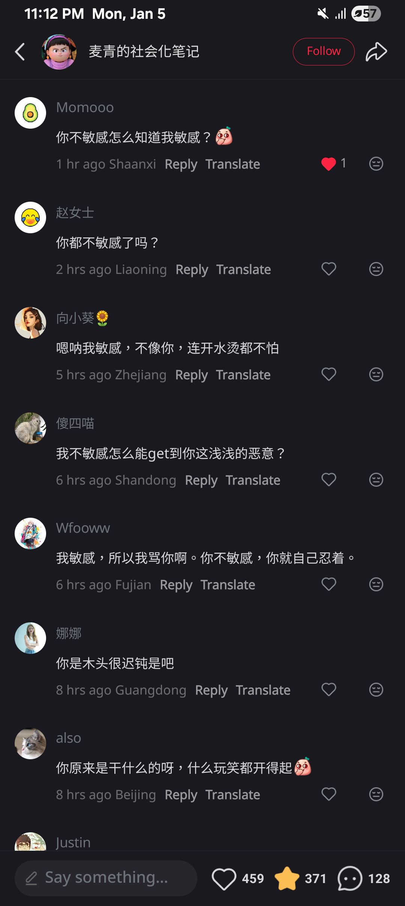

-
- 01:10 躲避與家人接觸，覺察羞愧，失望，盥洗，戴上牙套
- 01:34 排便，喝水
- 01:52 熱水澡，覺察難過，同在冥想
- 02:11 覺察遺憾，喝水，煲劇，入耳式耳機，半躺半坐，覺察難過，喜悅
- 03:19 聽音樂，網搜資訊，因眼前事物分心，強迫性做事，暗室直視 3C 藍光，半躺半坐
  id:: 695d6102-7957-4f77-a91c-7355653d66d1
- 04:38 聽 podcast，躺著
- 07:17 睡覺
- 07:49 因三急醒來，排尿
- 07:52 回籠覺，作夢
- 14:23 因身體不適醒來，半躺半坐，記錄[[夢境]]
  collapsed:: true
	- 夢見老同學陳志豪將誤穿我的內褲在公衆場合下還給我，當時我還沒收下就問對面的另一個人他會要嗎，接着只見這位同學表示失望，反問我假如不要爲何要這樣羞辱他
	- 現在想起來對方當時的選擇跟行爲 ── 不僅誤穿別人的衣物也不感到抱歉，且還在公衆下試圖公審你的底線，又何嚐不是一種侵犯他人邊界且還要情緒勒索他人必須大方的手段
		- 在這之前，當時我還是會受到對方情勒的影響，下意識地感到愧疚，認爲自己那樣的憤怒和反擊非常不應該
		- 如今反思之後，代價雖大，可我值得保護自己，也值得向對方釋放信息『 要欺負，也有代價 』
		- 在夢裏這項 [[以其人之道还治其人之身]]  舉動不免令我聯想起前天看見的留言有關
		  collapsed:: true
			- 
			- 
			- 
			- 
			- 
			- 
			-
	- 還夢見和另一位剛認識的攝影同事 [[outstation]] 公幹，其中一天因談及在瀑布和水中拍攝，對方不認同承擔攝像機泡水的風險，語帶嘲諷地說了一些話，結果我應激地回嘴自證的輿論 ── 『 你以爲我只是個普通的 cameraman，我也是 videographer 』，當下還因爲忽然想不起 [[cinematographer]] 導致的[[結巴]]
	- 現在回想起來，我覺察到當時的自己多半很辛苦，也認爲被瞧不起；然而，後來我選擇的應對方式非但沒有幫助自己取得信任，還可能冒犯其他攝影師，結果得不償失
		- 爲了重現[[安全感]]，雖然我當下感到非常[[委屈]]，我還是[[值得]]看見需要[[安撫]]自己的[[焦慮]]和[[自我價值]][[匱乏感]]，給自己很多的[[時間]]，練習將[[大局]][[考量]]在內的[[前提]]下，[[打磨]]自己的[[想法]]
	- 最後，夢醒之前，我還在一敵多人的場景
	- 替自己感到孤獨、難過、無奈
	- 停筆於 15:04
- 15:05 賴床
- 15:10 回籠覺，作夢
- 18:35 因外部聲音醒來，喝水，走動，閱讀，復習需要未被滿足時的感受，想不起昨天希望記錄下來的感受是哪一個
- 19:04 刷社媒，讀評論，半躺半坐
- 19:28 走動，晚餐，覺察抑鬱，疲勞，離子化飲用水，摸摸自己的頭，同在冥想，吃小食，喝水，吃甜食，熱水澡，腦子轉個不停
- 22:12 排便，沖涼
- 23:18 無風狀態，半躺半坐，刷社媒，查實所聽所見 ── 劉沛和他老婆還在一起，覺察深層的信念 ── 以爲別人的婚姻出狀況，覺察自己的渴望 ── 若有天即便有了自己的家庭跟孩子，除了把自己照顧好，也希望照顧到自己的老婆
	- 結束於 [[Thu, 08-01-2026]] 00:19