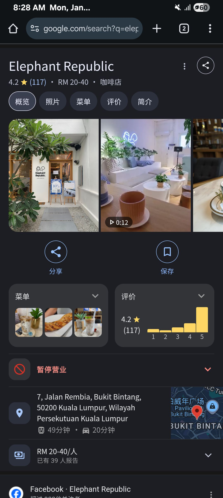

- 00:31 躺着，閉目養神
- 00:43 睡覺
- 07:11 因三急醒來，賴床
- 07:16 排尿，覺察焦慮，猶豫而決，頭頂和頸背覺壓迫，擔憂高血壓
- 07:20 時間帳，查看睡眠記錄
- 07:22 躺着，重新蓋被，安撫自己
- 07:35 聽音樂，躺着，賴床
- 07:51 聽音樂，賴床，網搜資訊，查實所聽所見 ── [[Elephant Republic]] 咖啡廳已暫停營業 ，刷社媒，好奇
  collapsed:: true
	- 
- 08:30 喝水，深呼吸，聽音樂，賴床，安撫自己
- 08:50 賴床，覺察焦慮
- 09:05 主動關閉風扇，睡睡醒醒，回籠覺，夢醒
- 19:42 因三急醒來，賴床
- 19:47 記錄夢境
	- 夢見和一群人逃離了地球以後，去到另一個星球的過程，待在太空艙時的生活
	- 還夢見自己家放着 3 輛豪車，過程卻來了 2 個女人，後來酒駕把我 2 輛車撞壞了
	- 覺察難過，焦慮，不甘心
- 19:51 躲避與家人接觸，暗室直視 3C藍光，半躺半坐，查看睡眠記錄
- 20:13 晚餐，走動，排尿，覺察抑鬱，疲勞，咳嗽，吃小食，鹽漱口腔
- 21:35 [[quick capture]]: #voice-memo
	- **random humming 001**
		- 
- 21:37 清洗廚具，忍糞，走動
- 21:49 [[KTV 想點唱的歌單]]，忍糞，坐着
- 21:54 清洗廚具，盥洗，戴上牙套
- 23:11 查看信箱，網搜資訊
- 23:23 躲避與家人接觸，遠離到安全的地方，刷社媒，半躺半坐，
	- 結束於 [[Tue, 13-01-2026]] 03:14