- 07:09 因身體不適醒來，賴床
- 07:15 因眼前事物分心，強迫性做事，哼唱，覺察焦慮
- 07:19 忘記上一秒做了什麼，走動，排尿，自備食材，煮 ── 🥑 牛油果醬沙拉煎餅，覺察羞愧，看見渴望自己的食物與家人分享，急促地進食，吃蔬果，沖涼，覺察鏡像潛意識的歌詞，清洗廚具，
- [[10]]:07 暗室直視 3C 產品，時間賬，喝水，哼唱，整潔雜物，緩衝
- [[10]]:13 試玩 [[DEMO]]，打遊戲，入耳式耳機，輕撫皮膚紅腫的地方，覺察 [[[[3D]] 暈]]，喜悅，焦慮，緊張，咬嘴皮
- 11:52 走動，喝水，閱讀： [[Google]] 正式啟動『 [[Personal Intelligence]] 』
  collapsed:: true
	- https://open.substack.com/pub/futureaitw/p/google-personal-intelligence?utm_source=share&utm_medium=android&r=22kilb
- 12:01 坐著，因眼前事物分心，聽歌，強迫性做事，覺察焦慮，咬嘴皮，網搜資訊，解決 [[DND]] 自動強行打開 ── 透過 [[Special Access]] > toggle off [[Google]]、Downgrade [[Modes and Routines]]
	- [[KTV 想點唱的歌單]]
- 12:36 排尿，喝水，午餐，吃小食，清洗廚具
- 13:32 清潔二廳儲物室 ── 消除老鼠屎的味道，確認異味來源，覺察排斥，中途遇到家人干預，確認自己想問的事，着急，憤怒，焦慮，咬嘴皮，強迫性做事，覺察自己臨時無法變通，固執，僵固，同在冥想，憤怒閃念，替刚清理完老鼠屎的范围喷消毒喷雾，用风扇通风，觉察腰酸背痛，忍尿
  collapsed:: true
	- 爲自理困難者一起學習設計自己的生活 ── [[Design Together / Design to Get There]]
	- 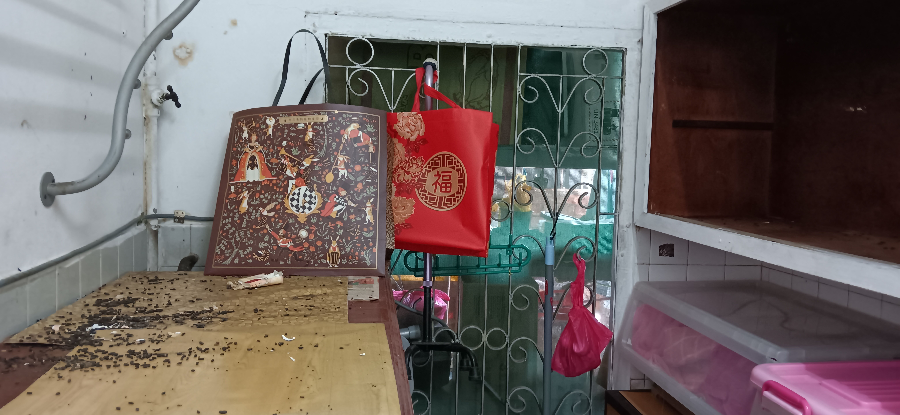
	- 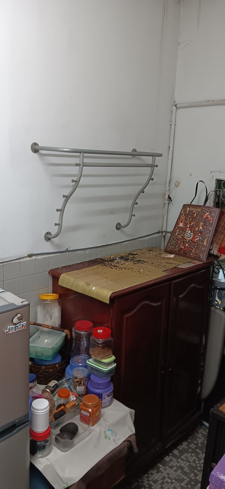
	- 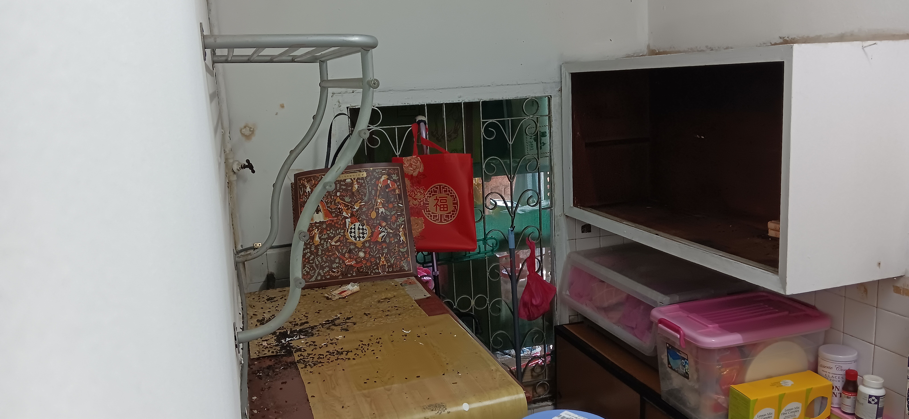
	- 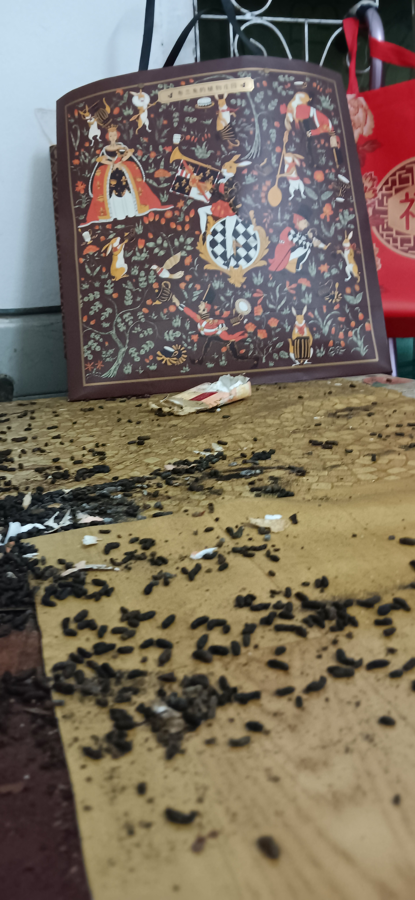
	- 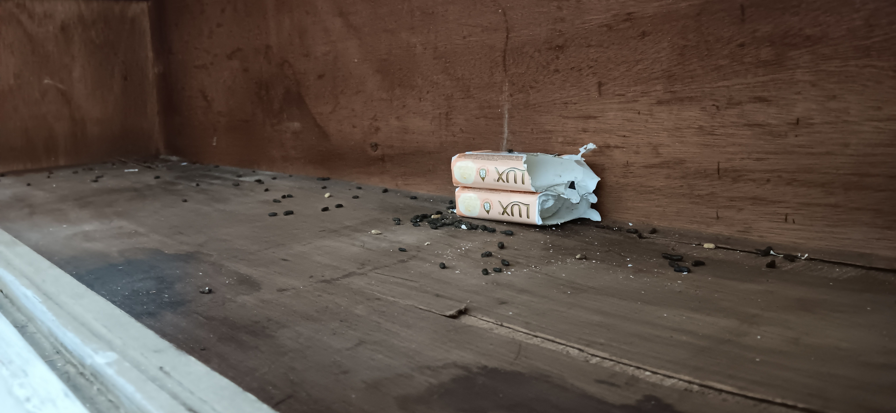
	- 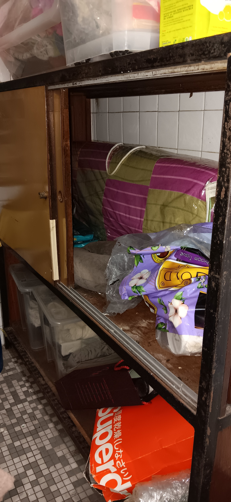
	- 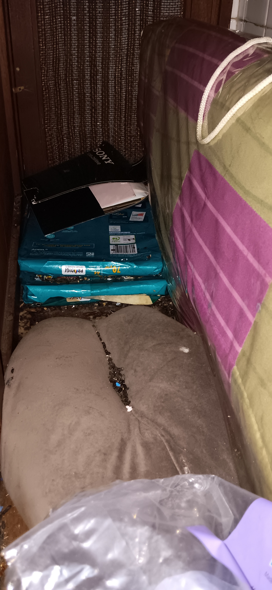
	- 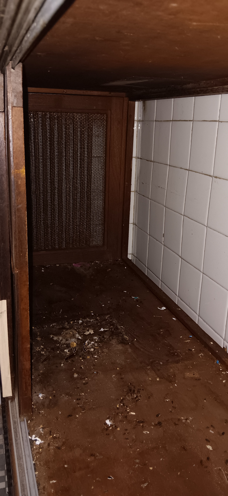
	- 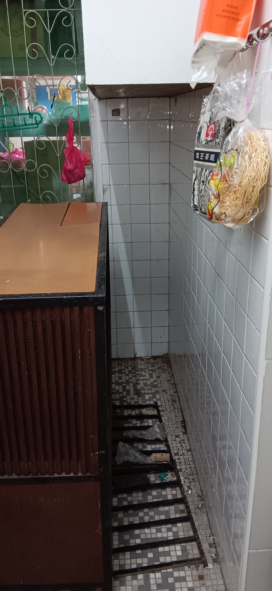
	- 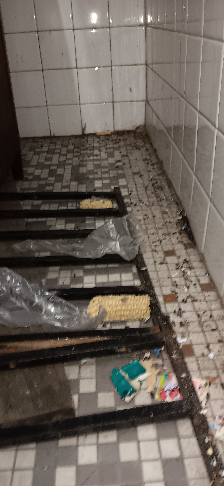
- 21:33 時間帳，喝冷飲，坐着
- 21:36 晚餐，喝冷飲，吃蔬果，清洗廚具，覺察腰酸
- 22:51 手洗拖鞋，分類塑膠袋和環保袋，覺察自己做事的 [[patterns]] 和大腦運作模式 ── 較難在琳瑯滿目的情況下迅速做決策；相反，需要動湊湊西湊湊才能摸得著一些頭緒，比如第一次過濾後得到傾向美觀的，直到第二輪才知道真正湊湊才能摸得著一些頭緒，比如第一次過濾後得到傾向美觀的，直到第二輪才知道真正做事的跟得上來
  collapsed:: true
	- 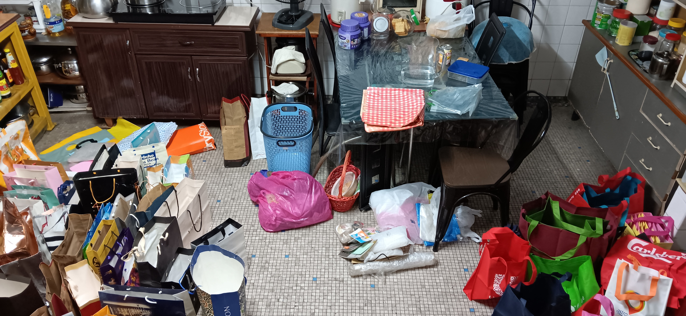
	- 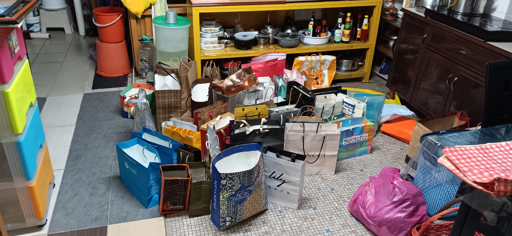
	- 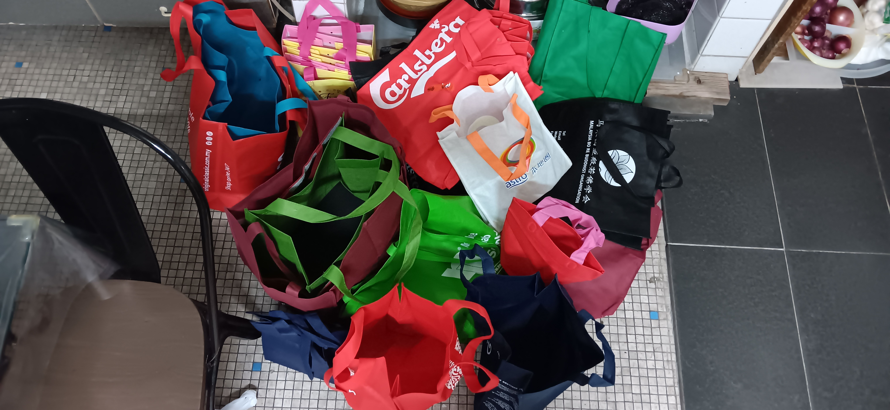
	- 暫停於 [[Sun, 18-01-2026]] 05:21