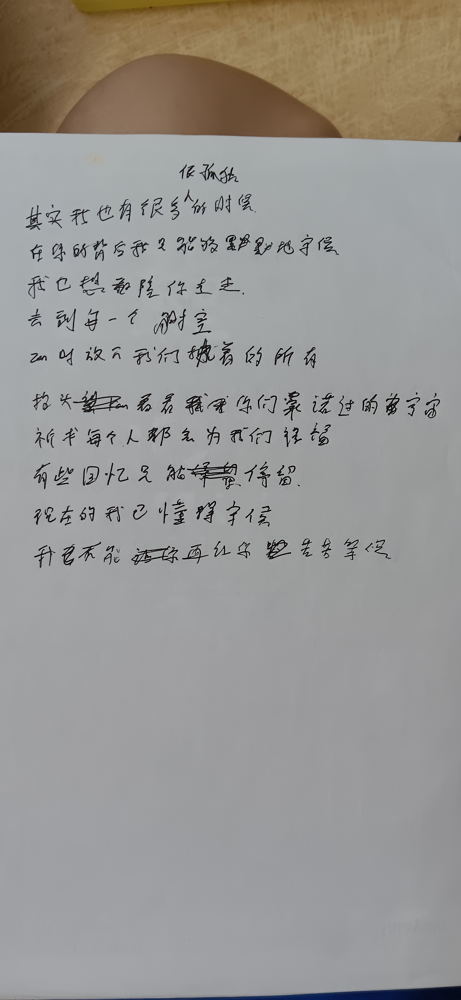

-
- 05:26 繼續替噴了消毒噴霧的櫃子保持通風，標註，幫雞蛋抹身，覺察腰酸，強忍睡意，忘記下一秒做了什麼
- 06:53 沖涼，強迫性做事，離子化飲用水，確認自己的手尾，沉默應對家人的謝謝，覺察疲勞，強忍睡意
- 08:09 時間帳，喝水，時間帳，坐著
- 08:31 睡覺，作夢，睡睡醒醒，夢醒
- 14:38 因外在聲音醒來
- 14:53 因室內悶熱醒來，記錄夢境
  collapsed:: true
	- 夢見市面上出現一款 [[App]]，使用後將掃描出來一個人真正的[[身世]][[背景]]，結果我身邊其中一位朋友被驗出來是其中一國[[總統]]的[[孩子]]，最後對方幫助我[[實現]][[願望]]
	- 覺察[[夢境]]反映底層更深的[[渴望]]：希望認識[[上流]][[社會]]且願意真正[[幫助自己]]的[[朋友]]
	- 停筆於 15:00
- 15:00 賴床，解決 [[Trime]] 無法一鍵實現[[简轉繁]]，下載軟件 ── [[DeepL Translate]]，測試軟件 ── [[Gboard]] 內嵌式[[简轉繁]]更友好且符合直覺
- 15:34 賴床，時間帳
- 15:44 打哈欠，走動，沖涼，摸摸自己的頭，沉默應對家人的提問，中途聽見嬤嬤反覆詢問爺爺要不吃糕，覺察排斥，比起他人的許可或需要，渴望看見自己更想吃的意願，覺察自己想要控制對方的念頭，遠離到安全的地方，躲避與家人接觸
- [[16]]:34 遠離到安全的地方，時間賬，同在冥想，認識自己的身體
- 16:49 過濾掉房間裏沒有幫助的紙質類樣件
  id:: 696ca5e1-15bb-4ff0-b130-8f086c853dcd
- 17:20 [[F: [[靈感]]筆記]]
  collapsed:: true
	- 
	- 17:24 [[quick capture]]: #voice-memo
		- **[[孤獨的時候]] [[DEMO]]**
			- 
- 17:25 繼續 ((696ca5e1-15bb-4ff0-b130-8f086c853dcd))
	- 結束於 22:42
- **17:48** [[quick capture]]: 
- **17:55** [[quick capture]]: %20~%20District%20YMD%20Chief%20(%209%20Dec%202018%20).pdf)
- 22:46 晚餐，急促地進食
  id:: 696cae1b-a425-4740-90e2-d3bfc485495f
- 22:57 時間帳
- 23:01 走動，覺察餓的感覺，喝水，吃小食，刷社媒，刻意不發出聲音，喝水，覺察疲勞，清洗廚具，忍糞
	- 結束於 [[Mon, 19-01-2026]] 01:14