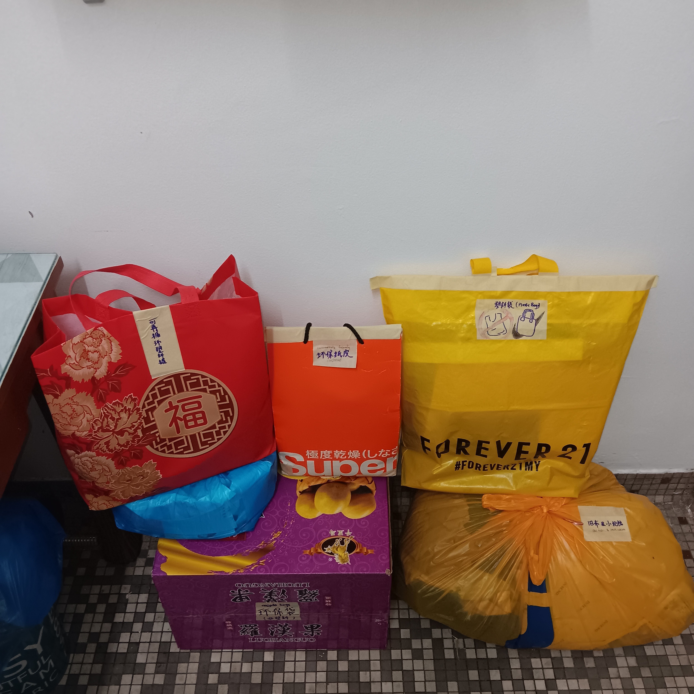

- 01:14 強忍睡意，躺着，刷社媒
- 02:05 睡覺，作夢，睡睡醒醒，夢醒，回籠覺
- 06:19 因身體不適醒來，頸背覺刺痛，賴床
- 06:22 時間帳，喝水，時間帳，記錄夢境
  collapsed:: true
	- 夢見[[人工智能]]的[[科技]]發展迅速，程度從每相隔幾個月推出一個全新的大模型，直到後來每隔幾天就更新一次
	- 當初由於各種大模型優勢大不相同，結果實現許多自動流被迫安裝許多插件和程序；後來單獨模型稱霸，只需一個類似[[全能]] [[MCP]] 裝置就可以幾乎適配所有日常在用的 [[App]] 及適用場景也變得越來越多
	- 覺察特別驚訝，如釋重負 ── 終於可以專注在產出，大於配置和面臨適配問題
	- 停筆於 06:31
- 06:31 走動，喝水
- 06:38 爲了拍照，整理雜物，強迫性做事
  collapsed:: true
	- 
	  id:: 696d6499-572e-4330-a117-e3b1e97f07c4
	- 完成於 06:52
- 06:52 緩衝，走動
- 06:58 蹲廁所，聽音樂，網搜資訊，覺察喜悅
- 07:23 走動，處理垃圾
- 07:42 查實所聽所見 ── [[[[1RC ( 1Utama Recycling Centre )]] ([[1Utama]] [[Recycling Centre]])]]  [[可再循環]][[物件]][[分類]]及[[規則]]，讀評論，坐著，無風狀態，躲避與家人接觸
- 08:09 清晰可再循環塑料罐子，走動，喝水，將可再循環物件移到後車廂  ((696d6499-572e-4330-a117-e3b1e97f07c4)) ，確認自己的手尾，咬嘴皮，覺察焦慮，中途遇到家人干預，他人的請求，覺察抗拒，無聲陪伴應對情況 ── 掌握[[洗衣機]]內安裝[[濾格]]
- 09:12 時間賬，喝水，主動打開風扇，打開房間裡的[[窗簾]]
- 09:15 早點，主動確認對方看見什麼 ── 放在冰箱，清洗廚具，手洗拖鞋，確認自己的手尾，替老鼠屎尿粘過的墊子[[消毒]]，下載軟件，測試軟件，
- 10:15 中途遇到家人干預，聽見嬤嬤將自己房間的被單到屋外晾乾時，覺察排斥，因為感覺自己的私人空間受到侵入，渴望自己同意下才允許， 時間賬
- [[10]]:23 喝水，因眼前事物分心，整理雜物，走動
- 11:17 喝水，走動
- 11:22 網搜資訊，重啟 3C 產品，坐著，[[KTV 想點唱的歌單]]，因眼前事物分心 ── 陳曉東[[面容]]的[[變化]]
- 11:47 藉助 [[AI]] 工具 ── 繼續優化當前 [[Gadgetbridge]] 睡眠記錄自動流，咬嘴皮，刷社媒，因等待眼前事物響應而分心，覺察焦慮，坐著
- 13:34 因眼前事物分心，網搜資訊，下載軟件 ── [[[[Notion]]-clear-trash]] [[Chrome]] 插件， 咬嘴皮，強迫性做事，覺察胃不舒服
- [[14]]:06  走動，排尿，喝水，寢具收進室內，確認自己的手尾，替老鼠屎尿粘過的另一處噴上消毒劑，強迫性做事，沖涼，覺察羞愧，午餐，吃小食，吃蔬果，沉默應對家人的提問，走動，覺察脊椎背部痠痛，
- [[16]]:30 [[MacBook Pro (MBP)]] pro 開機臨時反覆出現 [[Apple]] 的 Icon，進不了主頁，覺察焦慮，害怕
  id:: 696df043-c985-4e72-b675-a4022d9f35eb
- [[16]]:50 時間賬，
- [[16]]:58 藉助 [[AI]] 工具 ── [[Rovo Dev CLI]] 排查 ((696df043-c985-4e72-b675-a4022d9f35eb)) 的原因，刷社媒，咬嘴皮，覺察焦慮
- 18:52 排尿，主動關閉冷氣，覺察疲勞
- 18:57 繼續藉助 [[AI]] 工具 ── 排查出中途屏強行黑屏的原因是 [[Input Source Pro]] 繼升級後佔據巨量 CPU 所致
	- 成功解決於 20:41
- 20:41 刷社媒
- 20:59 備份 [[TimeMachine]]，走動，晚餐
- 22:25 排便
- **22:43** [[quick capture]]:  https://linka-six.vercel.app/
- 23:18 時間賬。緩衝，坐著
- 23:31 OGC，入耳式耳機
- 23:47 睡覺
	- 因冷痹和三急醒來於 [[Tue, 20-01-2026]] 07:21