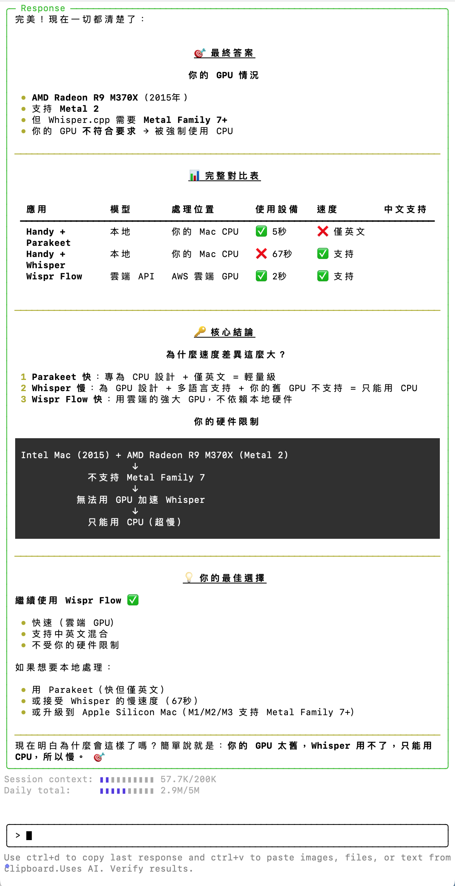

- 07:21 走動，排尿，喝水，盥洗，摘下牙套，看見[[嬤嬤]][[走路]]時[[跛腳]]的聲音+ 用桶[[裝水]] + [[廚房]]和[[廁所]]之間來回移動 + 用[[地拖]][[抹地]]，[[覺察]][[焦慮]]對方[[萬一]][[滑倒]]後暫時[[失業]]狀態下的自己[[被迫]]履行[[長照]]對方的[[責任]]，還有[[羞愧]]自己昨天[[倒干]]桶里的[[水]]，爲[[預防]][[害怕]]因[[積水]]導致[[蚊蟲]][[滋生]]等[[居家]][[安全]][[隱患]]
- 07:45 時間帳，[[遠離]]到[[安全]]的地方，主動關閉風扇，無風狀態，記錄[[閃念]]，哼唱，坐着
- 07:58 修正筆記，無風狀態
- 08:05 無風狀態，咬嘴皮，覺察焦慮，刷社媒，安裝軟件，藉助 [[AI]] 工具 ── 排查 [[Handy]] 不適配的原因 + 對比 [[Wispr Flow]] 轉譯中文的速度差異
	- [[snapshot]] 總結截圖
	  id:: 696ee822-d457-4855-85e6-3af675512324
	  collapsed:: true
		- 
	- 傾向的 [[markdown]] 格式
	  id:: 696ee84a-e4b6-4721-a7fb-1e71fe844ea6
	  collapsed:: true
		- ## 最終答案
			- ### 你的 [[GPU]] 情況：
				- [[AMD Radeon R9 M370X (2015 )]]
				- 支持 Metal [[2]]
				- 但 [[Whisper.cp]] 需要 [[Metal Family]] [[7]]+
				- 你的 [[GPU]] 不符合要求被強制使用 [[CPU]]
				-
		- ## 完整對比表
			- | **應用方案** | **處理方式** | **使用設備** | **速度** | **中文支持** | **隱私性** | **成本** |                                                 
			     |---------|---------|---------|------|---------|--------|------|                                                     
			     | [[Handy]] + [[Parakeet]] v3 | 本地運行 | [[CPU]] | [[5]] 秒 | ❌ 僅英文 | ✅ 完全離線 | 免費 |                              
			     | [[Handy]] + [[Whisper Small]] | 本地運行 | [[CPU]]（ [[GPU]]太舊 ）| 67 秒 | ✅ 支持 | ✅ 完全離線 | 免費 |                   
			     | [[Wispr Flow]] | 雲端 [[API]] | [[AWS]] 雲端 [[GPU]] | [[2]] 秒 | ✅ 支持 | ⚠️ 需上傳音頻 | 需訂閱 |
			-
		- ## 核心結論
			- ### 為什麼速度差異這麼大？
				- [[Parakeet]] 快：專為 [[CPU]] 設計 ＋僅英文=輕量級
				  logseq.order-list-type:: number
				- [[Whisper]] 慢：為 [[GPU]] 設計 ＋多語言支持＋你的舊 [[GPU]] 不支持二只能用 [[CPU]]
				  logseq.order-list-type:: number
				- [[Wispr Flow]] 快：用雲端的強大 [[GPU]] ，不依賴本地硬件
				  logseq.order-list-type:: number
				-
			- ### 你的硬件限制
				- ```mermaid                                                                                                           
				     flowchart TD                                                                                                         
				         A["Intel Mac 2015<br/>AMD Radeon R9 M370X"] --> B{"Metal 版本檢查"}                                              
				         B -->|"Metal 2"| C["不支持 Metal Family 7"]                                                                      
				         C --> D["無法用 GPU 加速 Whisper"]                                                                               
				         D --> E["強制使用 CPU"]                                                                                          
				         E --> F["轉錄速度: 67秒"]                                                                                                                                                                        
				  ```
				-
		- ## 你的最佳選擇
			- ### 繼續使用 [[Wispr Flow]]
				- 快速（ 雲端 [[GPU]] ）
				- 支持中英文混合
				- 不受你的硬件限制
				-
			- #### 如果想要本地處理：
				- 用 [[Parakeet]]（ 快但僅英文 ）
				- 或接受 [[Whisper]] 的慢速度（ 67 秒 ）
				- 或升級到 [[Apple]] [[Silicon Mac]]（ [[M1]]/ [[M2]] / [[M3]] 支持 [[Metal Family]] [[7]]+ ）
				-
		- ## 現在明白為什麼會這樣了嗎？
			- 簡單說就是：你的 [[GPU]] 太舊，[[Whisper]] 用不了，只能用 [[CPU]] ，所以慢
			-
	- 結束編輯於 [[10]]:[[10]]
- [[10]]:[[10]] 剛結束為 ((696ee822-d457-4855-85e6-3af675512324)) 整理成 ((696ee84a-e4b6-4721-a7fb-1e71fe844ea6))，據我平時我在 [[Logseq]] 日誌的編輯習慣和格式 [[formatting]] ，添加到 [[Rovo Dev CLI]] 和 [[[[Antigravity]] [[IDE]]]] 的[[全局規則配置]]如 [[GEMINI.md]]
  collapsed:: true
	- ## [[Rovo Dev CLI]] 全局格式化規則 - 永久配畳完成
	  collapsed:: true
		- ### 配置方式
			- 修改 *~/. rovodev/config. ymI'
				- 位置：“[[Agent]].additionalSystemPrompt
				- 內容：全局格式化規則
				- 效果：所有新 session 自動加載
				-
		- ### 生效範圍
			- DONE 所有新的 [[Rovo Dev CLI]]
			- DONE 所有恢復的 session ('--restore')
			- DONE 無需手動提醒
			-
		- ### [[AI]] 自動行為
			- | **功能** | **說明** |                                              
			     |---------|---------|---------|------|---------|--------|------|                                                     
			     | 雙格式輸出 | [[Terminal]] 格式 + [[Logseq]] 格式 |                              
			     | 雙向鏈接 | 所有專有名詞使用[[鏈接]] |                              
			     | 視覺增強 | emoji（ ♥❌⚠️⭐️ ）+ **組體**  |                              
			     | 層級結構 | Tab 或 4 空格縮進 |                              
			     | 表格優化 | 粗體表頭+鏈接 + emoji |                              
			     | 圖表支持 | [[Mermaid]] 文字加引號 |
			-
			-
		- ### 相關文件
			- ``~/. rovodev/LOGSEQ_FORMATTING_RULES.md``
				- ##### 詳細格式化規則（ 12 個核心特特徵 ）
				- ##### 實際應用示例和模板
				- ##### 底層邏輯説明
				- #####
			- `~/CLAUDE. md'`
				- ###### [[Claude]] / [[Rovo Dev CLI]] 全局規則
				-
			- `~/ . gemini/GEMINI.md"`
				- ##### [[[[Antigravity]] [[IDE]]]] 全局規則
				- ######
			- `~/bin/rovo-smart`
				- ##### 智能啟動器（可選）
				- #####
			- `~/bin/test-rovo-rules`
				- ###### 測試配置是否正確
				- #####
		- ### 驗證方法
			- 啟動新 session
				- ```bash
				  rovodev
				  # 或
				  rovo-dynamic
				  ```
				-
			- 詢間：「請總結今天的工作」
			- 檢査是否自動提供雙格式輸出
			-
		- ### 測試結果
			- 所有檢査項目：♥ 通過
				- DONE config.yml 配置
				- DONE LOGSEQ_FORMATTING_RULES. md
				- DONE CLAUDE.md
				- DONE GEMINI. md
				-
	- ## [[Rovo Dev CLI]] 規則體系建立完成
	  collapsed:: true
		- ### 架構真相
			- [[Rovo Dev CLI]] 開發商 : [[Atlassian]]
			- 底層 [[LLM]]： [[Anthropic]] [[Claude Sonnet]] [[4.5]]
			- 模型 ID： `anthropic. claude-sonnet-4-5-20250929-V1:0`
			- 這就是為什麼 [[CLAUDE.md]]有關聯性！
			-
		- ### 規則層級體系
			- |  | **優先級  ** | **文件** | **用途** | **適用範圍** |
			  | ---  | --- | --- | --- | --- |
			  | **1. **  | 最高 |`~/.rovodev/ROVODEV_RULES.md`|[[Rovo Dev CLI]] 專用規則|僅 [[Rovo Dev CLI]]|
			  | **2. ** | 中等 |`~/.rovodev/ROVODEV_RULES.md`|[[Claude]] 通用規則|所有使用 Claude 的工具|
			  | **3. ** | 格式 |`~/.rovodev/LOGSEQ_FORMATTING_RULES.md`|[[Logseq]] 格式化|輸出格式層|
			  | **4. ** | 參考 |`~/.gemini/GEMINI.md`| [[Gemini]] | [[[[Antigravity]] [[IDE]]]] |
			-
		- ### 為什麼有 [[CLAUDE.md]]？
			- ```mermaid                                                                                                           
			     flowchart TD                                                                                                         
			         A["Rovo Dev CLI<br/>(Atlassian)"] --> B["Claude Sonnet 4.5<br/>(Anthropic)"]                                             
			         C["Cursor IDE"] --> B                                                                      
			         D["Windsurf IDE"] --> B                                                                              
			         E["Claude Desktop"] --> B                                                                                          
			         E --> F["轉錄速度: 67秒"]                                                                                          
			                                                                                                   
			         B --> F["CLAUDE.md<br/>通用規則"]                                                                                          
			                                                                                                   
			         style A fill:#9f9,stroke:#333                                                                                          
			         style B fill:#f9f,stroke:#333                                                                                          
			         style F fill:#ff9,stroke:#333
			  ```
			- [[Rovo Dev CLI]] 使用 [[Claude]] 作為 [[AI]] 引擎
			- [[CLAUDE.md]] 是 [[Claude]] 的「使用手冊
			- 跨工具規則共享，避免重複配
			-
- [[10]]:50 忍尿，無風狀態，因眼前事物分心，修正舊筆記
- 12:19 排尿，走動，喝水，確認自己的手尾，爲避免阻塞行動方便，在已經搬下來的行李箱歸位之前，將二廳經過消毒的櫃子用清潔劑抹多一次，拖地清潔二廳和廚房地板上的瓷磚，覺察好奇，嘗試用不同劑量的 [[Clorox]] 漂白劑分別在[[迷你]][[方塊]]瓷磚地板和大片[[瓷磚]]之間的[[縫隙]]，覺察背部酸，強迫性做事，刷縫隙，水洗瓷磚地板，吃蔬果，中途遇到家人干預，沈默應對家人的提問，嘗試利用 [[Proton]] 備用的 [[三角警示牌 (Warning Triangle)]] 充當『 [[小心滑倒]] 』的警示牌，
- 19:00 遠離到安全的地方，時間帳，忍餓，喝水，強忍睡意，打哈欠
- 19:24 咬嘴皮，坐姿歪斜，查看信箱，刷社媒，忍餓
- 20:09 晚餐，喝水，走動，中途遇到家人干預，他人的請求，爆粗，覺察憤怒，聽見爺爺路過上廁所時主動暫停對話一分鐘，深呼吸，反問對方我剛說的話，說教，吃小食，吃甜食，覺察疲勞，打哈欠，清洗廚具，盥洗，
- 23:28 時間帳，才覺察到自己忘了戴上牙套
- 23:30 睡覺
	- 因身體不適和冷痹醒來於 [[Wed, 21-01-2026]] 08:26