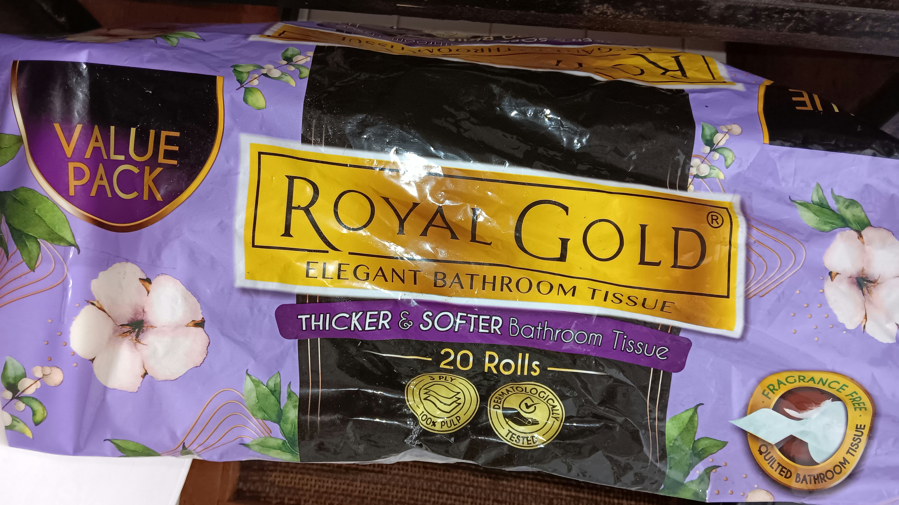
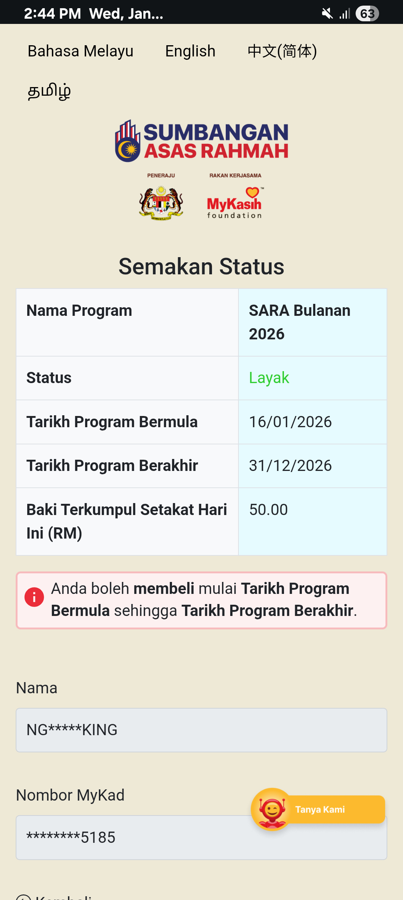
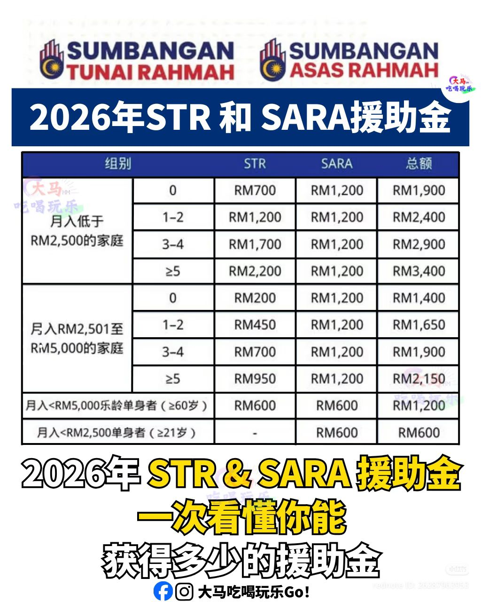
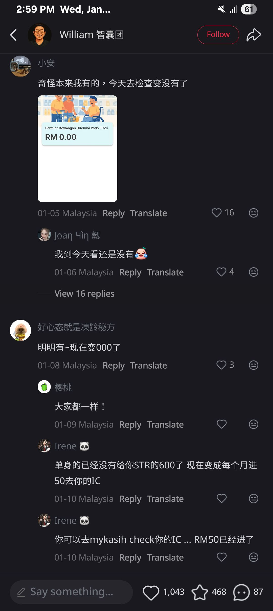
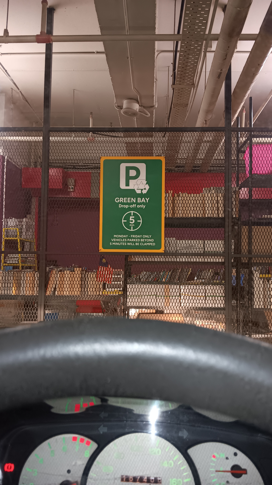
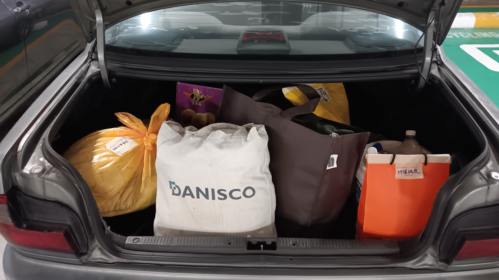
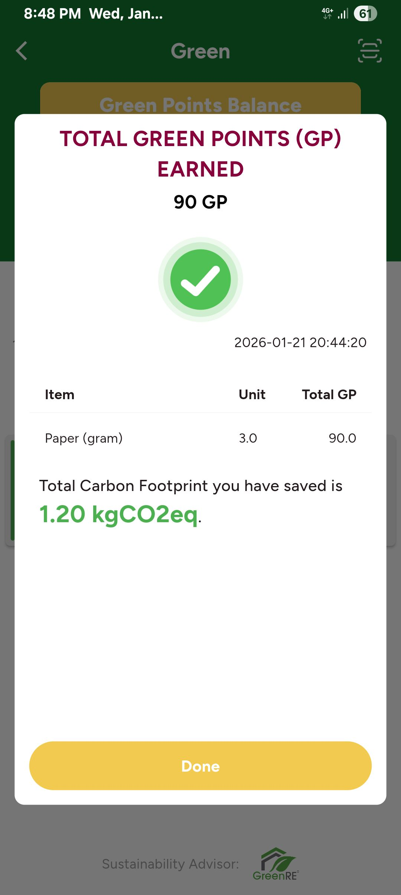
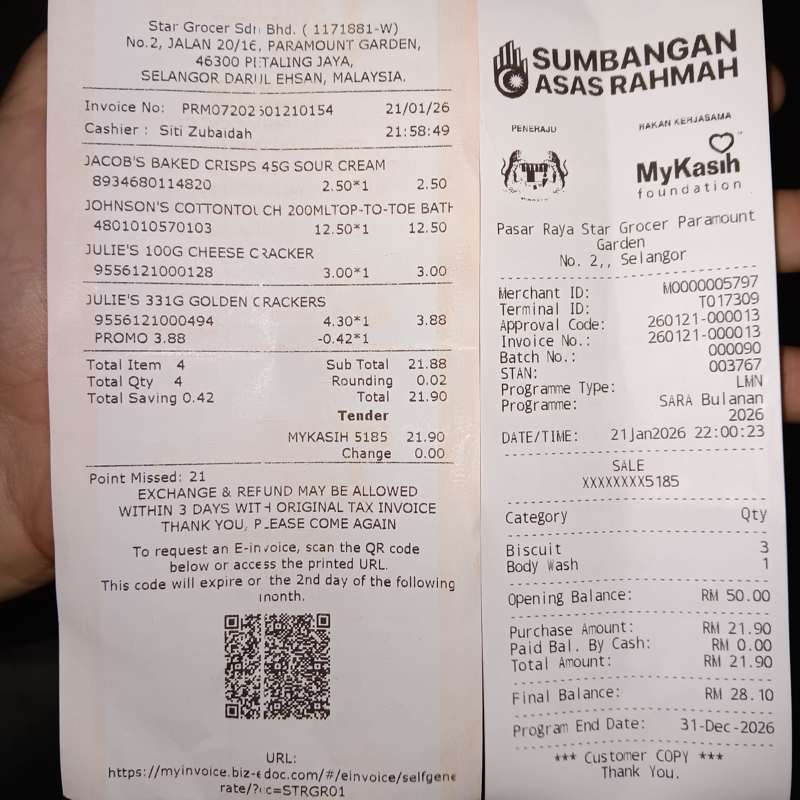
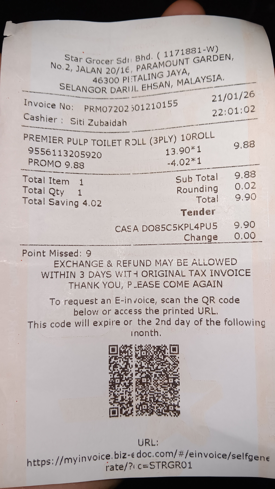
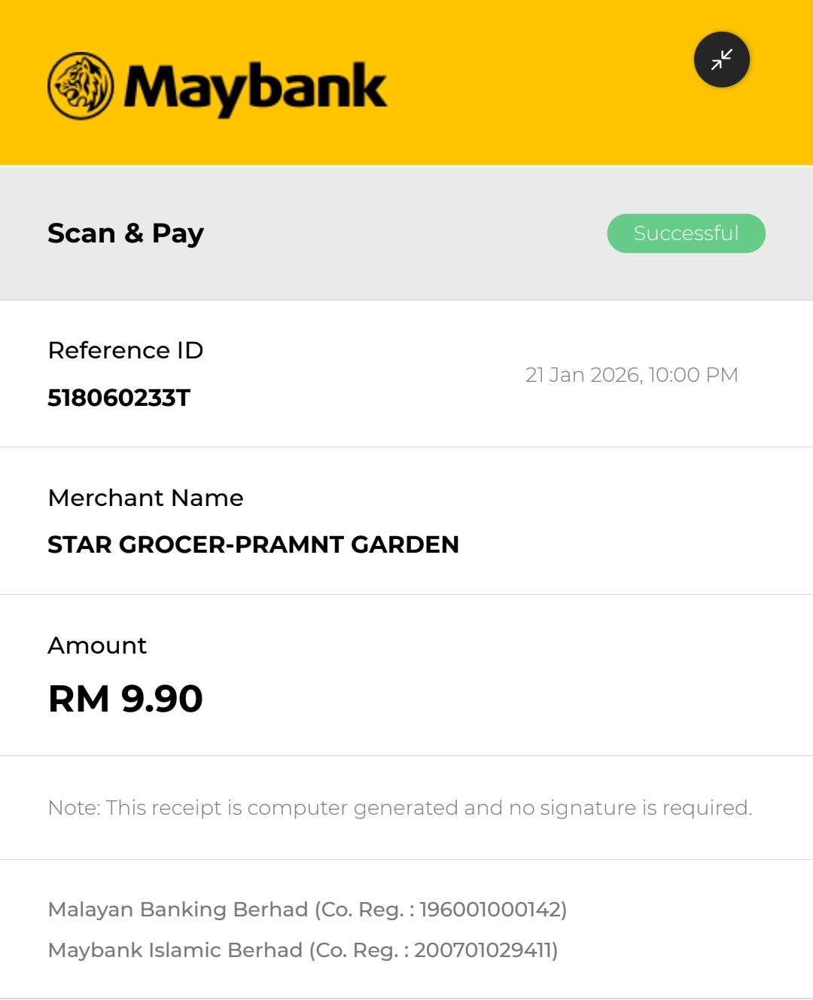

- 08:26 主動關閉風扇，喝水，記錄閃念
  collapsed:: true
	- 想起可能值得起步的繪畫作品：[[四格]][[漫畫]]
		- 主角：[[刺蝟]]和[[穿山甲]]
		- 象徵性：曾[[受傷]]但也想要嘗試[[活下去]]的狀態
		- 停筆於 08:35
- 08:35 無風狀態，查看睡眠記錄，半躺半坐，反覆想起昨日發生的事，覺察羞愧，緊張，心跳加快
- 08:39 排尿，喝水，走動，確認自己的手尾，將疑老鼠屎尿粘過的輕薄型睡墊進行消毒和曬太陽
- 09:23 覺察疲倦，打哈欠，查看信箱，覺察不屑自己從實習諮商師的回覆獲得短暫的安全感，渴望保護自己免於錯過重要信息而自責
- 09:28 主動打開風扇，躺着，深呼吸
- 09:42 躺着，記錄閃念
  collapsed:: true
	- 對他人的話經常感到受傷的關鍵核心多半源自我的認同感
	- 反之，足夠覺察任何部分的認同，極高幾率降低感傷率
	- 停筆於 09:46
- 09:46 猶豫而決，賴床
- 09:53 走動，半躺半坐，暗室直視 3C 藍光，搜電影
- [[10]]:24 居家看電影《 [[老鼠愛上貓]] 》，入耳式耳機，覺察喜悅
- 12:04 走動，打哈欠，午餐，吃小食，吃甜食，翻曬寢具，強忍睡意
- 12:57 強忍睡意，臨時記下需要買的東西：
  collapsed:: true
	- LATER 輕薄[[透明雙面膠]]
	- DONE [[Royal Gold]] 廁紙
		- 
	- 13:10 強忍睡意，排便，閱讀 https://open.substack.com/pub/uncleraven/p/ep-58-4-ai?utm_source=share&utm_medium=android&r=22kilb ，咬嘴皮，網搜資訊
- 13:36 沖涼，強忍睡意
- 14:00 適當坐一下，同在冥想，摸摸自己的頭，輕拍自己的胸口，猶豫而決，焦慮，羞愧，暗室直視 3C 產品，查實所聽所見 ── 天空還沒下雨
- [[14]]:06 時間帳，喝水，覺察焦慮，查實所聽所見 ── [[STR (Sumbangan Tunai Rahmah) 2026]] 已證實 [[LULUS]] 且一共 RM 600 除於 12 個月匯入 [[NRIC]] 身份證 = RM 50/ 月
  collapsed:: true
	- 
	- 
	- 
	- ((6970751b-2094-4966-ba48-2be865e485c3))
	- 14:47 開始整理，結束於 15:05
- 15:11 走動，喝水，折疊衣物 ── 爲送去回收站 [[1RC ( 1Utama Recycling Centre )]]，寢具收進室內，咬嘴皮，覺察好奇，焦慮，嘗試接駁電線和燈泡，失敗時覺察挫敗，覺察疲勞，熱水澡
- 18:47 時間賬，喝水，咬嘴皮，覺察疲勞，焦慮，猶豫而決，坐着，網搜資訊
- 18:58 儀容裝扮，走動，摺疊衣物，同在冥想
- 19:[[10]] 緩衝，準備出門，排尿，意外發現西裝櫃子裡塞滿了其他舊的布料，收納準備送到 [[1RC ( 1Utama Recycling Centre )]]
- 19:30 [[Proton Wira 1.5]] [[AEW 4248]] 意外電箱瞬間停電，無法啓動引擎，下車用工具敲打有效
- 19:58 開車出門，聽 podcast，前往 [[1Utama]] Mall
- 20:37 抵達目的地
  collapsed:: true
	- 
	- 倒數 5 分鐘
	- 
	- 
	- 結束於 20:49
- 20:49 前往 [[Star Grocer]]
- 21:08 抵達目的地，購物，覺察焦慮，猶豫而決，既希望省錢，又想要嘗試新事物 & 遵從自己心願
	- 結束於 22:01
- 22:01 開車回家
- 22:10 中途停在 [[Jalan 222, PJ]] 的的 [[Petronas]] 油站 ，檢查收條
  collapsed:: true
	- [[myKasih]] 消費 [[single receipt]]
	- 
	- Premier Pulp Toilet Roll (3 PLY) 10 Rolls | Ori Price RM 13.9
		- 
		- 
			- 
- 22:18 確認噪音來源，覺察焦慮，受驚嚇，害怕自己阻礙交通，查實所聽所見 ── 後方車主在鳴笛示意我霸佔了他需要的位置，確認前右車胎真的漏風很多，打風，走動
- 22:27 繼續記帳，無風狀態，坐着，咬嘴皮，時間帳
- 22:40 開車回家
- 23:01 到家，藉助 [[AI]] 工具 ── 透過 [[Rovo Dev CLI]] 延續 [[Antigravity [[IDE]]]] 上被迫中途的議題，文字提問，Outline 專注點，蹲著，咬嘴皮，覺察焦慮，強迫性做事，忍餓
- 23:21 走動，晚餐，吃小食 ── 剛買回來 [[Jacob's]] [[Baked 'n Crisp]] [[Sour Cream]] 口味特別開胃，熱水澡，嘗試剛新買 [[Johnson and Johnson's]] [[Top-to-Toe]] 的沐浴露🧴 ── 當初嗅起來的氣味頗香，到了沐浴在身上的時候氣味雖淡但非常舒服，覺察安心，喜悅
	- 結束於 [[Thu, 22-01-2026]] 01:00