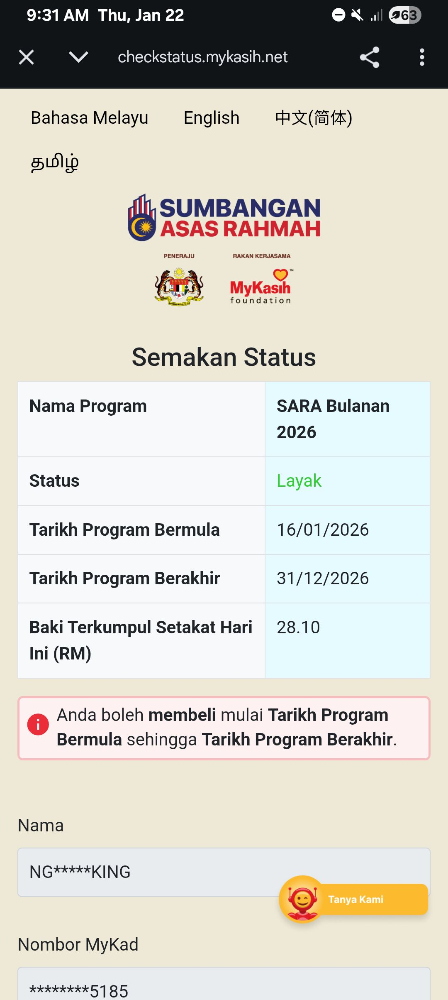

- 01:00 延續藉助 [[AI]] 工具 ── 透過 [[Rovo Dev CLI]] 延續 [[[[Antigravity]] [[IDE]]]] 上被迫中途的議題，打瞌睡，強忍睡意，坐著，咬牙，強迫性做事
- 01:26 睡覺
- 05:02 被自己的夢話驚醒：『講的話不會聽！』，夢見殺人等殘忍且恐怖的事情，回籠覺
- 09:28 因身體不適醒來，頭兩側覺緊繃，心跳加速，半躺半坐，輕拍自己的胸口，同在冥想，覺察思緒錯亂，深呼吸
- 09:34 時間帳，喝水，主動關閉風扇，檢查身份證 [[myKasih]] 帳號繼 [[Wed, 21-01-2026]] 消費後剩下的餘額 ── RM 28.10
  collapsed:: true
	- 
	-
- 09:37 走動，晾乾衣物，翻曬寢具，排尿，沖涼，午餐，吃小食，
- 12:36 排便，時間帳，記錄閃念
  collapsed:: true
	- [[被動]][[曝光]] vs [[主動]][[暴露]]
		- 在[[不外楊]]的[[前提]]下被他人[[私下]][[知曉]]或[[扒到]]關於自己的事，這事[[無法]][[控制]]；[[持續地]][[練習]][[覺察]]且[[保護]][[自己]]免受他人的[[操弄]]卻是[[相對]][[可控]]的
		- 停筆於 12:44
	- **12:48** [[quick capture]]:
	  collapsed:: true
		- 
		- https://www.facebook.com/share/p/1CChMT76tw/
- 12:53 沖涼，確認自己的手尾，走動，喝水
- 13:08 OGC，入耳式耳機
- 13:34 走動，喝水，寢具收進室內
- 13:45 喝水，藉助 AI 工具
  id:: 6971b98f-bf7b-4fb2-808a-816a149cbefc
- **14:06** [[quick capture]]:  {{twitter https://x.com/i/status/2014189734264754432}}
- [[14]]:06 走動，排尿，吃小食，處理蟑螂屍體
- 14:19 喝水，藉助 AI 工具 ── 優化當前未完善的 Gadgetbridge - Tasker - Notion 睡眠自動流，查看信箱，因眼前事物分心，半躺半坐，強迫性做事，強忍大腿屁股麻痺，咬嘴皮，覺察焦慮，向他人求助 ── Notion Support 替我找回被誤刪的 database 'Workspaces' / 'myWorkspaces'，文字提問，Outline 專注點，回信
  id:: 6971c186-4bea-48d2-bba4-6b8f8d536c06
- 20:21 晚餐，走動，喝水，清洗廚具，看視頻，覺察抗拒，難過，渴望自己的價值也獲得被欣賞
	- 結束於 [[Fri, 23-01-2026]] 00:24