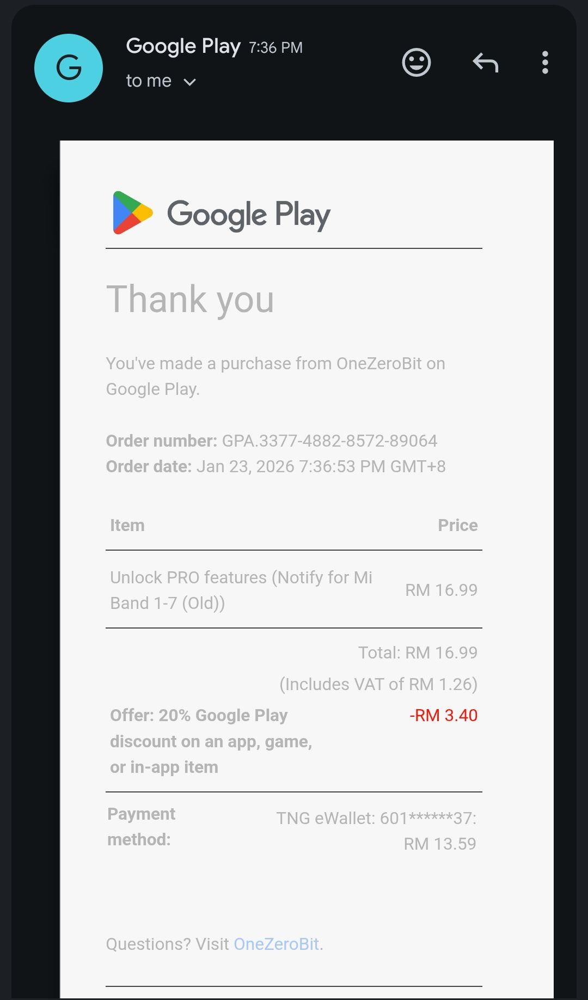

- 00:24 主動打開冷氣，蹲廁所，下載軟件，測試軟件，刷社媒，排便，強忍大腿屁股麻痹
- 01:09 熱水澡，走動
- 01:26 主動關閉冷氣，喝水，時間帳
- 01:30 睡覺，聽 podcast，預設倒數結束時間，作夢
- 08:14 因三急醒來，喝水，時間帳
- 08:16 忍尿，查看睡眠記錄，強迫性做事，覺察焦慮，着急
- 08:23 排尿，走動
- 10:00 刷社媒，自我撫慰，坐著
- [[10]]:48 OGC，入耳式耳機，坐著
- 11:[[16]] 喝水，走動，吃蔬果，午餐，吃小食，排尿
- 11:33 藉助 [[AI]] 工具 ── 延續實現睡眠自動流
- 12:55 翻曬寢具。走動，排尿
- 13:00  藉助 [[AI]] 工具 ── 延續實現睡眠自動流，咬嘴皮
- [[14]]:32 走動，喝水，寢具收進室內，簡單道謝，覺察羞愧，將想說的『我們坐下談談你是不是每件事情都需要交代』轉移到眼前未完成的事 ── 離子化飲用水
- [[14]]:55 遠離到安全的地方，延續實現睡眠自動流，咬嘴皮，強迫性做事
- 15:33 喝水，午餐，覺察羞愧，問自己好奇的事，清洗廚具，吃小食，吃蔬果，確認自己的手尾 ── 將曬過的睡毯
- [[16]]:54 時間賬， [[KTV 想點唱的歌單]]
- [[16]]:56 藉助 [[AI]] 工具 ── 延續實現睡眠自動流，咬嘴皮，暗室直視 3C 藍光
- 17:28 藉助 [[AI]] 工具 ── 延續實現睡眠自動流，咬嘴皮，走動，猶豫而決，購買  [[Unlock PRO features (Notify for Mi Band 1-7 (Old))]]  RM 13.59
  collapsed:: true
	- 
	- 結束於 21:45
- **19:40** [[CTOS]] basic report with [[CCRIS]] :
	- 
- 21:45 晚餐，看視頻，學習，清洗廚具，聽音樂，覺察喜悅，平靜，走動，熱水澡，盥洗，戴上牙套
- 23:43 喝水，聽音樂，預設倒數結束時間，睡覺
	- 因冷痹醒來於 [[Sat, 24-01-2026]] 07:23