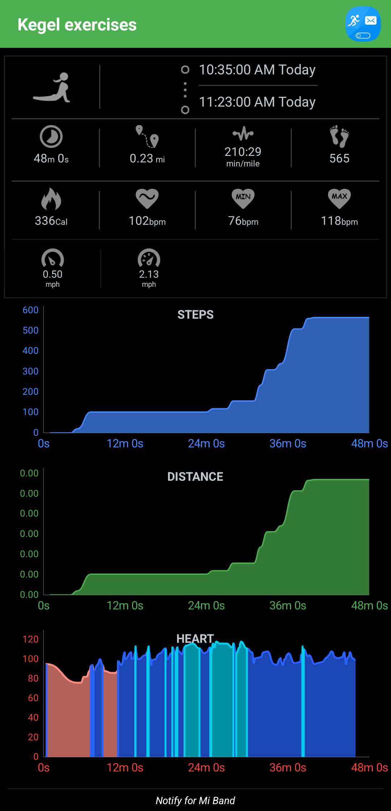

- 07:23 因冷痹醒來，賴床，回想夢境，覺察滿足，賴床
- 07:53 記錄夢境
  collapsed:: true
	- 夢見自己和[[舊同學]][[王慧燕]]一起搭[[長途]]巴士
	- 巴士上我[[巧遇]]了另一位[[日本]][[女生]]，雙眼[[大大的]]，非常[[漂亮]]和[[迷人]]，不知道過程怎麼的，後來我們就變得越來越[[親近]]，對方也趁我[[側臥]][[不小心睡着]]的時候，將她自己的頭也[[輕輕地]]靠在我[[左腿]]上，接着我便用[[左手]][[輕撫]]對方的頭，還記得對方的頭髮特別的柔順
	- 醒來之前，巴士剛好經過一座[[湖泊]]，然後這位日本女生卻看着我說讓我帶她去[[看湖]]吧，接着我用非常[[有限]]的[[日語]]回了句 『 [[sokka]]? 』
	- 停筆於 08:03
- 08:03 喝水，走動
- 08:08 蹲廁所，輕揉自己的肚子，聽音樂，修正筆記，查看睡眠記錄
- 08:35 聽音樂，走動，熱水澡，同在冥想，摘下牙套
- 09:03 坐着，曬太陽，聽音樂，聽 ambience，閱讀，默哀，覺察平靜，羞恥，害羞
- 09:44 聽音樂，喝水，坐着，調整 [[Mi Smart Band 4]] 的快捷功能
- 09:55 走動，曬寢具，時間帳，緩衝，搬動重物，清理雜物
- 10:35 運動，打遊戲
- 11:24 檢查[[運動]][[紀錄]]，覺察焦慮，咬嘴皮，蹲着
  collapsed:: true
	- 
- 11:37 走動，午餐，煮，吃蔬果，覺察着急，急促地進食，吃小食
- 13:11 清洗廚具，走動，覺察如釋重負
- 13:39 翻曬寢具，處理垃圾，喝水，沖涼
- 14:07 確認自己的手尾，查實所聽所見，整理雜物，聽音樂
- 15:21 寢具收進室內，打掃客廳，嘗試搬動傢俬，設計空間
- 22:29 沖涼
- 22:56 走動，前往附近的 [[KFC]]，查實所聽所見，開車出門， [[McDonald's]] [[drive-thru]] 外帶 [[Prosperity Burger]]
	- 00:00 到家