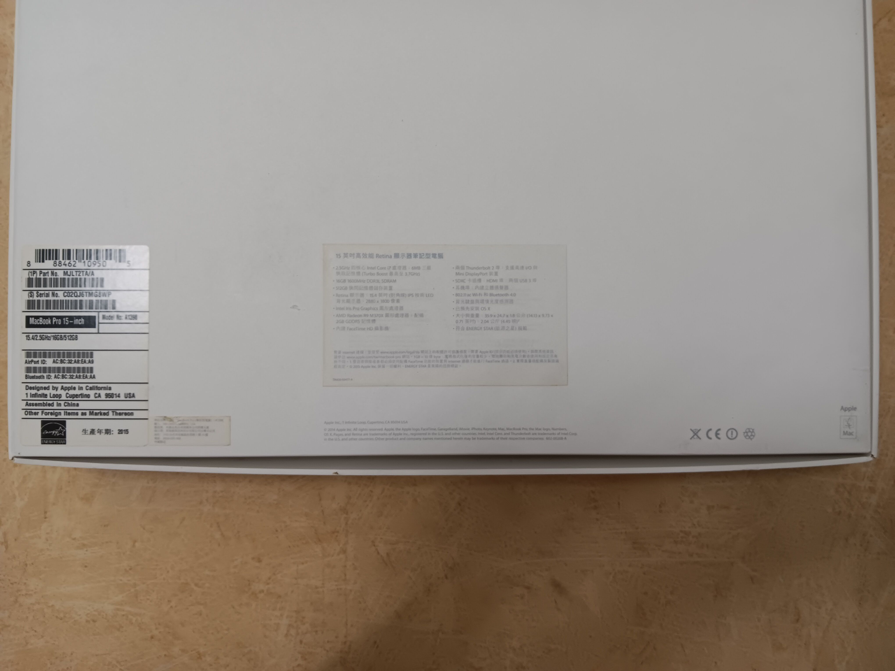
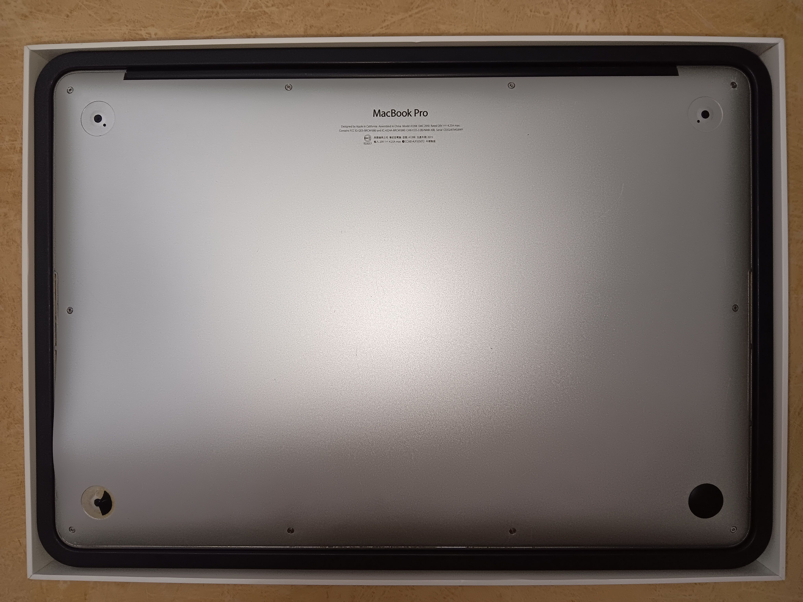
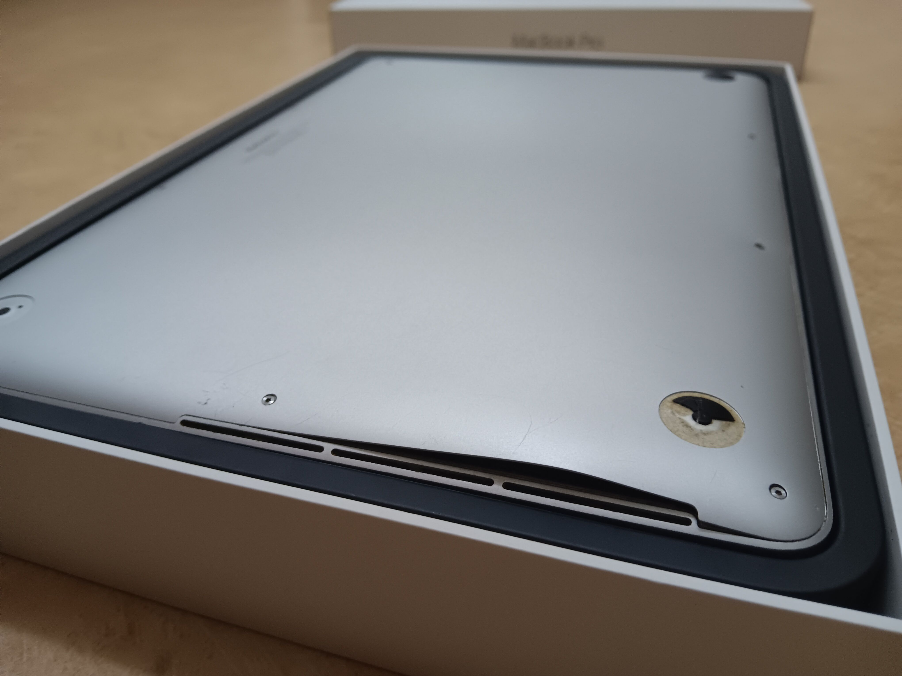
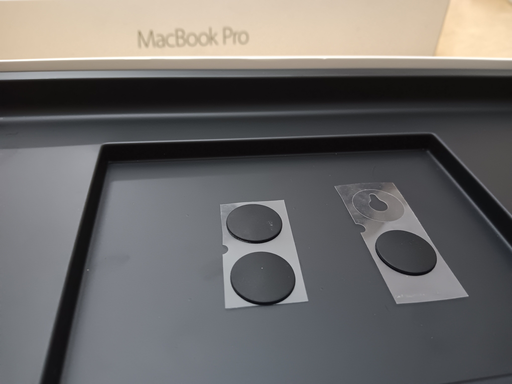
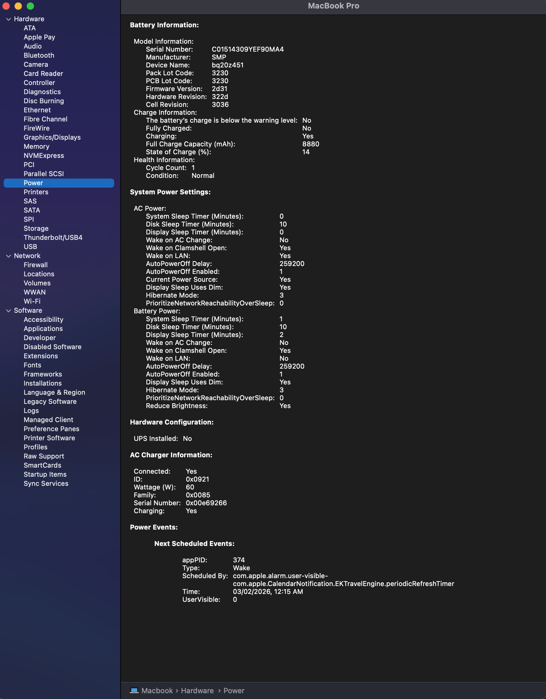

- 00:12 繼續  ((697d94b5-9e17-4365-8d06-361625a8d709))，暗室直視 3C 藍光，覺察雙眼不適，半躺半坐
- 01:46 睡覺，睡睡醒醒
- 11:31 外部聲音醒來，因身體不適醒來，因疲倦起不了身，賴床，覺察心跳加快，焦慮，輕拍自己的胸口
- 11:44 繼續  ((697d94b5-9e17-4365-8d06-361625a8d709))，覺察焦慮
- 12:16 半躺半坐，回信 [[YKL Mac Fix]]
- 12:45 喝水，確認戶口現金流
- 12:57 回籠覺
- 13:24 走動，確認事前準備，拍照
  collapsed:: true
	- 
	- 
	- 
	- 
	-
- 13:55 走動，沖涼，盥洗，摘下牙套，午餐，排尿，吃小食，沈默應對家人的提問
- 14:40 喝水，換衣，躲避與家人接觸，儀容裝扮，走動
- 14:47 覺察焦慮，爲等下 [[MAE]] App [[QR Code Scan & Pay]] 順利支付，提前補充有剩的餘額
- 15:00 開車出門
- 15:20 抵達目的地，等待，聽歌，覺察焦慮，輕拍自己的肋骨
- [[16]]:01 換新電池完畢，查實所聽所見，確認自己的手尾
  collapsed:: true
	- 
	-
- [[16]]:12 確認 [[warranty]] 將出現在未收到的 [invoice](logseq://graph/Sync-Logseq?block-id=69807845-9f56-4450-90a5-96161cc09805)，離開
- 16:23 開車前往油站
- 16:33 打風，走動
- 16:42 前往 [[Mr DIY]]，猶豫而決
- 17:22 開車回家
- 17:39 到家，覺察安全，無風狀態，強迫性做事，查看信箱，確認所聽所見，整理筆記
	- 收條 [[Receipt]]： [[MacBook Pro (MBP)]] [[model no. A1398]] [[battery replacement]] ｜ [[180 Days limited warranty]] ── [[expiry date]]: [[Sat, 01-08-2026]]
	  id:: 69807845-9f56-4450-90a5-96161cc09805
		- 
	- 整理結束於 18:01
- 18:01 主動打開風扇，走動，喝水，整理筆記，解決在 [[WhatsApp]] 綁定 [[MacBook Pro (MBP)]] 時出現問題，暗室直視 3C 藍光，咬嘴皮
	- 為了解決 [ [[WhatsApp]] 於 [[iOS]] 及 [[Android]] 之間同步失敗的問題
	  id:: 698173e6-39f0-43eb-9e6e-ec921ebd7f0b
		- 備份 [[WhatsApp]] 至 [[iCloud]] 始於 19:18
		  id:: 698082ab-6a29-475e-a04b-32289b236219
			- 中斷且重新開始於 20:00
			- 第 [[2]] 次中斷且透過 [[iMazing]] 備份到 [[MacBook Pro (MBP)]]
- 20:08 網搜資訊，學習 ── 為延長 [[MacBook Pro (MBP)]] [[電池]][[壽命]]，善用[[低瓦數]]的[[充電器]] + 智能電源管理工具，下載軟件 ── [[AlDente]]
  collapsed:: true
	- [jetclimb](https://www.reddit.com/user/jetclimb/)： 『 [So I’ve tested as low as an apple 5w charger. If you use too low a wattage then it can’t charge the battery and be working on it. I use an 18w travel charger which works fine on Intel and M series laptops. If you are using it while charging it may charge slowly. 20-30w works fine and you can use it. Remember the mba comes with as low as a 30w charger. If you want it to charge faster from 0% you can put it to sleep. Again I’ve tested this with a 5w for emergency purposes only.](https://www.reddit.com/r/macbookpro/comments/1en8nr5/comment/lh6axth/?utm_source=share&utm_medium=web3x&utm_name=web3xcss&utm_term=1&utm_content=share_button) 』
	  
	  所以我测试过用苹果5W充电器，电量低到这种程度。如果你用太低的瓦数，它就充不了电，而且还在用电。我用的是18W的旅行充电器，在英特尔和M系列笔记本电脑上都能正常使用。如果你边用边充，可能充得比较慢。20-30W就没问题，你可以用。记住，MacBook Air标配的充电器最低也有30W。如果你想让它从0%开始充得更快，你可以让它进入睡眠状态。再说一遍，我只在紧急情况下用过5W的充电器测试。
	-
	- Al Dente - 煮飯或麵條時，保留[[嚼勁]]的[[米心]] / [[麵心]]
	  {{video https://www.youtube.com/shorts/3kRqClIa30Y}}
	- {{video https://www.youtube.com/shorts/AnOPOAlef_0}}
- 23:16 延續 ((698082ab-6a29-475e-a04b-32289b236219))，網搜資訊，下載軟件，測試軟件，強迫性做事，忍餓，強忍睡意
	- 中途休息於 [[Tue, 03-02-2026]] 07:00