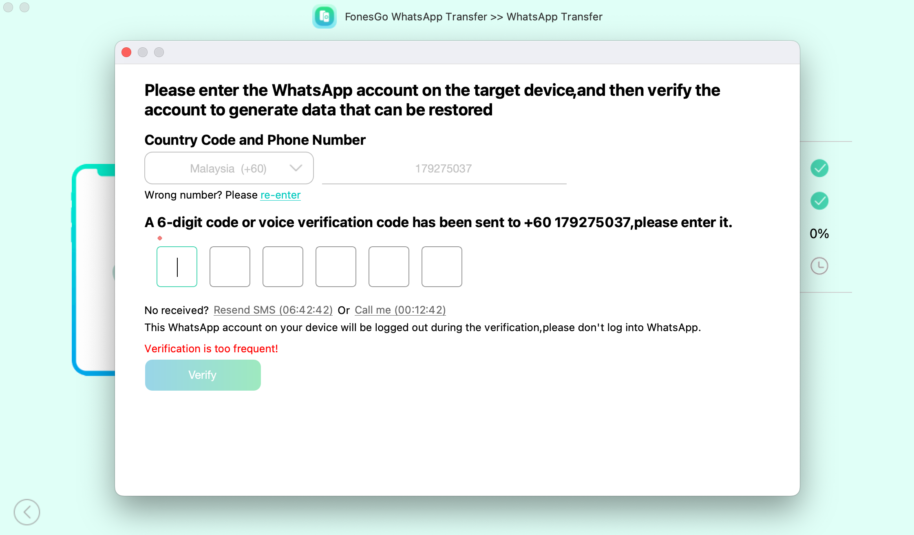

- 07:00 走動，夜宵，強忍睡意，覺察極度的疲勞，排斥，焦慮，害怕，失望，清洗廚具，熱水澡，手洗拖鞋，吃蔬果，喝水
- 09:49 時間賬，喝水，查看信箱，藉助 [[AI]] 工具
- [[10]]:21 強忍睡意，強迫性做事，咬牙，暗室直視 3C 藍光，繼續 ((698173e6-39f0-43eb-9e6e-ec921ebd7f0b))，下載及測試軟件 ── [[FonesGo WhatsApp Transfer]]
- 12:[[16]] 強忍睡意，猶豫而決，喝水，走動
- 12:24 睡覺，主動打開冷氣，吹冷氣，睡睡醒醒，因冷斃醒來，重新蓋被，因外部聲音醒來，覺察焦慮，害怕，因疲倦起不了身，回籠覺
- 16:00 吹冷氣，因冷斃醒來，重新蓋被，因身體不適醒來，覺察胸口悶，賴床，
- [[16]]:24 吹冷氣，喝水，走動，查實所聽所見，時間賬
- [[16]]:26 吹冷氣，坐著，暗室直視 3C 藍光，強迫性做事，網搜資訊，入耳式耳機，覺察好奇
- 18:22 [[FonesGo WhatsApp Transfer]] > [[verification]] ， [[WhatsApp]] 賬戶因為申請太多次遭限時
	- 
- 18:25 主動關閉冷氣，走動，喝水
- 18:28 無風狀態，OGC，入耳式耳機
  id:: 6981cdc4-8cd4-4783-b3c8-44b4c2fedb33
- 18:51 無風狀態，Troubleshooting
- 19:35 無風狀態，刷社媒，坐著
- 20:28 走動，排尿，晚餐
	- 結束於 22:12
- 22:12 強迫性做事，因眼前事物分心，整理雜物，調整客廳的物件擺設，空間設計，覺察好奇，覺察焦慮，咬嘴皮
	-