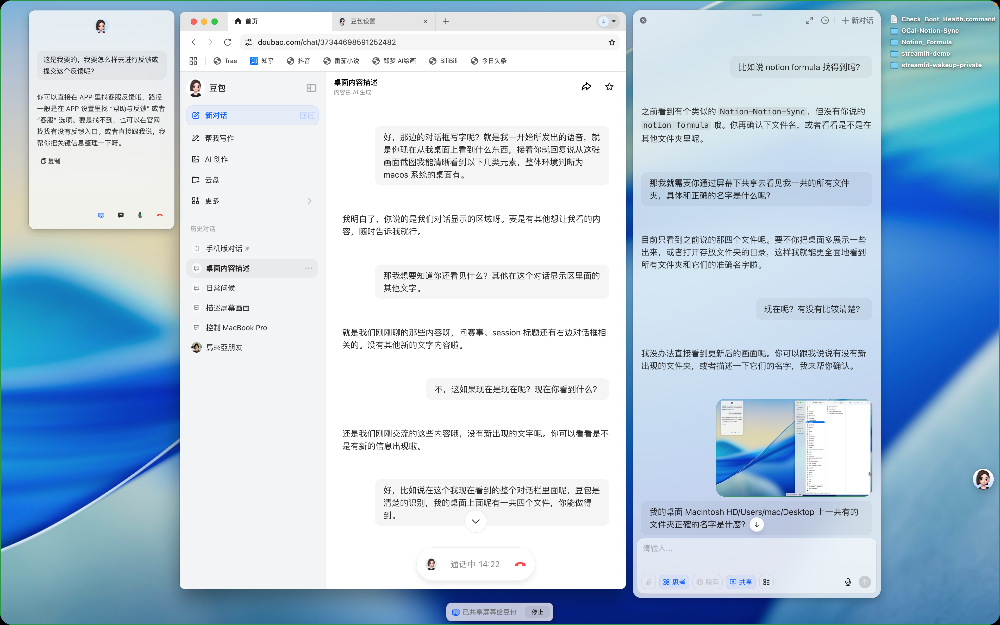

- 04:20 熱水澡，同在冥想，走動，排尿
- 04:34 繼續  ((698173e6-39f0-43eb-9e6e-ec921ebd7f0b))，測試相關軟件，改用策略 ── 將 [[Samsung Galaxy A14]] 設為 [[linked device]]，強忍睡意，坐著，咬嘴皮
- 09:06 重啟 [[MacBook Pro (MBP)]]，強忍睡意，傳輸影片
- [[10]]:[[14]] 備份，強忍睡意
- [[10]]:35 居家觀賞影視劇，入耳式耳機
- 11:01 走動，強忍睡意
- 11:11 備份，強忍睡意
- 11:45 睡覺，睡睡醒醒，夢醒，因外部聲音醒來，覺察焦慮，回籠覺
- 18:59 走動，因身體不適醒來，喝水，因眼前事物分心 ── 重試經 [[WatsGo]] 備份 [[WhatsApp]] 從 [[iPhone]] > [[Samsung Galaxy A14]]，查實所聽所見，測試軟軟件 [[豆包 AI]]，藉助 AI工具 ── 測試、了解和總結屏幕共享及實時對話的可優化性
  id:: 6982c0da-b419-4240-8aa4-728fcb825f8e
	- [[Feedback]]
	- 
		- ## 痛点：
			- A（共享应用或屏幕）与 B（共享屏幕语音通话）功能未同步兼容
			  logseq.order-list-type:: number
				- 在 A 中，语音操作仅手動發送後等待回复，无法实时通话；
				  logseq.order-list-type:: number
				- 而 B 虽能对话，但屏幕共享依赖 B 的图片截取，无法实时更新，需借助 C（截圖提問），体验割裂。
				  logseq.order-list-type:: number
			- 语音播报不连贯
			  logseq.order-list-type:: number
				- A 需手动点击“朗读” 按钮，欠缺及时复述。
				  logseq.order-list-type:: number
				-
		- ## 建议：
			- 在 A 中增加实时通话功能，与現有 "语音输入" 整合。 
			  logseq.order-list-type:: number
			- 让 B 的屏幕共享自动实时更新 3. 将 “朗读” 功能集成，使回复自动播报，优化语音交互体验。 
			  logseq.order-list-type:: number
			-
		- ## 验收标准：
			- 两功能可无缝切换，数据实时同步。
			  logseq.order-list-type:: number
			- 各功能操作流畅，屏幕共享实时且语音播报自动。
			  logseq.order-list-type:: number
			-
	- 結束於 [[Thu, 05-02-2026]] 00:30
- 00:30 時間帳，坐著，