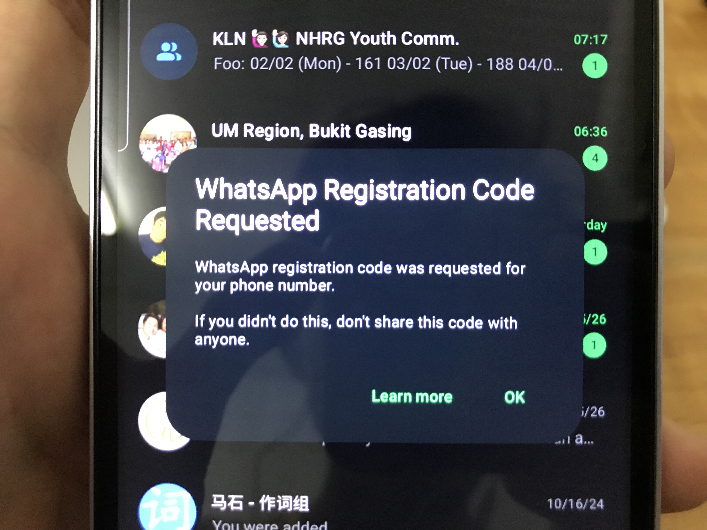
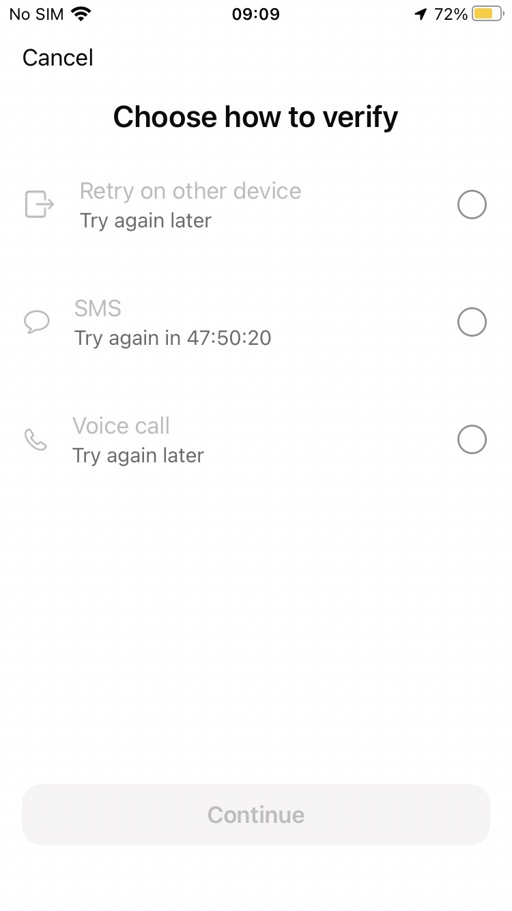
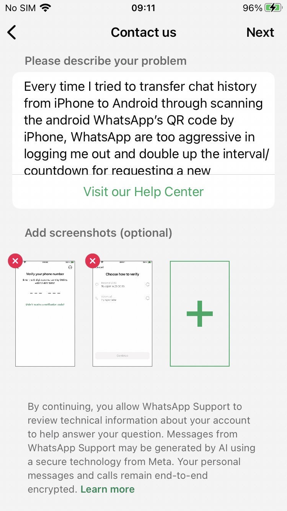
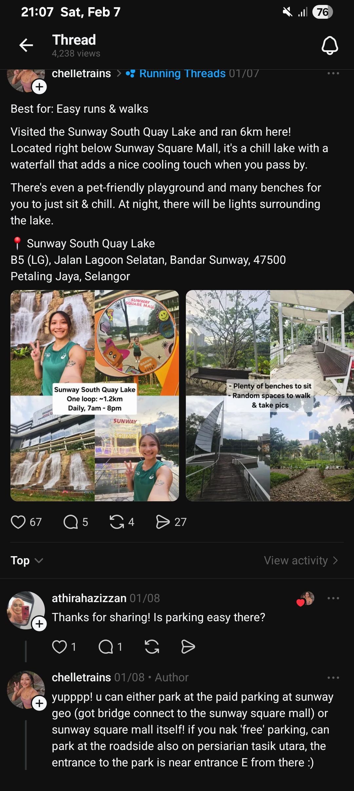

- 03:30 忍尿，強迫性做事
- 04:16  走動，摘下牙套，排尿，覺察排斥，難過，渴望自己的辛苦被自己看見，夜宵，吃甜食，清洗廚具，熱水澡，盥洗，戴上牙套
- 06:07 喝水，繼續 [[為升級 [[macOS]] 至 [[Sequoia]]，經 [[OCLP]] 格式化 [[external drive]] 及安裝 [[installer]]]]，將存在 [[mirrorless]] [[相機]] [[Sony α7S]] 的 [[SD Card]] 拿來取代疑損壞的 [[Transcend StoreJet 1TB HDD]]，覺察好奇，欣慰，驚喜，感謝自己的嘗試
  id:: 6986417a-a7cc-408a-8309-0acc131b9d28
- 06:48 時間賬，哼唱
- 06:52
- 09:11 經過 24 小時之後，[[iPhone]] 向 [[WhatsApp]] 申請 [[verification]] [[code]] 重演 [[Android]] 僅收到通知但消失的 6 位數號碼
  collapsed:: true
	- 
	- 
	- 
	- 
- 08:55 主動尋得他人的幫助，編輯信息，覺察焦慮，表達自己的看見、感受、需要和請求，強迫性做事
- [[10]]:26 時間賬
- 13:00 排尿，覺察疲勞，強忍睡意，走動
- 13:05 喝水，藉助 [[AI]] 工具 ── 覆盤原因，重啟 3C 產品，查實所聽所見，書時間賬，調整 UI
- 13:35 午餐，吃甜食，刻意放慢動作
- 14:45 自主修髮
- 15:45 掃地，確認自己的手尾，沖涼
- 16:15 強忍睡意，強迫性做事，整理客廳的擺設，因眼前事物分心，覺察焦慮，走動，覺察不甘心
- 20:36 時間帳，沖涼，喝水，強迫性做事，因眼前事物分心，查看信箱，忘記上一秒要做什麼
- 20:52 排便，網搜資訊，查實所聽所見
	- 
	- https://www.threads.com/@chelletrains/post/DTNixyRkr94?xmt=AQF0F9zJaNcpjYWbpr8R2OaxGUMtp4raPsnNwANEdWKvH6_YWNGVYYFb0fN8e-vYq21O-xMG&slof=1
	-
- 21:15 熱水澡，覺察疲勞，強忍睡意，猶豫而決
- 21:47 喝水，強迫性做事，打瞌睡，強忍睡意，查實所聽所見 ── 明天停車的位置
	-
-