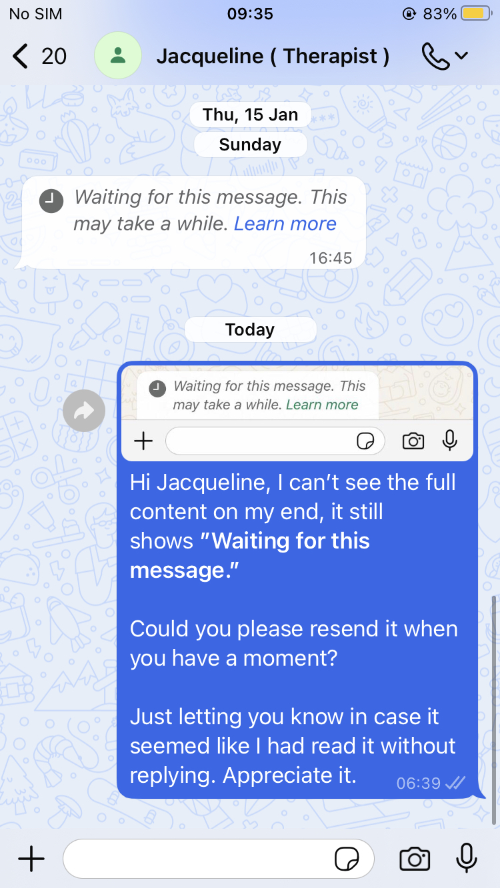

- 00:12 遠離到安全的地方，躺著，忘記上一秒看手環的時間時分是多少，覺察心慌，雙手發麻，輕拍自己的胸口
- 00:22 流淚，覺察難過，輕撫自己的頭
- 00:36 [[quick capture]]: #voice-memo
	- **孤獨 hummimg**
		- 
- 00:39 經 [[Smart Switch]] 設置 [[WhatsApp]] 從 [[iPhone]] 同步到 [[Samsung Galaxy A14]]
  id:: 698a0dc2-bc04-41fb-a6d6-39ce2b4c7e32
	- 開始於 00:49
	- 自動整理已傳輸數據且斷聯數據線於 02:41
	- 繼續完善剩餘動作於 02:56
- 00:49 時間賬，覺察焦慮
- 00:52 走動，晚餐，吃蔬果，覺察頭兩側緊繃，稍微站不穩
- 02:41 查實所聽所見 ── ((698a0dc2-bc04-41fb-a6d6-39ce2b4c7e32))
- 02:44 處理垃圾，走動
- 02:56 即將進入 [[Importing chat history]] 之前，再次遇到 [[Samsung Galaxy A14]] 申請的 [[verification code]] 遲遲未在 [[iPhone]] 上出現，且還需要等上 12 小時
- 03:15 排便，刷社媒，熱水澡
- 04:12 覺察焦慮比，編輯信息
- 04:32 藉助 [[AI]] 工具 ── 如何回覆實習諮商師 [[Jacqueline Kon Jia Min]] 未如期顯示的來信
	- 
	- 成功發出於 06:41
- 06:41 強忍睡意，測試軟件新功能 ── 在 [[WhatsApp]] 和 [[Meta AI]] 從覆盤如何倒計時草擬信息，直到聊到如何利用其科技改善弱勢群體的生活，覺察喜悅
- 09:04 看視頻，入耳式耳機，覺察很難集中精力
- 09:38 睡覺，睡睡醒醒，夢醒，作噩
- 18:30 因身體不適醒來，因疲倦起不了身，半躺半坐
- 18:41 走動，查實所聽所見，查看信箱，覺察如釋重負，難過
- 18:54 繼續完善備份 ── 於 [[Samsung Galaxy A14]]